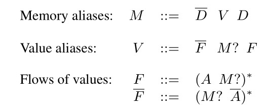
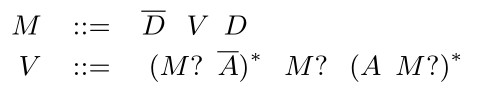
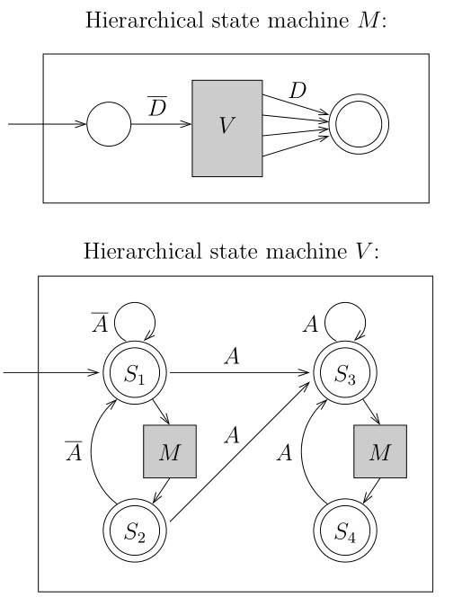
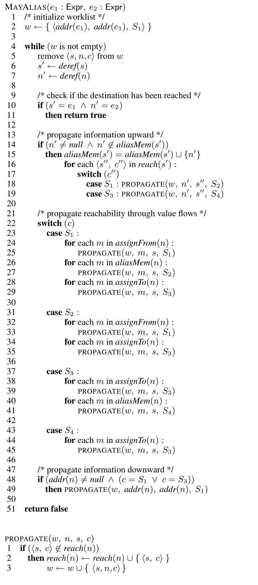

CFL Anderson Alias Analysis
===========================

在 LLVM5.0.1 中实现了很多种 Alias Analysis，其中包括了
CFL-Anderson-AliasAnalysis，该 Alias Analysis 用到的算法基于
“Demand-driven alias analysis for C”
(http://www.cs.cornell.edu/~xinz/papers/alias-popl08.pdf)
这篇论文，并做了一些适配修改。

Demand-Driven Alias Analysis for C
----------------------------------

该论文提出了一种 a demand-driven, flow-insensitive analysis algorithm
for answering may-alias queries.

Program Representation
~~~~~~~~~~~~~~~~~~~~~~

在该论文中，将程序形式化表示为一种 C-like program：

1. 程序中所有的值都是指针
2. 程序中包含指针赋值语句
3. 由于该别名分析 ( Alias analysis)
   是流不敏感的，所以这些赋值语句之间的控制流是 irrelevant
   ，这些赋值语句可以按照任意顺序执行任意多次

--------------

论文中使用一种称为 Program Expression Graph ( PEG )
的数据结构来表示程序中出现的所有的表达式和赋值语句，图中的结点表示程序中的表达式，结点之间的边分为两类：

-  Pointer dereference edges (D)，用于表示指针解引用语句
-  Assignment edges (A)，用于表示赋值语句

对于每一条 A 边 和 D 边，都有一条对应的反方向 (reverse)
的边与之对应，用在A上加上划线，在D上加上划线来表示。

.. math::

   \overline{A}，\overline{D}

一个PEG 的示例，如下图所示：

.. figure:: assets/Figure.1-PEG.jpg
   :alt: Figure.1-PEG

   Figure.1-PEG

该图的左边显示了程序中包含的指针赋值语句，该图的右边就是该程序的 PEG
。水平的实线表示 Assignment edges ( A- edges)，垂直的虚线表示 Pointer
dereference edges ( D-edges)。

Alias Analysis via CFL-Reachabiliry
~~~~~~~~~~~~~~~~~~~~~~~~~~~~~~~~~~~

论文中定义了两种别名关系：

-  Memory (or location) alias:
   如果两个表达式的内存位置相同，那么它们就是 memory alias
-  Value alias: 如果两个表达式在计算 (evaluate)
   后得到相同的指针值，那么他们就是 value alias

论文中用二元关系 M 来描述 memory alias：M ⊆ Expr × Expr，用二元关系 V
来描述 value alias：V ⊆ Expr × Expr。每一个关系都可以看作是 PEG
中的一条边，这样就将 M 和 V 的计算形式化为一个在 PEG 上的 context-free
language (CFL) reachability problem (见 “Program Analysis via Graph
Reachability” http://research.cs.wisc.edu/wpis/papers/tr1386.pdf 和 “The
Set Constraint/CFL Reachability Connection in Practice”
https://theory.stanford.edu/~aiken/publications/papers/pldi04.pdf)。CFL-Reachability
的大致思想是，给定一个图，图上的边都带有标记，则图中的结点之间是否满足关系
R 就可以通过以下方式形式化为 CFL-Reachability
问题来进行判断：构造一个文法 G，结点 n 与 n‘ 之间满足关系 R
当且仅当图中由结点 n 至 n’ 之间的边上的标记所构成的序列属于文法 G
所定义的语言 L(G)。

下图是该论文为解决别名分析问题，在 PEG 图上构造的上下文无关文法 G0：

   Figure.2-Grammar1

文法中的 “?” 表示该符号是可选的，文法中的 "*" 是 Kleene star
operator，符号 D 和 A 是终结符，其余的符号都是非终结符，D 即 PEG 图中的
Pointer dereference edges，A 即 PEG图中的 Assignment edges。 可以消除
Figure.2 所示的文法 G0 中的非终结符 F 得到新的文法 G，如下图 Figure.3
所示：

   Figure.3-Grammar2

下面以 Figure.1 所示的 PEG 为例，说明如何判断 ``*x`` 和 ``*s``
之间是否为 memory alias。 首先，表达式 ``&r`` 和 ``y`` 是 value
alias，\ ``V(&r, y)``\ ，因为存在 ``y = &r``
这样一条语句，即存在这样一条边 ``A(&r, y)``\ ，符合文法 G 中非终结符 V
的产生式。因此对 ``&r`` 和 ``y`` 的解引用得到的表达式之间就是 memory
alias，即 ``M(r, *y)``\ ，表达式 ``r`` 和 ``*y`` 之间是 memory
alias；然后，存在语句 ``*y`` 的值流向了 ``x``\ ，\ ``r`` 的值流向了
``s`` ，二元关系 (x, s) 符合文法 G 中非终结符 V 的产生式，所以 ``x`` 和
``s`` 之间是 value alias，V(x, s)。所以 ``*x`` 和 ``*s`` 之间是 memory
alias，\ ``M( *x, *s)``\ 。 从 CFL-reachability 的角度来看，在 PEG
中存在一条由 ``*x`` 到 ``*s`` 的路径
``[ *x, x, *y, y, &r, r, s, *s ]``\ ，对应于 PEG 中边的序列：

.. math::

   \overline{D} \overline{A} \overline{D} \overline{A} D A D

该序列满足文法 G 中 M的产生式，所以 ``*x`` 和 ``*s`` 之间是 memory
alias，\ ``M( *x, *s)``\ 。

Hierarchical State Machine Representation
^^^^^^^^^^^^^^^^^^^^^^^^^^^^^^^^^^^^^^^^^

使用 Hierarchical State Machine 来表示 Figure.3 所示的上下文无关文法
G，下一节中的 alias analysis algorithm 就是基于该 Hierarchical State
Machine Model 来构建的，Hierarchical State Machine
是一种自动机，它的结点是 state 或者是 box，state
就和常见的有限状态自动机中的state一样，而 box 表示对另外一个 state
machine 的调用，并且 box 有一系列的输入和输出，与被调用的 state machine
的初始状态和结束状态相对应。

根据 Figure.3 所示的上下文无关文法 G 所构造的 hierarchical, recursive
state machine 如下图所示：

   Figure.4-Hierarchical-State-Machine

图的上半部分是 memory alias M 所对应的 hierarchical state
machine，下半部分是 value alias V 所对应的 hierarchical state machine。

Alias Analysis Algorithm
^^^^^^^^^^^^^^^^^^^^^^^^

论文提出的 Alias Analysis Algorithm 如下所示（论文原文中的算法疑似有
typo，下图所示的算法是我修正后的算法，如有错误，欢迎指正）：

   Figure.5-Alias-Analysis-Algorithm

算法中 worklist 中的元素是三元组 ``<s, n, c>``\ ，表示 PEG 中的结点 s
到达了结点 n，并且此时的自动机状态为 c
。算法中出现的一些函数的意义如下：

-  *addr(n)* 表示对结点 n 的取地址操作后得到的结点，对应于 PEG 中的
   reverse dereference edge；
-  *deref(n)* 表示对结点 n 的解引用操作后得到的结点，对应于 PEG 中的
   dereference edge；
-  *assignTo(n)* 表示对所有的被 n 赋值的那些结点，即在 PEG 中以结点 n
   为起点的那些 assignment edges 的终点结点，对应于 PEG 中的 assignment
   edges；
-  *assignFrom(n)* 表示所有的赋值给 n 的那些结点，即在 PEG 中以结点 n
   为终点的那些 assignment edges 的起点结点，对应于 PEG 中的 reverse
   assignment edges；
-  *reach(n)* 是二元组 ``<s, c>`` 的集合，表示 PEG 中的结点 s 到达了结点
   n，并且此时的自动机状态为 c ；
-  *aliasMem(n)* 是那些当前已知的结点 n 的 memory alias 的结点；

下面还是以 Figure.1 所示的 PEG 为例，说明如何使用该算法判断 ``*x`` 和
``*s`` 之间是否为 memory alias。

-  首先，worklist 被初始化为 ``{ <x, x, S1> }``\ ；
-  进入第一轮循环，取出 worklist 中的元素
   ``<x, x, S1>``\ ，因为\ ``assignFrom(x)`` 为 ``{ *y }``\ （执行
   “propagate reachability through value flows” 部分的代码）并且
   ``addr(x) != null && c == S1``\ （执行 " propagate information
   downward" 部分的代码），所以第一轮循环后 worklist 为
   ``{ <x, *y, S1>, <&x, &x, S1> }``\ ；
-  进入第二轮循环，取出 worklist 中的元素：\ ``<x, *y, S1>``\ ，因为
   ``assignTo(*y)`` 为 ``{ x }``\ （执行 “propagate reachability through
   value flows” 部分的代码）并且 ``addr(*y) != null && c == S1``\ （执行
   " propagate information downward" 部分的代码），所以第二轮循环后
   worklist 为
   ``{ <x, x, S3>, <y, y, S1> , <&x, &x, S1>}``\ ，\ ``reach(*y)`` 为
   ``{ <x, S1> }``\ ；
-  进入第三轮循环，取出 worklist 中的元素：\ ``<y, y, S1>``\ ，因为
   ``assignFrom(y)`` 为 ``{ &r }``\ （执行 “propagate reachability
   through value flows” 部分的代码）并且
   ``addr(y) != null && c == S1``\ （执行 " propagate information
   downward" 部分的代码），所以第三轮循环后 worklist 为
   ``{ <y, &r, S1>, <&y, &y, S1>, <x, x, S3>, <&x, &x, S1> }``\ ；
-  进入第四轮循环，取出 worklist 中的元素：\ ``<y, &r, S1>``\ ，\ ``s'``
   为 ``*y``\ ，\ ``n'`` 为 ``r``\ ，\ ``aliasMem(*y)``
   为空，\ ``reach(*y)`` 为\ ``{ <x, S1> }``\ ，因为
   ``r != null && r 不属于 aliasMem(*y)``\ （执行 “propagate information
   upward” 部分的代码），所以第四轮循环后 worklist 为
   ``{ <x, r, S2>, <&y, &y, S1>, <x, x, S3>, <&x, &x, S1> }``\ ；
-  进入第五轮循环，取出 worklist 中的元素：\ ``<x, r, S2>``\ ，因为
   ``assignTo(r)`` 为 ``{ s }``\ ，\ ``assignFrom(r)`` 为
   ``{ &z }``\ （执行 “propagate reachability through value flows”
   部分的代码），所以第五轮循环后 worklist 为
   ``{ <x, s, S3>, <x, &z, S1>, <&y, &y, S1>, <x, x, S3>, <&x, &x, S1> }``\ ；
-  进入第六轮循环，取出worklist 中的元素：\ ``<x, s, S3>``\ ，\ ``s'``
   为 ``*x``\ ，\ ``n'`` 为 ``*s``\ ，因为
   ``s' == e1 && n' == e2``\ ，所以\ ``*x`` 和 ``*s`` 之间为 memory
   alias，算法结束。

Implementation of CFL Anderson Alias Analysis
---------------------------------------------

CFL-Anderson-AliasAnalysis 的代码实现位于
``llvm-5.0.1.src/include/llvm/Analysis/CFLAndersAliasAnalysis.h`` 和
``llvm-5.0.1.src/lib/Analysis/CFLAndersAliasAnalysis.cpp``\ 。在前面的章节提到过，对于
LLVM 中不同的别名分析算法，在实现时都要定义一个继承自 ``AAResultBase``
的 Result 类，并重写函数
``AliasResult alias(const MemoryLocation &, const MemoryLocation &)``\ ，对于
CFL-Anderson-AliasAnalysis 就是 ``CFLAndersAAResult::alias``
函数。\ ``CFLAndersAAResult::alias`` 函数体如下：

.. code:: cpp

   AliasResult CFLAndersAAResult::alias(const MemoryLocation &LocA,
                                        const MemoryLocation &LocB) {
     if (LocA.Ptr == LocB.Ptr)
       return LocA.Size == LocB.Size ? MustAlias : PartialAlias;

     // Comparisons between global variables and other constants should be
     // handled by BasicAA.
     // CFLAndersAA may report NoAlias when comparing a GlobalValue and
     // ConstantExpr, but every query needs to have at least one Value tied to a
     // Function, and neither GlobalValues nor ConstantExprs are.
     if (isa<Constant>(LocA.Ptr) && isa<Constant>(LocB.Ptr))
       return AAResultBase::alias(LocA, LocB);

     AliasResult QueryResult = query(LocA, LocB);
     if (QueryResult == MayAlias)
       return AAResultBase::alias(LocA, LocB);

     return QueryResult;
   }

``CFLAndersAAResult::alias`` 函数的参数为两个\ ``MemoryLocation``
类型的变量。\ ``MemoryLocation``
类有3个成员变量：\ ``const Value *Ptr``, ``uint64_t Size``,
``AAMDNodes AATags``\ 。\ ``MemoryLocation``
用于表示一个指定的内存位置。\ ``const Value *Ptr``
用于记录起始地址；\ ``uint64_t Size``
用于记录该内存位置的大小，如果大小不确定用 UnknownSize ( 在
``MemoryLocation`` 中定义 ) 来表示；\ ``AAMDNodes AATags``
用于记录该内存位置的有关别名信息的 metadata 信息。

该函数的第一部分代码：

.. code:: cpp

   if (LocA.Ptr == LocB.Ptr)
     return LocA.Size == LocB.Size ? MustAlias : PartialAlias;

判断两个 ``MemoryLocation``
类型的参数的起始地址是否相同，如果起始地址相同，并且大小也相同，那么返回
MustAlias，大小不同，则返回 PartialAlias（因为此时两个
``MemoryLocation`` 类型的对象必定有重叠部分）。

第二部分代码，对于 CFLAndersAA 不能处理的情况，调用了
``AAResultBase::alias`` 进行处理（ 注释：\ ``GlobalValue`` 是
``Constant`` 的子类 ）。

第三部分代码，CFLAndersAA 的核心代码的入口，使用 CFLAndersAA
算法来判断两个 ``MemoryLocation`` 类型的对象的别名关系。

``CFLAndersAAResult::query`` 的实现如下：

.. code:: cpp

   AliasResult CFLAndersAAResult::query(const MemoryLocation &LocA,
                                        const MemoryLocation &LocB) {
     auto *ValA = LocA.Ptr;
     auto *ValB = LocB.Ptr;

     if (!ValA->getType()->isPointerTy() || !ValB->getType()->isPointerTy())
       return NoAlias;

     auto *Fn = parentFunctionOfValue(ValA);
     if (!Fn) {
       Fn = parentFunctionOfValue(ValB);
       if (!Fn) {
         // The only times this is known to happen are when globals + InlineAsm are
         // involved
         DEBUG(dbgs()
               << "CFLAndersAA: could not extract parent function information.\n");
         return MayAlias;
       }
     } else {
       assert(!parentFunctionOfValue(ValB) || parentFunctionOfValue(ValB) == Fn);
     }

     assert(Fn != nullptr);
     auto &FunInfo = ensureCached(*Fn);

     // AliasMap lookup
     if (FunInfo->mayAlias(ValA, LocA.Size, ValB, LocB.Size))
       return MayAlias;
     return NoAlias;
   }

注意到，\ ``assert(Fn != nullptr);``
之前的语句都是一些前置条件的判断及处理，在\ ``CFLAndersAAResult::query``
函数中判断两个 ``MemoryLocation``
类型的变量是否为别名关系时，最核心是语句
``FunInfo->mayAlias(ValA, LocA.Size, ValB, LocB.Size)``\ ，即对函数
``CFLAndersAAResult::FunctionInfo::mayAlias`` 的调用。

``FunctionInfo`` 类的定义如下：

.. code:: cpp

   class CFLAndersAAResult::FunctionInfo {
     /// Map a value to other values that may alias it
     /// Since the alias relation is symmetric, to save some space we assume values
     /// are properly ordered: if a and b alias each other, and a < b, then b is in
     /// AliasMap[a] but not vice versa.
     DenseMap<const Value *, std::vector<OffsetValue>> AliasMap;

     /// Map a value to its corresponding AliasAttrs
     DenseMap<const Value *, AliasAttrs> AttrMap;

     /// Summary of externally visible effects.
     AliasSummary Summary;

     Optional<AliasAttrs> getAttrs(const Value *) const;

   public:
     FunctionInfo(const Function &, const SmallVectorImpl<Value *> &,
                  const ReachabilitySet &, const AliasAttrMap &);

     bool mayAlias(const Value *, uint64_t, const Value *, uint64_t) const;
     const AliasSummary &getAliasSummary() const { return Summary; }
   };

``FunctionInfo`` 类的成员变量的意义由注释写的很清楚，成员变量
``AliasMap`` 用于表示 value 与其可能互为别名的其他 value 的映射，
成员变量 ``AttrMap`` 用于表示 value 与其 AliasAttrs 属性。成员变量
``Summary``
用于表示该函数的参数/返回值之间的别名关系等信息的摘要，这样当处理对某个函数的调用点时，可以通过该摘要信息得到实参/返回值之间的别名关系等信息。

函数 ``CFLAndersAAResult::FunctionInfo::mayAlias`` 的定义如下：

.. code:: cpp

   bool CFLAndersAAResult::FunctionInfo::mayAlias(const Value *LHS,
                                                  uint64_t LHSSize,
                                                  const Value *RHS,
                                                  uint64_t RHSSize) const {
     assert(LHS && RHS);

     // Check if we've seen LHS and RHS before. Sometimes LHS or RHS can be created
     // after the analysis gets executed, and we want to be conservative in those
     // cases.
     auto MaybeAttrsA = getAttrs(LHS);
     auto MaybeAttrsB = getAttrs(RHS);
     if (!MaybeAttrsA || !MaybeAttrsB)
       return true;

     // Check AliasAttrs before AliasMap lookup since it's cheaper
     auto AttrsA = *MaybeAttrsA;
     auto AttrsB = *MaybeAttrsB;
     if (hasUnknownOrCallerAttr(AttrsA))
       return AttrsB.any();
     if (hasUnknownOrCallerAttr(AttrsB))
       return AttrsA.any();
     if (isGlobalOrArgAttr(AttrsA))
       return isGlobalOrArgAttr(AttrsB);
     if (isGlobalOrArgAttr(AttrsB))
       return isGlobalOrArgAttr(AttrsA);

     // At this point both LHS and RHS should point to locally allocated objects

     auto Itr = AliasMap.find(LHS);
     if (Itr != AliasMap.end()) {

       // Find out all (X, Offset) where X == RHS
       auto Comparator =  {
         return std::less<const Value *>()(LHS.Val, RHS.Val);
       };
   #ifdef EXPENSIVE_CHECKS
       assert(std::is_sorted(Itr->second.begin(), Itr->second.end(), Comparator));
   #endif
       auto RangePair = std::equal_range(Itr->second.begin(), Itr->second.end(),
                                         OffsetValue{RHS, 0}, Comparator);

       if (RangePair.first != RangePair.second) {
         // Be conservative about UnknownSize
         if (LHSSize == MemoryLocation::UnknownSize ||
             RHSSize == MemoryLocation::UnknownSize)
           return true;

         for (const auto &OVal : make_range(RangePair)) {
           // Be conservative about UnknownOffset
           if (OVal.Offset == UnknownOffset)
             return true;

           // We know that LHS aliases (RHS + OVal.Offset) if the control flow
           // reaches here. The may-alias query essentially becomes integer
           // range-overlap queries over two ranges [OVal.Offset, OVal.Offset +
           // LHSSize) and [0, RHSSize).

           // Try to be conservative on super large offsets
           if (LLVM_UNLIKELY(LHSSize > INT64_MAX || RHSSize > INT64_MAX))
             return true;

           auto LHSStart = OVal.Offset;
           // FIXME: Do we need to guard against integer overflow?
           auto LHSEnd = OVal.Offset + static_cast<int64_t>(LHSSize);
           auto RHSStart = 0;
           auto RHSEnd = static_cast<int64_t>(RHSSize);
           if (LHSEnd > RHSStart && LHSStart < RHSEnd)
             return true;
         }
       }
     }

     return false;
   }

函数 ``CFLAndersAAResult::FunctionInfo::mayAlias``
的注释写的很详细，不再赘述。

在\ ``CFLAndersAAResult::query`` 函数中判断两个 ``MemoryLocation``
类型的变量是否为别名关系时，最核心是语句
``FunInfo->mayAlias(ValA, LocA.Size, ValB, LocB.Size)``\ ，而 FunInfo
则是函数 ``CFLAndersAAResult::ensureCached`` 的返回值，下面说明在函数
``CFLAndersAAResult::ensureCached`` 中是如何构造 FunInfo 的。

``CFLAndersAAResult::ensureCached`` 的实现如下：

.. code:: cpp

   const Optional<CFLAndersAAResult::FunctionInfo> &
   CFLAndersAAResult::ensureCached(const Function &Fn) {
     auto Iter = Cache.find(&Fn);
     if (Iter == Cache.end()) {
       scan(Fn);
       Iter = Cache.find(&Fn);
       assert(Iter != Cache.end());
       assert(Iter->second.hasValue());
     }
     return Iter->second;
   }

在 ``CFLAndersAAResult`` 中使用缓存，存储函数 Fn 的
``CFLAndersAAResult::FunctionInfo`` 信息。在函数 ``scan`` 中通过调用
``buildInfoFrom`` 函数来构造函数 Fn 的
``CFLAndersAAResult::FunctionInfo`` 信息，并加入到缓存 Cache 中。

``buildInfoFrom`` 函数的定义如下：

.. code:: cpp

   CFLAndersAAResult::FunctionInfo
   CFLAndersAAResult::buildInfoFrom(const Function &Fn) {
     CFLGraphBuilder<CFLAndersAAResult> GraphBuilder(
         *this, TLI,
         // Cast away the constness here due to GraphBuilder's API requirement
         const_cast<Function &>(Fn));
     auto &Graph = GraphBuilder.getCFLGraph();

     ReachabilitySet ReachSet;
     AliasMemSet MemSet;

     std::vector<WorkListItem> WorkList, NextList;
     initializeWorkList(WorkList, ReachSet, Graph);
     // TODO: make sure we don't stop before the fix point is reached
     while (!WorkList.empty()) {
       for (const auto &Item : WorkList)
         processWorkListItem(Item, Graph, ReachSet, MemSet, NextList);

       NextList.swap(WorkList);
       NextList.clear();
     }

     // Now that we have all the reachability info, propagate AliasAttrs according
     // to it
     auto IValueAttrMap = buildAttrMap(Graph, ReachSet);

     return FunctionInfo(Fn, GraphBuilder.getReturnValues(), ReachSet,
                         std::move(IValueAttrMap));
   }

``buildInfoFrom`` 函数体的第一部分代码，为函数 Fn 建立 CFLGraph（
与论文中的 Program Expression Graph 相对应，做了一些修改 ）。

.. code:: cpp

   CFLAndersAAResult::FunctionInfo
   CFLAndersAAResult::buildInfoFrom(const Function &Fn) {
     CFLGraphBuilder<CFLAndersAAResult> GraphBuilder(
         *this, TLI,
         // Cast away the constness here due to GraphBuilder's API requirement
         const_cast<Function &>(Fn));
     auto &Graph = GraphBuilder.getCFLGraph();
     ...... // 省略
   }

在 CFLGraph 中，结点用数据结构 Node ( ``typedef InstantiatedValue Node``
) 来表示，该数据结构有两个成员变量：\ ``Value *Val`` 和
``unsigned DerefLevel`` 。与论文中的 PEG 不同的是，CFLGraph 中的 edge
表示的只是 assignment edges，而 pointer dereference edges
则是\ **隐式**\ 地保存在 CFLGraph中，即：对于每一个结点 ( Val,
DerefLevel ) 都有一条连向 ( Val, DerefLevel+1) 的 dereference edge
和一条连向 ( Val, DerefLevel-1 ) 的 reference edge 。CFLGraph 中的
edge（struct Edge 数据结构有两个成员变量：\ ``Node Other`` 和
``int64_t Offset``\ ，Other 就是该结点连向的另外一个结点，offset
是用于描述指针指向复杂结构的某个域的情况，比如一个指针指向的是数组中的某个元素时）是作为一个
Node 的属性出现的，即对于每一个
Node，它有很多条连向其他结点的边；类似地，AliasAttrs也作为每个 Node
的属性出现。

.. code:: cpp

   struct NodeInfo {
       EdgeList Edges, ReverseEdges; // 该结点的边集
       AliasAttrs Attr; // 该结点所具有的对别名分析有用的一些属性标记
   };

在 ``CFLGraphBuilder`` 中构建 CFLGraph 时通过 vsitor pattern
实现，定义了一个继承自 ``InstVisitor`` 的 ``GetEdgesVisitor`` 类，重写
``visitXXX`` ( xxx 代表不同的的 Instruction，如
``visitGetElementPtrInst``, ``visitLoadInst``, ``visitStoreInst``, etc )
函数，对不同的 Instruction 执行不同的操作以实现向 CFLGraph
中添加结点和边（处理函数调用有关的 Instruction 时就用到了 FunctionInfo
的 成员变量 AliasSummary Summary）。

下面以 LoadInst 为例说明，如何构建 CFLGraph，先举一个简单的 LoadInst
的例子，LoadInst 用于从内存中读取内容：

.. code:: llvm

   %ptr = alloca i32                               ; yields i32*:ptr
   store i32 3, i32* %ptr                          ; yields void
   %val = load i32, i32* %ptr                      ; yields i32:val = i32 3

上述例子，就是 ptr 指向 i32 大小的内存，该内存的值被写入为3，然后通过
LoadInst 读取该内存的值记作 val。 ``visitLoadInst`` 函数的定义如下：

.. code:: cpp

   void visitLoadInst(LoadInst &Inst) {
       auto *From = Inst.getPointerOperand();
       auto *To = &Inst;
       addLoadEdge(From, To);
   }

From 就是 LLVM IR 中的 ptr，To 就是LLVM IR 中的
val，然后以它们为参数调用
``addLoadEdge``\ ，\ ``addLoadEdge``\ 函数体的内容很简单，就是对
``addDerefEdge(From, To, true)``\ 的调用。\ ``addDerefEdge``
函数体如下：

.. code:: cpp

   void addDerefEdge(Value *From, Value *To, bool IsRead) {
       assert(From != nullptr && To != nullptr);
       if (!From->getType()->isPointerTy() || !To->getType()->isPointerTy())
           return;
       addNode(From);
       addNode(To);
       if (IsRead) {
           Graph.addNode(InstantiatedValue{From, 1});
           Graph.addEdge(InstantiatedValue{From, 1}, InstantiatedValue{To, 0});
       } else {
           Graph.addNode(InstantiatedValue{To, 1});
           Graph.addEdge(InstantiatedValue{From, 0}, InstantiatedValue{To, 1});
       }
   }

注意到 ``addDerefEdge`` 函数的第三个参数为 bool IsRead，并且
``addLoadEdge`` 函数在调用 ``addDerefEdge`` 函数时，将第三个参数设置为
true。

首先对 From 和 To 调用 ``addNode`` 函数，其函数体如下：

.. code:: cpp

   void addNode(Value *Val, AliasAttrs Attr = AliasAttrs()) {
       assert(Val != nullptr && Val->getType()->isPointerTy());
       if (auto GVal = dyn_cast<GlobalValue>(Val)) {
           if (Graph.addNode(InstantiatedValue{GVal, 0},
                             getGlobalOrArgAttrFromValue(*GVal)))
               Graph.addNode(InstantiatedValue{GVal, 1}, getAttrUnknown());
       } else if (auto CExpr = dyn_cast<ConstantExpr>(Val)) {
           if (hasUsefulEdges(CExpr)) {
               if (Graph.addNode(InstantiatedValue{CExpr, 0}))
                   visitConstantExpr(CExpr);
           }
       } else
           Graph.addNode(InstantiatedValue{Val, 0}, Attr);
   }

如果 Val 是 ``GlobalValue``\ ，并且
``Graph.addNode(InstantiatedValue{GVal, 0}, getGlobalOrArgAttrFromValue(*GVal))``
返回 true，则将 ``InstantiatedValue{GVal, 1}`` 加入到 CFLGraph
中，\ **猜测**\ 加 ``InstantiatedValue{GVal, 1}`` 应该为了是维护
CFLGraph 中的隐式的由 ( Val, DerefLevel ) 连向 ( Val, DerefLevel+1) 的
dereference edge 。 如果 Val 是我们关心的
``ConstantExpr``\ （指那些不包括 Cmp 指令的ConstantExpr，关于
ConstantExpr，https://llvm.org/docs/LangRef.html#constant-expressions），并且\ ``Graph.addNode(InstantiatedValue{CExpr, 0})``
返回 true，调用 ``visitConstantExpr(CExpr)`` ，在
``visitConstantExpr(CExpr)`` 中，根据 ``ConstantExpr`` 的不同，执行
``addNode`` , ``addAssignEdge`` 等操作。 如果 Val 既不是 ``GlobalValue``
也不是 ``ConstantExpr``\ ，直接将\ ``InstantiatedValue{Val, 0}`` 加入
CFLGraph 中。

因为在 ``addLoadEdge`` 函数中调用\ ``addDerefEdge`` 函数时，将第三个参数
``IsRead`` 设置为 true ，所以对 From 和 To 调用 ``addNode`` 函数后，进入
``IsRead`` 为 true 的分支：

.. code:: cpp

           Graph.addNode(InstantiatedValue{From, 1});
           Graph.addEdge(InstantiatedValue{From, 1}, InstantiatedValue{To, 0});

首先调用 ``Graph.addNode`` 将结点 {From, 1} 加入到 CFLGraph 中，然后调用
``Graph.addEdge`` 将以结点 {From, 1} 为起点，以结点 {To, 0}
为终点的边加入到 CFLGraph 中 。 ``%val = load i32, i32* %ptr``
可以看作是这样一条 C-like 语句：\ ``val = *ptr``\ ，将结点 {From, 1}
加入到 CFLGraph 中是为了隐式地增加了一条由 {From, 0} 连向 {From, 1}
的边，对应论文中 PEG 中的边 ``ptr -> *ptr`` ；将以结点 {From, 1}
为起点，以结点 {To, 0} 为终点的边加入到 CFLGraph 中，对应论文中 PEG
中的边 ``*ptr -> val`` 。

注意，前述代码中 ``addNode`` 与 ``Graph.addNode`` 不同，\ ``addNode`` 是
``CFLGraphBuilder`` 的成员函数，Graph 是 ``CFLGraphBuilder`` 的一个
``CFLGraph`` 类型的成员变量，\ ``Graph.addNode`` 即
``CFLGraph::addNode``

``CFLGraph::addNode`` 代码如下：

.. code:: cpp

     bool addNode(Node N, AliasAttrs Attr = AliasAttrs()) {
       assert(N.Val != nullptr);
       auto &ValInfo = ValueImpls[N.Val];
       auto Changed = ValInfo.addNodeToLevel(N.DerefLevel);
       ValInfo.getNodeInfoAtLevel(N.DerefLevel).Attr |= Attr;
       return Changed;
     }

``CFLGraph::addEdge``\ 代码如下：

.. code:: cpp

   void addEdge(Node From, Node To, int64_t Offset = 0) {
       auto *FromInfo = getNode(From);
       assert(FromInfo != nullptr);
       auto *ToInfo = getNode(To);
       assert(ToInfo != nullptr);

       FromInfo->Edges.push_back(Edge{To, Offset});
       ToInfo->ReverseEdges.push_back(Edge{From, Offset});
   }

``buildInfoFrom`` 函数体的第二部分，通过 worklist 算法计算 ReachSet 和
MemSet 。

.. code:: cpp

   CFLAndersAAResult::FunctionInfo
   CFLAndersAAResult::buildInfoFrom(const Function &Fn) {
     ...... // 省略
     ReachabilitySet ReachSet;
     AliasMemSet MemSet;

     std::vector<WorkListItem> WorkList, NextList;
     initializeWorkList(WorkList, ReachSet, Graph);
     // TODO: make sure we don't stop before the fix point is reached
     while (!WorkList.empty()) {
       for (const auto &Item : WorkList)
         processWorkListItem(Item, Graph, ReachSet, MemSet, NextList);

       NextList.swap(WorkList);
       NextList.clear();
     }
     ...... // 省略
   }

``ReachabilitySet`` 类用于实现论文中提出的 MAYALIAS 算法中的 *reach(n)*
。 ``AliasMemSet`` 类用于实现 MAYALIAS 算法中的 *aliasMem(n)* 。

``WorkListItem`` 的定义如下：

.. code:: cpp

   struct WorkListItem {
     InstantiatedValue From;
     InstantiatedValue To;
     MatchState State;
   };

``WorkListItem`` 与 MAYALIAS 算法中的 worklist element 相对应，是一个
``<From, To, State>`` 三元组。

MatchState 表示自动机的状态：

.. code:: cpp

   enum class MatchState : uint8_t {
     // The following state represents S1 in the paper.
     FlowFromReadOnly = 0,
     // The following two states together represent S2 in the paper.
     FlowFromMemAliasNoReadWrite,
     FlowFromMemAliasReadOnly,
     // The following two states together represent S3 in the paper.
     FlowToWriteOnly,
     FlowToReadWrite,
     // The following two states together represent S4 in the paper.
     FlowToMemAliasWriteOnly,
     FlowToMemAliasReadWrite,
   };

-  state ``FlowFromReadOnly`` 用于表示 Figure.4 所示的 hierarchical
   state machine 中的 state S1；
-  state ``FlowFromMemAliasNoReadWrite`` 和 ``FlowFromMemAliasReadOnly``
   用于表示 hierarchical state machine 中的 state S2；
-  state ``FlowToWriteOnly`` 和 ``FlowToReadWrite`` 用于表示
   hierarchical state machine 中的 state S3；
-  state ``FlowToMemAliasWriteOnly`` 和 ``FlowToMemAliasReadWrite``
   用于表示 hierarchical state machine 中的 state S4；
-  其中后缀 ``ReadOnly`` 表示存在一条不包含 reverse assignment edges
   的别名路径，后缀 ``WriteOnly`` 表示存在一条只包含 assignment edges
   的别名路径，后缀 ``ReadWrite`` 表示存在存在一条只包含 assignment
   和reverse assignment edges 的别名路径，后缀 ``WriteOnly``
   表示存在一条只包含 assignment edges 的别名路径，后缀 ``NoReadWrite``
   表示存在一条不包含 assignment 和 reverse assignment edges
   的别名路径。

``initializeWorkList`` 函数的定义如下：

.. code:: cpp

   static void initializeWorkList(std::vector<WorkListItem> &WorkList,
                                  ReachabilitySet &ReachSet,
                                  const CFLGraph &Graph) {
     for (const auto &Mapping : Graph.value_mappings()) {
       auto Val = Mapping.first;
       auto &ValueInfo = Mapping.second;
       assert(ValueInfo.getNumLevels() > 0);

       // Insert all immediate assignment neighbors to the worklist
       for (unsigned I = 0, E = ValueInfo.getNumLevels(); I < E; ++I) {
         auto Src = InstantiatedValue{Val, I};
         // If there's an assignment edge from X to Y, it means Y is reachable from
         // X at S3 and X is reachable from Y at S1
         for (auto &Edge : ValueInfo.getNodeInfoAtLevel(I).Edges) {
           propagate(Edge.Other, Src, MatchState::FlowFromReadOnly, ReachSet,
                     WorkList);
           propagate(Src, Edge.Other, MatchState::FlowToWriteOnly, ReachSet,
                     WorkList);
         }
       }
     }
   }

在 ``initializeWorkList`` 函数中，处理 CFLGraph 中的 assignment
edges，如果存在一条 assignment edge ``X -> Y`` (即存在语句 y =
x)，意味着 X 能够到达 Y，并且此时的自动机状态是 S3；Y能够到达
X，并且此时的自动机状态是 S1。这里通过调用 ``propagate``
函数来上述三元组 ``<Y, X, S1>``\ ， ``<X, Y, S3>`` 加入到 worklist
中，并且更新 ``ReachSet`` 。

``propagate`` 函数就是论文中 MAYALIAS 算法中的 ``PROPAGATE``
函数的实现。

.. code:: cpp

   static void propagate(InstantiatedValue From, InstantiatedValue To,
                         MatchState State, ReachabilitySet &ReachSet,
                         std::vector<WorkListItem> &WorkList) {
     if (From == To)
       return;
     if (ReachSet.insert(From, To, State))
       WorkList.push_back(WorkListItem{From, To, State});
   }

回到 ``buildInfoFrom`` 函数中，在对 worklist 进行初始化后，不断更新
worklist 直至到达不动点，关键函数是 ``processWorkListItem``\ 。

``processWorkListItem`` 第一部分代码如下，对应于论文中 MAYALIAS 算法中的
“propagate information upward” 部分：

.. code:: cpp

   static void processWorkListItem(const WorkListItem &Item, const CFLGraph &Graph,
                                   ReachabilitySet &ReachSet, AliasMemSet &MemSet,
                                   std::vector<WorkListItem> &WorkList) {
     auto FromNode = Item.From;
     auto ToNode = Item.To;

     auto NodeInfo = Graph.getNode(ToNode);
     assert(NodeInfo != nullptr);

     // The newly added value alias pair may pontentially generate more memory
     // alias pairs. Check for them here.
     auto FromNodeBelow = getNodeBelow(Graph, FromNode);
     auto ToNodeBelow = getNodeBelow(Graph, ToNode);
     if (FromNodeBelow && ToNodeBelow &&
         MemSet.insert(*FromNodeBelow, *ToNodeBelow)) {
       propagate(*FromNodeBelow, *ToNodeBelow,
                 MatchState::FlowFromMemAliasNoReadWrite, ReachSet, WorkList);
       for (const auto &Mapping : ReachSet.reachableValueAliases(*FromNodeBelow)) {
         auto Src = Mapping.first;
         auto MemAliasPropagate = [&](MatchState FromState, MatchState ToState) {
           if (Mapping.second.test(static_cast<size_t>(FromState)))
             propagate(Src, *ToNodeBelow, ToState, ReachSet, WorkList);
         };

         MemAliasPropagate(MatchState::FlowFromReadOnly,
                           MatchState::FlowFromMemAliasReadOnly);
         MemAliasPropagate(MatchState::FlowToWriteOnly,
                           MatchState::FlowToMemAliasWriteOnly);
         MemAliasPropagate(MatchState::FlowToReadWrite,
                           MatchState::FlowToMemAliasReadWrite);
       }
     }
     ..... // 省略
   }

函数 ``getNodeBelow`` 就是输入一个 CFLGraph 和一个 Node { Val,
DerefLevel }，返回对 Node 的解引用，即 {Val, DerefeLevel+1}。 对于当前的
WorkList item，通过调用 ``getNodeBelow``\ ，获得 FromNode 和 ToNode
的解引用对应的结点 FromNodeBelow 和 ToNodeBelow，如果 FromNodeBelow 和
ToNodeBelow 不在 aliasMemSet 集合中，将其加入到 aliasMemSet 中，然后根据
FromNodeBelow 在 ReachSet 中的元素的情况，调用propagate函数更新WorkList
和 ReachSet 。注意到此处实现与 MayAlias
算法有一处不同：\ ``propagate(*FromNodeBelow, *ToNodeBelow, MatchState::FlowFromMemAliasNoReadWrite, ReachSet, WorkList)``\ ，该条语句将
``<FromNodeBelow, ToNodeBelow, MatchState::FlowFromMemAliasNoReadWrite>``
加入到了 worklist 中，与hierarchical state machine V 中的
``S1 -> M -> S2`` 对应 ，同时更新了 ``ReachSet``\ 。

``processWorkListItem`` 的第二部分代码如下，对应于论文中 MayAlias
算法中的 “propagate reachability through value flows” 部分：

.. code:: cpp

   static void processWorkListItem(const WorkListItem &Item, const CFLGraph &Graph,
                                   ReachabilitySet &ReachSet, AliasMemSet &MemSet,
                                   std::vector<WorkListItem> &WorkList) {
     ...... // 省略
     
     // This is the core of the state machine walking algorithm. We expand ReachSet
     // based on which state we are at (which in turn dictates what edges we
     // should examine)
     // From a high-level point of view, the state machine here guarantees two
     // properties:
     // - If *X and *Y are memory aliases, then X and Y are value aliases
     // - If Y is an alias of X, then reverse assignment edges (if there is any)
     // should precede any assignment edges on the path from X to Y.
     auto NextAssignState = [&](MatchState State) {
       for (const auto &AssignEdge : NodeInfo->Edges)
         propagate(FromNode, AssignEdge.Other, State, ReachSet, WorkList);
     };
     auto NextRevAssignState = [&](MatchState State) {
       for (const auto &RevAssignEdge : NodeInfo->ReverseEdges)
         propagate(FromNode, RevAssignEdge.Other, State, ReachSet, WorkList);
     };
     auto NextMemState = [&](MatchState State) {
       if (auto AliasSet = MemSet.getMemoryAliases(ToNode)) {
         for (const auto &MemAlias : *AliasSet)
           propagate(FromNode, MemAlias, State, ReachSet, WorkList);
       }
     };

     switch (Item.State) {
     case MatchState::FlowFromReadOnly: {
       NextRevAssignState(MatchState::FlowFromReadOnly);
       NextAssignState(MatchState::FlowToReadWrite);
       NextMemState(MatchState::FlowFromMemAliasReadOnly);
       break;
     }
     case MatchState::FlowFromMemAliasNoReadWrite: {
       NextRevAssignState(MatchState::FlowFromReadOnly);
       NextAssignState(MatchState::FlowToWriteOnly);
       break;
     }
     case MatchState::FlowFromMemAliasReadOnly: {
       NextRevAssignState(MatchState::FlowFromReadOnly);
       NextAssignState(MatchState::FlowToReadWrite);
       break;
     }
     case MatchState::FlowToWriteOnly: {
       NextAssignState(MatchState::FlowToWriteOnly);
       NextMemState(MatchState::FlowToMemAliasWriteOnly);
       break;
     }
     case MatchState::FlowToReadWrite: {
       NextAssignState(MatchState::FlowToReadWrite);
       NextMemState(MatchState::FlowToMemAliasReadWrite);
       break;
     }
     case MatchState::FlowToMemAliasWriteOnly: {
       NextAssignState(MatchState::FlowToWriteOnly);
       break;
     }
     case MatchState::FlowToMemAliasReadWrite: {
       NextAssignState(MatchState::FlowToReadWrite);
       break;
     }
     }

该部分代码的实现与论文 MayAlias 算法中 “propagate reachability through
value flows” 部分一一对应。

``buildInfoFrom`` 函数体的第三部分，计算 AliasAttrs 并返回 FunctionInfo
。

.. code:: cpp

   CFLAndersAAResult::FunctionInfo
   CFLAndersAAResult::buildInfoFrom(const Function &Fn) {
     ...... // 省略
     
     // Now that we have all the reachability info, propagate AliasAttrs according
     // to it
     auto IValueAttrMap = buildAttrMap(Graph, ReachSet);

     return FunctionInfo(Fn, GraphBuilder.getReturnValues(), ReachSet,
                         std::move(IValueAttrMap));
   }

``buildAttrMap`` 函数的定义如下：

.. code:: cpp

   static AliasAttrMap buildAttrMap(const CFLGraph &Graph,
                                    const ReachabilitySet &ReachSet) {
     AliasAttrMap AttrMap;
     std::vector<InstantiatedValue> WorkList, NextList;

     // Initialize each node with its original AliasAttrs in CFLGraph
     for (const auto &Mapping : Graph.value_mappings()) {
       auto Val = Mapping.first;
       auto &ValueInfo = Mapping.second;
       for (unsigned I = 0, E = ValueInfo.getNumLevels(); I < E; ++I) {
         auto Node = InstantiatedValue{Val, I};
         AttrMap.add(Node, ValueInfo.getNodeInfoAtLevel(I).Attr);
         WorkList.push_back(Node);
       }
     }

     while (!WorkList.empty()) {
       for (const auto &Dst : WorkList) {
         auto DstAttr = AttrMap.getAttrs(Dst);
         if (DstAttr.none())
           continue;

         // Propagate attr on the same level
         for (const auto &Mapping : ReachSet.reachableValueAliases(Dst)) {
           auto Src = Mapping.first;
           if (AttrMap.add(Src, DstAttr))
             NextList.push_back(Src);
         }

         // Propagate attr to the levels below
         auto DstBelow = getNodeBelow(Graph, Dst);
         while (DstBelow) {
           if (AttrMap.add(*DstBelow, DstAttr)) {
             NextList.push_back(*DstBelow);
             break;
           }
           DstBelow = getNodeBelow(Graph, *DstBelow);
         }
       }
       WorkList.swap(NextList);
       NextList.clear();
     }

     return AttrMap;
   }

前面提到过，对于每一个 Node 都有一个 NodeInfo 来存储与该 Node
相关的信息：

.. code:: cpp

   struct NodeInfo {
       EdgeList Edges, ReverseEdges; // 该结点的边集
       AliasAttrs Attr; // 该结点所具有的对别名分析有用的一些属性标记
   };

``AliasAttrMap`` 类是一个用于用于存储 Node 和 与其对应的 AliasAttrs 的
Map 结构。\ ``buildAttrMap`` 函数的代码逻辑很直观，就是根据 ReachSet
的内容，通过 worklist 算法向其他的相关结点传播 AliasAttrs 信息。

在 ``buildInfoFrom`` 函数的最后，调用 ``FunctionInfo`` 的构造函数，返回
``FunctionInfo`` 的一个实例。 ``FunctionInfo`` 的构造函数：

.. code:: cpp

   CFLAndersAAResult::FunctionInfo::FunctionInfo(
       const Function &Fn, const SmallVectorImpl<Value *> &RetVals,
       const ReachabilitySet &ReachSet, const AliasAttrMap &AMap) {
     populateAttrMap(AttrMap, AMap);
     populateExternalAttributes(Summary.RetParamAttributes, Fn, RetVals, AMap);
     populateAliasMap(AliasMap, ReachSet);
     populateExternalRelations(Summary.RetParamRelations, Fn, RetVals, ReachSet);
   }

``populateAttrMap`` 函数的定义如下：

.. code:: cpp

   static void populateAttrMap(DenseMap<const Value *, AliasAttrs> &AttrMap,
                               const AliasAttrMap &AMap) {
     for (const auto &Mapping : AMap.mappings()) {
       auto IVal = Mapping.first;

       // Insert IVal into the map
       auto &Attr = AttrMap[IVal.Val];
       // AttrMap only cares about top-level values
       if (IVal.DerefLevel == 0)
         Attr |= Mapping.second;
     }
   }

``populateAttrMap`` 函数就是将 AMap 中\ ``DerefLevel`` 为 0 的结点的
AliasAttrs 信息复制到 FunctionInfo 类的成员变量 AttrMap 中。

``populateExternalAttributes`` 函数的定义如下：

.. code:: cpp

   static void populateExternalAttributes(
       SmallVectorImpl<ExternalAttribute> &ExtAttributes, const Function &Fn,
       const SmallVectorImpl<Value *> &RetVals, const AliasAttrMap &AMap) {
     for (const auto &Mapping : AMap.mappings()) {
       if (auto IVal = getInterfaceValue(Mapping.first, RetVals)) {
         auto Attr = getExternallyVisibleAttrs(Mapping.second);
         if (Attr.any())
           ExtAttributes.push_back(ExternalAttribute{*IVal, Attr});
       }
     }
   }

``populateExternalAttributes`` 函数这里调用了函数
``getInterfaceValue``\ ，\ ``InterfaceValue``
是一个含有两个成员变量的结构体：
``struct InterfaceValue { unsigned Index; unsigned DerefLevel; };``\ ，\ ``InterfaceValue``
用于描述一个函数的参数和返回值，Index 为 0 表示返回值，Index
为非零值时表示第 Index 个函数参数。函数 ``getInterfaceValue``\ 的原型为
``static Optional<InterfaceValue> getInterfaceValue(InstantiatedValue IValue, const SmallVectorImpl<Value *> &RetVals)``\ ，如果参数
``IValue`` 是参数或者返回值的话，返回对应的
``InterfaceValue``\ ，否则返回空指针。这样看来，\ ``populateExternalAttributes``
函数的功能就很好理解，将 AMAP 中是函数参数或返回值的结点的
ExternallyVisibleAttrs（关于 ExternallyVisibleAttrs 见
AliasAnalysis-Basic 一节） 信息存储至 ``FunctionInfo`` 的成员变量
``Summary.RetParamAttributes`` 中。

``populateAliasMap`` 函数的定义如下：

.. code:: cpp

   static void
   populateAliasMap(DenseMap<const Value *, std::vector<OffsetValue>> &AliasMap,
                    const ReachabilitySet &ReachSet) {
     for (const auto &OuterMapping : ReachSet.value_mappings()) {
       // AliasMap only cares about top-level values
       if (OuterMapping.first.DerefLevel > 0)
         continue;

       auto Val = OuterMapping.first.Val;
       auto &AliasList = AliasMap[Val];
       for (const auto &InnerMapping : OuterMapping.second) {
         // Again, AliasMap only cares about top-level values
         if (InnerMapping.first.DerefLevel == 0)
           AliasList.push_back(OffsetValue{InnerMapping.first.Val, UnknownOffset});
       }

       // Sort AliasList for faster lookup
       std::sort(AliasList.begin(), AliasList.end());
     }
   }

``populateAliasMap`` 函数就是根据 ``ReachSet`` 的内容，将 AMap 中
``DerefLevel`` 为 0 的结点及与其互为别名的并且 ``DerefLevel`` 为 0
的结点加入到 ``AliasMap`` 中。

``populateExternalRelations`` 函数的定义如下：

.. code:: cpp

   static void populateExternalRelations(
       SmallVectorImpl<ExternalRelation> &ExtRelations, const Function &Fn,
       const SmallVectorImpl<Value *> &RetVals, const ReachabilitySet &ReachSet) {
     // If a function only returns one of its argument X, then X will be both an
     // argument and a return value at the same time. This is an edge case that
     // needs special handling here.
     for (const auto &Arg : Fn.args()) {
       if (is_contained(RetVals, &Arg)) {
         auto ArgVal = InterfaceValue{Arg.getArgNo() + 1, 0};
         auto RetVal = InterfaceValue{0, 0};
         ExtRelations.push_back(ExternalRelation{ArgVal, RetVal, 0});
       }
     }

     // Below is the core summary construction logic.
     // A naive solution of adding only the value aliases that are parameters or
     // return values in ReachSet to the summary won't work: It is possible that a
     // parameter P is written into an intermediate value I, and the function
     // subsequently returns *I. In that case, *I is does not value alias anything
     // in ReachSet, and the naive solution will miss a summary edge from (P, 1) to
     // (I, 1).
     // To account for the aforementioned case, we need to check each non-parameter
     // and non-return value for the possibility of acting as an intermediate.
     // 'ValueMap' here records, for each value, which InterfaceValues read from or
     // write into it. If both the read list and the write list of a given value
     // are non-empty, we know that a particular value is an intermidate and we
     // need to add summary edges from the writes to the reads.
     DenseMap<Value *, ValueSummary> ValueMap;
     for (const auto &OuterMapping : ReachSet.value_mappings()) {
       if (auto Dst = getInterfaceValue(OuterMapping.first, RetVals)) {
         for (const auto &InnerMapping : OuterMapping.second) {
           // If Src is a param/return value, we get a same-level assignment.
           if (auto Src = getInterfaceValue(InnerMapping.first, RetVals)) {
             // This may happen if both Dst and Src are return values
             if (*Dst == *Src)
               continue;

             if (hasReadOnlyState(InnerMapping.second))
               ExtRelations.push_back(ExternalRelation{*Dst, *Src, UnknownOffset});
             // No need to check for WriteOnly state, since ReachSet is symmetric
           } else {
             // If Src is not a param/return, add it to ValueMap
             auto SrcIVal = InnerMapping.first;
             if (hasReadOnlyState(InnerMapping.second))
               ValueMap[SrcIVal.Val].FromRecords.push_back(
                   ValueSummary::Record{*Dst, SrcIVal.DerefLevel});
             if (hasWriteOnlyState(InnerMapping.second))
               ValueMap[SrcIVal.Val].ToRecords.push_back(
                   ValueSummary::Record{*Dst, SrcIVal.DerefLevel});
           }
         }
       }
     }

     for (const auto &Mapping : ValueMap) {
       for (const auto &FromRecord : Mapping.second.FromRecords) {
         for (const auto &ToRecord : Mapping.second.ToRecords) {
           auto ToLevel = ToRecord.DerefLevel;
           auto FromLevel = FromRecord.DerefLevel;
           // Same-level assignments should have already been processed by now
           if (ToLevel == FromLevel)
             continue;

           auto SrcIndex = FromRecord.IValue.Index;
           auto SrcLevel = FromRecord.IValue.DerefLevel;
           auto DstIndex = ToRecord.IValue.Index;
           auto DstLevel = ToRecord.IValue.DerefLevel;
           if (ToLevel > FromLevel)
             SrcLevel += ToLevel - FromLevel;
           else
             DstLevel += FromLevel - ToLevel;

           ExtRelations.push_back(ExternalRelation{
               InterfaceValue{SrcIndex, SrcLevel},
               InterfaceValue{DstIndex, DstLevel}, UnknownOffset});
         }
       }
     }

     // Remove duplicates in ExtRelations
     std::sort(ExtRelations.begin(), ExtRelations.end());
     ExtRelations.erase(std::unique(ExtRelations.begin(), ExtRelations.end()),
                        ExtRelations.end());
   }

``ExternalRelation`` 是一个含有三个成员变量的结构体
``struct ExternalRelation { InterfaceValue From, To; int64_t Offset; };``\ ，用于表示一个函数的参数和返回值之间的别名关系，使得在分析对该函数的调用点能够得到实参与函数返回值之间的别名关系。\ ``populateExternalRelations``
处理了以下几种情况：

-  函数返回值就是某个参数的情况，\ ``populateExternalRelations``
   函数的第一部分处理了这种情况
-  函数的参数/返回值之间存在别名关系。并且存在这样的特殊情况：函数的参数
   P 被赋值给一个变量 I ，函数的返回值是对I的解引用 ``*I``
   ，实际上\ ``*P`` 与 ``*I`` 应该是别名关系（即 {P, 1} 与 {I, 1}
   互为别名），但是在 ReachSet 中 ``*I``
   并没有与其有别名关系的值。\ ``populateExternalRelations``
   函数的第二部分处理了这种情况

至此，FunctionInfo 构建完毕。
