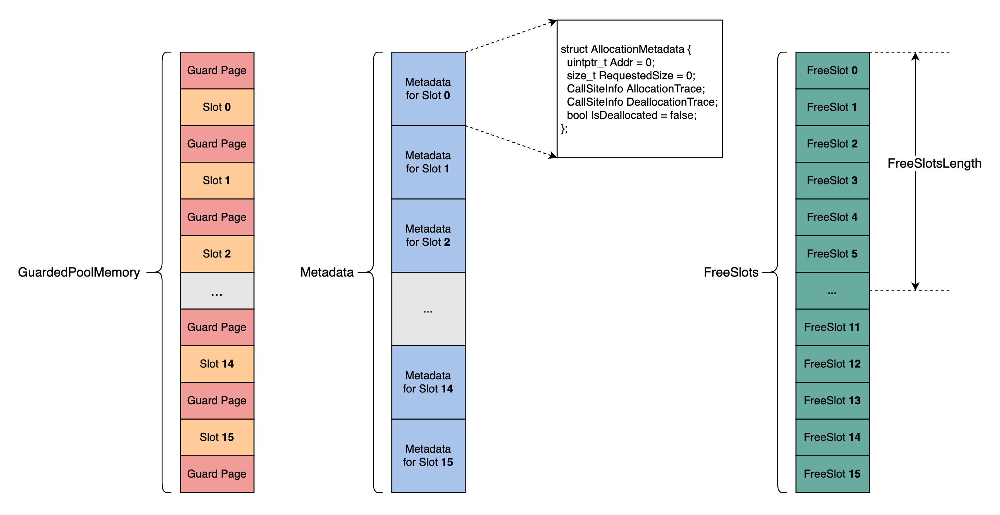
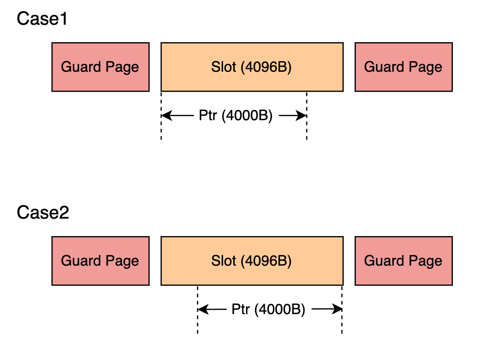
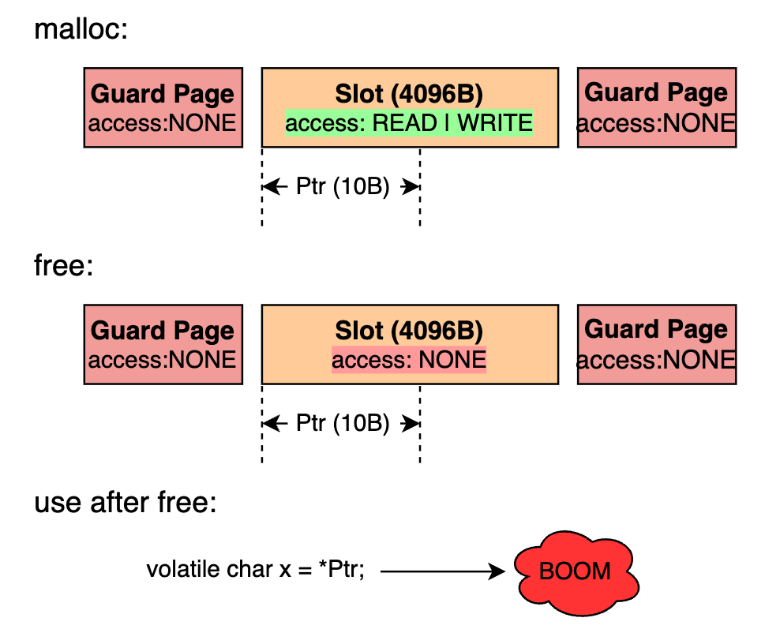

GWP-ASan 原理剖析
=================

序言
----

GWP-ASan
是一个概率性内存错误检测工具，是以内存分配器的方式实现的。概率性是指随机保护某些堆分配，在性能和捕获内存错误之间有一个
tradeoff。

Address sanitizer, thread sanitizer
等由编译时插桩和运行时库两部分组成，需要从源码重新编译程序。而 GWP-ASan
则不需要从源码重新编译，因为 GWP-ASan 是以内存分配器的方式实现的。

GWP-ASan 实际上是有多个实现的：

-  TCMalloc

   -  https://google.github.io/tcmalloc/gwp-asan.html

   -  https://github.com/google/tcmalloc/blob/master/tcmalloc/guarded_page_allocator.h

-  Chromium

   -  https://chromium.googlesource.com/chromium/src/+/lkgr/docs/gwp_asan.md

   -  https://chromium.googlesource.com/chromium/src/+/refs/heads/main/components/gwp_asan/

-  Android

   -  https://developer.android.com/ndk/guides/gwp-asan

-  llvm-project

   -  https://github.com/llvm/llvm-project/tree/main/compiler-rt/lib/gwp_asan

本文 GWP-ASan 原理剖析是基于的 llvm-project 中的 GWP-ASan，llvm-project
版本是
`cef07169ec9f46fd25291a3218cf12bef324ea0c <https://github.com/llvm/llvm-project/commit/cef07169ec9f46fd25291a3218cf12bef324ea0c>`__

了解 GWP-ASan 原理建议先看下
https://sites.google.com/a/chromium.org/dev/Home/chromium-security/articles/gwp-asan
有一个基本的了解。

原理
----

GWP-ASan 的核心数据结构就是上图中的 GuardedPoolMemory, Metadata,
FreeSlots。

-  GuardedPoolMemory

   -  包含 16 个 Slot 和 16+1 个 GuardPage。Slot 和 GuardPage 的大小都是
      PageSize。Slot 的数量可以由参数 MaxSimultaneousAllocations (Number
      of simultaneously-guarded allocations available in the pool.
      Defaults to 16) 通过环境变量进行设置

   -  每一次由 GWP-ASan 分配出去的内存，都是位于在 GuardedPoolMemory
      Slot 中的内存

      -  每一次可分配的内存大小，最大为 PageSize

      -  每一个 Slot 用于一次内存分配后，该 Slot
         不会再用于另外的内存分配，直至这块 chunk
         被释放。假设上一次分配的内存位于 Slot 0
         中，并且分配的内存还没有被释放，就算 Slot 0
         中还有足够的大小可供这一次分配，这一次分配的内存还是会去其他的
         Slot 中分配

-  Metadata

   -  每一个 GuardedPoolMemory Slot 对应 Metadata 中的一个
      AllocationMetadata

   -  Metadata 中记录了 Addr, RequestedSize, AllocationTrace,
      DeallocationTrace, IsDeallocated 的信息

-  FreeSlots

   -  FreeSlot 中记录的是之前分配出去的且当前已经被释放了的
      GuardedPoolMemory Slot Index。如果 GuardedPoolMemory 中的 16 个
      Slot 都已经分配出去过了（注，这 16 个 Slot
      当前有可能已经被释放、也有可能没有释放），此时需要再分配内存时，是随机去
      FreeSlots 选择一个 FreeSlot 对应的 GuardedPoolMemory Slot
      进行分配。如果 FreeSlots 中没有 FreeSlot，则分配失败

   -  FreesSlotsLength 记录的是当前 FreeSlots 的有效长度

-  检测到内存错误立即 Crash

   -  整个 GuardedPoolMemory 是通过 mmap 申请的，初始时都是 PROT_NONE
      权限。只有在将 Slot 的一部分大小分配出去时，才将该 Slot 的权限通过
      mprotect 设置为 PROT_READ \| PROT_WRITE，等到释放这块内存时，又将
      Slot 权限设置为 PROT_NONE

   -  这样一旦有 heap buffer overflow, heap buffer underflow 或者 use
      after free 这样的错误，就会因为没有权限访问而 crash

检测 heap buffer overflow
-------------------------

例子
~~~~

.. code:: cpp

   #include <cstdlib>

   int main() {
     char *Ptr = reinterpret_cast<char *>(malloc(4000));
     volatile char x = *(Ptr + 4016);
     volatile char y = *(Ptr + 4096);
     return 0;
   }

::

   $ clang++ -fsanitize=scudo heap_buffer_overflow.cpp -o heap_buffer_overflow
   $ GWP_ASAN_OPTIONS='SampleRate=1' ./heap_buffer_overflow

注意到上述例子 heap buffer overflow 的例子，有时候能够检测到
``*(Ptr + 4016)`` 这次越界访问，有时候则检测不到 ``*(Ptr + 4016)``
这次越界访问（只检测到了 ``*(Ptr + 4096)`` 的越界访问）。多次运行
./heap_buffer_overflow 会得到两种报告：

-  Case1, Buffer Overflow at 4096 bytes to the right of a 4000-byte
   allocation

   ::

      *** GWP-ASan detected a memory error ***
      Buffer Overflow at 0x7bfff7a41000 (4096 bytes to the right of a 4000-byte allocation at 0x7bfff7a40000) by thread 235485 here:
        #0 heap_buffer_overflow(+0x290b9) [0x55555557d0b9]
        #1 heap_buffer_overflow(+0x293a5) [0x55555557d3a5]
        #2 heap_buffer_overflow(+0x295e9) [0x55555557d5e9]
        #3 /lib/x86_64-linux-gnu/libpthread.so.0(+0x12730) [0x7ffff7ca0730]
        #4 heap_buffer_overflow(main+0x2e) [0x5555555a115e]
        #5 /lib/x86_64-linux-gnu/libc.so.6(__libc_start_main+0xeb) [0x7ffff7aac09b]
        #6 heap_buffer_overflow(_start+0x2a) [0x55555555a53a]

      0x7bfff7a41000 was allocated by thread 235485 here:
        #0 heap_buffer_overflow(+0x290c9) [0x55555557d0c9]
        #1 heap_buffer_overflow(+0x26d25) [0x55555557ad25]
        #2 heap_buffer_overflow(+0x27edb) [0x55555557bedb]
        #3 heap_buffer_overflow(+0x41f82) [0x555555595f82]
        #4 heap_buffer_overflow(main+0x19) [0x5555555a1149]
        #5 /lib/x86_64-linux-gnu/libc.so.6(__libc_start_main+0xeb) [0x7ffff7aac09b]
        #6 heap_buffer_overflow(_start+0x2a) [0x55555555a53a]

      *** End GWP-ASan report ***

-  Case2, Buffer Overflow at 4016 bytes to the right of a 4000-byte
   allocation

   ::

      *** GWP-ASan detected a memory error ***
      Buffer Overflow at 0x7bfff7a41010 (4016 bytes to the right of a 4000-byte allocation at 0x7bfff7a40060) by thread 235483 here:
        #0 heap_buffer_overflow(+0x290b9) [0x55555557d0b9]
        #1 heap_buffer_overflow(+0x293a5) [0x55555557d3a5]
        #2 heap_buffer_overflow(+0x295e9) [0x55555557d5e9]
        #3 /lib/x86_64-linux-gnu/libpthread.so.0(+0x12730) [0x7ffff7ca0730]
        #4 heap_buffer_overflow(main+0x21) [0x5555555a1151]
        #5 /lib/x86_64-linux-gnu/libc.so.6(__libc_start_main+0xeb) [0x7ffff7aac09b]
        #6 heap_buffer_overflow(_start+0x2a) [0x55555555a53a]

      0x7bfff7a41010 was allocated by thread 235483 here:
        #0 heap_buffer_overflow(+0x290c9) [0x55555557d0c9]
        #1 heap_buffer_overflow(+0x26d25) [0x55555557ad25]
        #2 heap_buffer_overflow(+0x27edb) [0x55555557bedb]
        #3 heap_buffer_overflow(+0x41f82) [0x555555595f82]
        #4 heap_buffer_overflow(main+0x19) [0x5555555a1149]
        #5 /lib/x86_64-linux-gnu/libc.so.6(__libc_start_main+0xeb) [0x7ffff7aac09b]
        #6 heap_buffer_overflow(_start+0x2a) [0x55555555a53a]

      *** End GWP-ASan report ***

检测原理
~~~~~~~~

为什么会出现上述现象，原因见下图：

-  GWP-ASan 是对于每一次 allocate 都是随机选择 left-align or right-align
   的

-  对于 case1 来说，返回给用户的 Ptr 地址就是 Slot
   的起始地址，所以当访问 ``*(Ptr + 4016)`` 时，Ptr + 4016 还是在该 Slot
   中，也就是有权限访问的，也就不会 crash，所以检测不到
   ``*(Ptr + 4016)`` 此处溢出。

-  对于 case2 来说，返回给用户的 Ptr 地址就是 SlotEnd - Size，所以当访问
   ``*(Ptr + 4016)`` 时，Ptr + 4016 是位于该 GuardPage
   中的，没有权限访问，故能检测出 ``*(Ptr + 4016)`` 此处溢出。

-  对于 case1 和 case2 来说，都能检测 ``*(Ptr + 4096)``
   到这次溢出，这是因为 case1 和 case2 中，Ptr + 4096 都位于 Guard Page
   中，因此都能检测到这里的溢出。

检测 use after free
-------------------

.. _例子-1:

例子
~~~~

.. code:: cpp

   #include <cstdlib>

   int main() {
     char *Ptr = reinterpret_cast<char *>(malloc(10));

     for (unsigned i = 0; i < 10; ++i) {
       *(Ptr + i) = 0x0;
     }

     free(Ptr);
     volatile char x = *Ptr;
     return 0;
   }

::

   $ clang++ -fsanitize=scudo use_after_free.cpp -o use_after_free
   $ GWP_ASAN_OPTIONS='SampleRate=1' ./use_after_free
   *** GWP-ASan detected a memory error ***
   Use After Free at 0x7b287e319000 (0 bytes into a 10-byte allocation at 0x7b287e319000) by thread 307939 here:
     #0 ./use_after_free(+0x290b9) [0x5603b0fe40b9]
     #1 ./use_after_free(+0x293a5) [0x5603b0fe43a5]
     #2 ./use_after_free(+0x295e9) [0x5603b0fe45e9]
     #3 /lib/x86_64-linux-gnu/libpthread.so.0(+0x12730) [0x7f287e579730]
     #4 ./use_after_free(main+0x54) [0x5603b1008184]
     #5 /lib/x86_64-linux-gnu/libc.so.6(__libc_start_main+0xeb) [0x7f287e38509b]
     #6 ./use_after_free(_start+0x2a) [0x5603b0fc153a]

   0x7b287e319000 was deallocated by thread 307939 here:
     #0 ./use_after_free(+0x290c9) [0x5603b0fe40c9]
     #1 ./use_after_free(+0x26d25) [0x5603b0fe1d25]
     #2 ./use_after_free(+0x280eb) [0x5603b0fe30eb]
     #3 ./use_after_free(+0x44dc4) [0x5603b0fffdc4]
     #4 ./use_after_free(main+0x50) [0x5603b1008180]
     #5 /lib/x86_64-linux-gnu/libc.so.6(__libc_start_main+0xeb) [0x7f287e38509b]
     #6 ./use_after_free(_start+0x2a) [0x5603b0fc153a]

   0x7b287e319000 was allocated by thread 307939 here:
     #0 ./use_after_free(+0x290c9) [0x5603b0fe40c9]
     #1 ./use_after_free(+0x26d25) [0x5603b0fe1d25]
     #2 ./use_after_free(+0x27edb) [0x5603b0fe2edb]
     #3 ./use_after_free(+0x41f82) [0x5603b0ffcf82]
     #4 ./use_after_free(main+0x19) [0x5603b1008149]
     #5 /lib/x86_64-linux-gnu/libc.so.6(__libc_start_main+0xeb) [0x7f287e38509b]
     #6 ./use_after_free(_start+0x2a) [0x5603b0fc153a]

   *** End GWP-ASan report ***

.. _检测原理-1:

检测原理
~~~~~~~~

为什么能检测到此处 use after free，原理见下图：

-  GWP-ASan 在分配内存时，会将分配出去的 chunk 所在的 Slot 的权限通过
   mprotect 设置为 PROT_READ \| PROT_WRITE，等到释放这块内存时，又将
   Slot 权限设置为 PROT_NONE。这样当访问已经释放的内存时会就是 crash

如果仔细思考下，GWP-ASan 检测 use-after-free
是有局限性的，考虑如下代码：

-  第 27 行的 use-after-free 就不会被检测出来，因为 underlying slot
   又被用于分配了

-  第 33 行的 use-after-free 虽然会被检测出来，但是
   allocation/deallocation stack traces 实际上并不匹配，报告中给出的是
   Ptr17 的 allocation/deallocation stack traces

.. code:: cpp

   #include <cstdlib>

   int main() {
     // fill GuardedPoolMemory 16 slots
     char *Ptr1 = reinterpret_cast<char *>(malloc(10));
     char *Ptr2 = reinterpret_cast<char *>(malloc(10));
     char *Ptr3 = reinterpret_cast<char *>(malloc(10));
     char *Ptr4 = reinterpret_cast<char *>(malloc(10));
     char *Ptr5 = reinterpret_cast<char *>(malloc(10));
     char *Ptr6 = reinterpret_cast<char *>(malloc(10));
     char *Ptr7 = reinterpret_cast<char *>(malloc(10));
     char *Ptr8 = reinterpret_cast<char *>(malloc(10));
     char *Ptr9 = reinterpret_cast<char *>(malloc(10));
     char *Ptr10 = reinterpret_cast<char *>(malloc(10));
     char *Ptr11 = reinterpret_cast<char *>(malloc(10));
     char *Ptr12 = reinterpret_cast<char *>(malloc(10));
     char *Ptr13 = reinterpret_cast<char *>(malloc(10));
     char *Ptr14 = reinterpret_cast<char *>(malloc(10));
     char *Ptr15 = reinterpret_cast<char *>(malloc(10));
     char *Ptr16 = reinterpret_cast<char *>(malloc(10));
     // use and free Ptr1
     for (unsigned i = 0; i < 10; ++i) {
       *(Ptr1 + i) = 0x0;
     }
     free(Ptr1);
     // reuse Ptr1's underlying GuardedPoolMemory slot
     char *Ptr17 = reinterpret_cast<char *>(malloc(10));
     // use after free, false negative
     volatile char x = *Ptr1;
     // free Ptr17
     free(Ptr17);
     // use after free, wrong allocation/deallocation stack traces.
     volatile char y = *Ptr1;
     return 0;
   }

::

   *** GWP-ASan detected a memory error ***
   Use After Free at 0x7b7f2fad5ff0 (0 bytes into a 10-byte allocation at 0x7b7f2fad5ff0) by thread 1005136 here:
     #0 ./use_after_free_dumb(+0x30c26) [0x55cc332dac26]
     #1 ./use_after_free_dumb(+0x31107) [0x55cc332db107]
     #2 ./use_after_free_dumb(+0x30e37) [0x55cc332dae37]
     #3 /lib/x86_64-linux-gnu/libpthread.so.0(+0x12730) [0x7f7f2fd1a730]
     #4 ./use_after_free_dumb(main+0x168) use_after_free_dumb.cpp:33:21  [0x55cc332ef3c8]
     #5 /lib/x86_64-linux-gnu/libc.so.6(__libc_start_main+0xeb) [0x7f7f2fb4009b]
     #6 ./use_after_free_dumb(_start+0x2a) [0x55cc332c68da]

   0x7b7f2fad5ff0 was deallocated by thread 1005136 here:
     #0 ./use_after_free_dumb(+0x30c26) [0x55cc332dac26]
     #1 ./use_after_free_dumb(+0x2fbb4) [0x55cc332d9bb4]
     #2 ./use_after_free_dumb(+0x306d2) [0x55cc332da6d2]
     #3 ./use_after_free_dumb(main+0x162) use_after_free_dumb.cpp:31:3 [0x55cc332ef3c2]
     #4 /lib/x86_64-linux-gnu/libc.so.6(__libc_start_main+0xeb) [0x7f7f2fb4009b]
     #5 ./use_after_free_dumb(_start+0x2a) [0x55cc332c68da]

   0x7b7f2fad5ff0 was allocated by thread 1005136 here:
     #0 ./use_after_free_dumb(+0x30c26) [0x55cc332dac26]
     #1 ./use_after_free_dumb(+0x2fbb4) [0x55cc332d9bb4]
     #2 ./use_after_free_dumb(+0x30547) [0x55cc332da547]
     #3 ./use_after_free_dumb(+0x3ee02) [0x55cc332e8e02]
     #4 ./use_after_free_dumb(+0x3e935) [0x55cc332e8935]
     #5 ./use_after_free_dumb(main+0x143) use_after_free_dumb.cpp:27:9 [0x55cc332ef3a3]
     #6 /lib/x86_64-linux-gnu/libc.so.6(__libc_start_main+0xeb) [0x7f7f2fb4009b]
     #7 ./use_after_free_dumb(_start+0x2a) [0x55cc332c68da]

   *** End GWP-ASan report ***

GWP-ASan 与 ASan 的对比
-----------------------

1. ASan 能检测栈、堆、全局变量的内存错误，而 GWP-ASan
   只能检测堆上的内存错误，并且 GWP-ASan 的内存错误检测能力是概率性的
   (probabilistic)
2. ASan 的额外性能开销和内存开销远高于 GWP-ASan，ASan 通常会增加 2-3
   倍的性能和内存开销，而 GWP-ASan
   的额外开销则基本可以忽略不计。这是这样 GWP-ASan
   可以在生产环境/版本中使用，比如 GWP-ASan 在 Chrome
   浏览器中发现了很多内存错误
3. GWP-ASan 发现的错误中大约有 90% 都是 use-after-frees，剩下的则是
   out-of-bounds reads and writes

总结
----

实际上 GWP-ASan 的原理非常简单，很早以前就在
`ElectricFence <https://en.wikipedia.org/wiki/Electric_Fence>`__ or
`PageHeap <https://docs.microsoft.com/en-us/windows-hardware/drivers/debugger/gflags-and-pageheap>`__
中就有所应用。而这种通过概率采样的方式去处理问题的思路还是非常有意思的，虽然采样的方式会牺牲一定的准确性与能力，但是另一方面就可以在基本不影响应用的环境下去发现问题。不止是
GWP-ASan，AutoFDO
也是通过随机采样而不是程序插桩的方式，在不影响原本程序性能的情况下，收集程序运行时信息指导反馈编译时优化。
