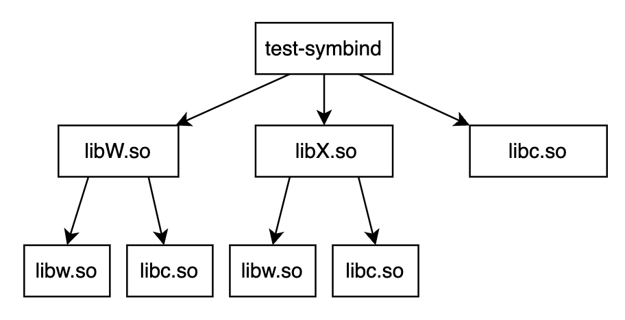

How Sanitizer Interceptor Works
===============================

我们在前面的文章中提到，所有的 Sanitizer 都由编译时插桩 (compile-time
instrumentation) 和运行时库 (run-time library) 两部分组成。

那么 sanitizer 的运行时库中做了哪些事情呢？

以 ASan 为例：

-  ASan
   编译时会在每一处内存读写语句之前插入代码，根据每一次访问的内存所对应的影子内存
   ( shadow
   memory，就是使用额外的内存记录常规内存的状态）的状态来检测本次内存访问是否合法。还会在栈变量和全局变量附近申请额外内存作为危险区用于检测内存溢出。

-  ASan 运行时库中最主要的就是替换了 malloc/free, new/delete
   的实现，这样应用程序的内存分配都由 ASan 实现的内存分配器负责。ASan
   内存分配器会在它分配的堆内存附近申请额外内存用于检测堆内存溢出，还会将被释放的内存优先放在隔离区
   (quarantine) 用于检测像 heap-use-after-free, double-free
   这样的堆内存错误。

ASan 运行时库中实际上不止替换了 malloc/free, new/delete
的函数实现，还替换了非常多的库函数的实现，如：memcpy, memmove, strcpy,
strcat, pthread_create 等。

那么 sanitizer 是如何做到替换 malloc, free, memcpy
这些函数实现的呢？答案就是 sanitizer 中的 interceptor 机制。

本文以 ASan 为例，分析在 Linux x86_64 环境下 sanitizer interceptor
的实现原理。

Symbol interposition
--------------------

在讲解 sanitizer interceptor
的实现原理之前，我们先来了解一下前置知识：symbol interposition。

首先我们考虑这样一个问题：如何在我们的应用程序中替换 libc 的 malloc
实现为我们自己实现的版本？

1. 一个最简单的方式就是在我们的应用程序中定义一个同名的 malloc 函数

2. 还有一种方式就是将我们的 malloc 函数实现在 libmymalloc.so
   中，然后在运行我们的应用程序之前设置环境变量
   ``LD_PRELOAD=/path/to/libmymalloc.so``

那么为什么上述两种方式能生效呢？答案是 symbol interposition。

`ELF
specfication <http://www.sco.com/developers/gabi/latest/contents.html>`__
在第五章 Program Loading and Dynamic Linking 中提到：

   When resolving symbolic references, the dynamic linker examines the
   symbol tables with a breadth-first search. That is, it first looks at
   the symbol table of the executable program itself, then at the symbol
   tables of the ``DT_NEEDED`` entries (in order), and then at the
   second level ``DT_NEEDED`` entries, and so on.

动态链接器 (dynamic linker/loader) 在符号引用绑定 (binding symbol
references) 时，以一种广度优先搜索的顺序来查找符号：executable,
needed0.so, needed1.so, needed2.so, needed0_of_needed0.so,
needed1_of_needed0.so, …

如果设置了 LD_PRELOAD，那么查找符号的顺序会变为：executable,
preload0.so, preload1.so needed0.so, needed1.so, needed2.so,
needed0_of_needed0.so, needed1_of_needed0.so, …

如果一个符号在多个组件（executable 或 shared
object）中都存在定义，那么动态链接器会选择它所看到的第一个定义。

我们通过一个例子来理解该过程：

.. code:: cpp

   $ cat main.c
   extern int W(), X();

   int main() { return (W() + X()); }

   $ cat W.c
   extern int b();

   int a() { return (1); }
   int W() { return (a() - b()); }

   $ cat w.c
   int b() { return (2); }

   $ cat X.c
   extern int b();

   int a() { return (3); }
   int X() { return (a() - b()); }

   $ cat x.c
   int b() { return (4); }

   $ gcc -o libw.so -shared w.c
   $ gcc -o libW.so -shared W.c -L. -lw -Wl,-rpath=.
   $ gcc -o libx.so -shared x.c
   $ gcc -o libX.so -shared X.c -L. -lx -Wl,-rpath=.
   $ gcc -o test-symbind main.c -L. -lW -lX -Wl,-rpath=.

该例子中可执行文件与动态库之间的依赖关系如下图所示：

按照我们前面所说，本例中动态链接器在进行符号引用绑定时，是按照广度优先搜索的顺序，即：test-symbind,
libW.so, libX.so, libc.so, libw.so, libx.so 的顺序查找符号定义的。

动态链接器提供了环境变量 LD_DEBUG
来输出一些调试信息，我们可以通过设置环境变量 LD_DEBUG=“symbols:bindings”
看下 test-symbind 的 symbol binding 的过程：

::

   $ LD_DEBUG="symbols:bindings" ./test-symbind
      1884890:        symbol=a;  lookup in file=./test-symbind [0]
      1884890:        symbol=a;  lookup in file=./libW.so [0]
      1884890:        binding file ./libW.so [0] to ./libW.so [0]: normal symbol `a'
      1884890:        symbol=b;  lookup in file=./test-symbind [0]
      1884890:        symbol=b;  lookup in file=./libW.so [0]
      1884890:        symbol=b;  lookup in file=./libX.so [0]
      1884890:        symbol=b;  lookup in file=/lib/x86_64-linux-gnu/libc.so.6 [0]
      1884890:        symbol=b;  lookup in file=./libw.so [0]
      1884890:        binding file ./libW.so [0] to ./libw.so [0]: normal symbol `b'
      1884890:        symbol=a;  lookup in file=./test-symbind [0]
      1884890:        symbol=a;  lookup in file=./libW.so [0]
      1884890:        binding file ./libX.so [0] to ./libW.so [0]: normal symbol `a'
      1884890:        symbol=b;  lookup in file=./test-symbind [0]
      1884890:        symbol=b;  lookup in file=./libW.so [0]
      1884890:        symbol=b;  lookup in file=./libX.so [0]
      1884890:        symbol=b;  lookup in file=/lib/x86_64-linux-gnu/libc.so.6 [0]
      1884890:        symbol=b;  lookup in file=./libw.so [0]
      1884890:        binding file ./libX.so [0] to ./libw.so [0]: normal symbol `b'

-  函数 a 在 libW.so 和 libX.so 中都有一份定义，但因为是按照
   test-symbind, libW.so, libX.so, libc.so, libw.so, libx.so
   的顺序查找符号定义的，所以最终所有对函数 a 的引用都绑定到 libW.so
   中函数 a 的实现

-  函数 b 在 libw.so 和 libx.so 中都有一份定义，但因为是按照
   test-symbind, libW.so, libX.so, libc.so, libw.so, libx.so
   的顺序查找符号定义的，所以最终所有对函数 b 的引用都绑定到 libw.so
   中函数 b 的实现

--------------

这样我们就理解为什么上述两种替换 malloc 的方式能生效了：

-  方式一：在我们的应用程序中定义一个同名的 malloc
   函数。动态链接器在查找符号时 executable 的顺序在 libc.so
   之前，因此所有对 malloc 的引用都会绑定到 executable 中 malloc
   的实现。

-  方式二：将我们的 malloc 函数实现在 libmymalloc.so
   中，然后在运行我们的应用程序之前设置环境变量
   LD_PRELOAD=/path/to/libmymalloc.so。动态链接器在查找符号时
   libmymalloc.so 的顺序在 libc.so 之前，因此所有对 malloc
   的引用都会绑定到 libmymalloc.so 中 malloc 的实现。

--------------

实际上 sanitizer 对于 malloc/free 等库函数的替换正是利用了 symbol
interposition 这一特性。下面我们以 ASan 为例来验证一下。

考虑如下代码：

.. code:: cpp

   // test.cpp
   #include <iostream>
   int main() {
       std::cout << "Hello AddressSanitizer!\n";
   }

我们首先看下 GCC 的行为。

使用 GCC 开启 ASan 编译 test.cpp
，\ ``g++ -fsanitize=address test.cpp -o test-gcc-asan`` 得到编译产物
test-gcc-asan。因为 GCC 默认会\ **动态链接** ASan
运行时库，所以我们可以使用 ``objdump -p test-gcc-asan | grep NEEDED``
查看 test-gcc-asan 依赖的动态库 (shared objects)：

::

   $ objdump -p test-gcc-asan | grep NEEDED
     NEEDED               libasan.so.5
     NEEDED               libstdc++.so.6
     NEEDED               libm.so.6
     NEEDED               libgcc_s.so.1
     NEEDED               libc.so.6

可以清楚的看到在 test-gcc-asan 依赖的动态库中 libasan.so 的顺序是在
libc.so 之前的。实际上链接时参数 ``-fsanitize=address`` 会使得
libasan.so 成为程序的第一个依赖库。

然后我们再通过环境变量 LD_DEBUG 看下 test-gcc-asan 的 symbol bindding
的过程：

::

   $ LD_DEBUG="bindings" ./test-gcc-asan
      3309213:        binding file /lib/x86_64-linux-gnu/libc.so.6 [0] to /usr/lib/x86_64-linux-gnu/libasan.so.5 [0]: normal symbol `malloc' [GLIBC_2.2.5]
      3309213:        binding file /lib64/ld-linux-x86-64.so.2 [0] to /usr/lib/x86_64-linux-gnu/libasan.so.5 [0]: normal symbol `malloc' [GLIBC_2.2.5]
      3309213:        binding file /usr/lib/x86_64-linux-gnu/libstdc++.so.6 [0] to /usr/lib/x86_64-linux-gnu/libasan.so.5 [0]: normal symbol `malloc' [GLIBC_2.2.5]

可以看到动态链接器将 libc.so, ld-linux-x86-64.so 和 libstdc++.so 中对
malloc 的引用都绑定到了 libasan.so 中的 malloc 实现。

--------------

下面我们看下 Clang，因为 Clang 默认是\ **静态链接** ASan
运行时库，所以我们就不看 test-clang-asan 所依赖的动态库了，直接看 symbol
binding 的过程：

::

   $ clang++ -fsanitize=address test.cpp -o test-clang-asan
   $ LD_DEBUG="bindings" ./test-clang-asan
      3313022:        binding file /lib/x86_64-linux-gnu/libc.so.6 [0] to ./test-clang-asan [0]: normal symbol `malloc' [GLIBC_2.2.5]
      3313022:        binding file /lib64/ld-linux-x86-64.so.2 [0] to ./test-clang-asan [0]: normal symbol `malloc' [GLIBC_2.2.5]
      3313022:        binding file /usr/lib/x86_64-linux-gnu/libstdc++.so.6 [0] to ./test-clang-asan [0]: normal symbol `malloc' [GLIBC_2.2.5]

同样可以看到动态链接器将 libc.so, ld-linux-x86-64.so.2 和 libstdc++.so
中对 malloc 的引用都绑定到了 test-clang-asan 中的 malloc 实现（因为 ASan
运行时库 中实现了 malloc，并且 clang 将 ASan 运行时库静态链接到
test-clang-asan 中）。

Sanitizer interceptor
---------------------

下面我们来在源码的角度，学习下 sanitizer interceptor 的实现。

阅读学习 LLVM 代码的一个非常有效的方式就是结合对应的测试代码来学习。

Sanitizer interceptor 存在一个测试文件
interception_linux_test.cpp，\ `llvm-project/interception_linux_test.cpp
at main · llvm/llvm-project ·
GitHub <https://github.com/llvm/llvm-project/blob/main/compiler-rt/lib/interception/tests/interception_linux_test.cpp>`__

.. code:: cpp

   #include "interception/interception.h"
   #include "gtest/gtest.h"

   static int InterceptorFunctionCalled;

   DECLARE_REAL(int, isdigit, int);

   INTERCEPTOR(int, isdigit, int d) {
     ++InterceptorFunctionCalled;
     return d >= '0' && d <= '9';
   }

   namespace __interception {

   TEST(Interception, Basic) {
     EXPECT_TRUE(INTERCEPT_FUNCTION(isdigit));

     // After interception, the counter should be incremented.
     InterceptorFunctionCalled = 0;
     EXPECT_NE(0, isdigit('1'));
     EXPECT_EQ(1, InterceptorFunctionCalled);
     EXPECT_EQ(0, isdigit('a'));
     EXPECT_EQ(2, InterceptorFunctionCalled);

     // Calling the REAL function should not affect the counter.
     InterceptorFunctionCalled = 0;
     EXPECT_NE(0, REAL(isdigit)('1'));
     EXPECT_EQ(0, REAL(isdigit)('a'));
     EXPECT_EQ(0, InterceptorFunctionCalled);
   }

   }  // namespace __interception

这段测试代码基于 sanitizer 的 interceptor 机制替换了 ``isdigit``
函数的实现，在我们实现的 ``isdigit`` 函数中，每次 ``isdigit``
函数被调用时都将变量 ``InterceptorFunctionCalled`` 自增
1。然后通过检验变量 ``InterceptorFunctionCalled`` 的值来测试 interceptor
机制的实现是否正确，通过 ``REAL(isdigit)`` 来调用真正的 ``isdigit``
函数实现。

上述测试文件 interception_linux_test.cpp 中实现替换 ``isdigit``
函数的核心部分是如下代码片段：

.. code:: cpp

   INTERCEPTOR(int, isdigit, int d) {
     ++InterceptorFunctionCalled;
     return d >= '0' && d <= '9';
   }

   INTERCEPT_FUNCTION(isdigit);

   DECLARE_REAL(int, isdigit, int);
   REAL(isdigit)('1');

-  ``INTERCEPTOR(int, isdigit, int d) { ... }`` 用于将函数 ``isdigit``
   的实现替换为 { … } 的实现

-  在代码中调用 ``isdigit`` 之前，需要先调用
   ``INTERCEPT_FUNCTION(isdigit)``\ 。如果
   ``INTERCEPT_FUNCTION(isdigit)`` 返回为 true，则说明成功替换了将 libc
   中 ``isdigit`` 函数的实现。

-  ``REAL(isdigit)('1')`` 用于调用真正的 ``isdigit`` 实现，不过在调用
   ``REAL(isdigit)('1')`` 之前需要先
   ``DECLARE_REAL(int, isdigit, int)``\ 。

这部分代码在宏展开后的内容如下：

.. code:: cpp

   // INTERCEPTOR(int, isdigit, int d) 宏展开
   typedef int (*isdigit_type)(int d);
   namespace __interception { isdigit_type real_isdigit; } 
   extern "C" int isdigit(int d) __attribute__((weak, alias("__interceptor_isdigit"), visibility("default")));
   extern "C" __attribute__((visibility("default"))) int __interceptor_isdigit(int d) {
     ++InterceptorFunctionCalled;
     return d >= '0' && d <= '9';
   }

   // INTERCEPT_FUNCTION(isdigit) 宏展开
   ::__interception::InterceptFunction(
       "isdigit",
       (::__interception::uptr *) & __interception::real_isdigit,
       (::__interception::uptr) & (isdigit),
       (::__interception::uptr) & __interceptor_isdigit);

   // DECLARE_REAL(int, isdigit, int) 宏展开
   typedef int (*isdigit_type)(int);
   namespace __interception { extern isdigit_type real_isdigit; };

   // REAL(isdigit)('1') 宏展开
   __interception::real_isdigit('1');

-  我们首先看下 INTERCEPTOR 宏做了哪些事情

   -  首先在 \__interception namespace 中定义了一个函数指针
      real_isdigit，该函数指针实际上后续会被设置为指向真正的 ``isdigit``
      函数地址。

   -  然后将 ``isdigit`` 函数设置为 weak，并且将 ``isdigit`` 设置成
      ``__interceptor_isdigit`` 的 alias 别名

   -  最后将我们自己版本的 ``isdigit`` 函数逻辑实现在
      ``__interceptor_isdigit`` 函数中

   根据 symbol interposition 这一节的内容，我们知道：要想替换 libc.so 中
   某个函数的实现（不妨把该函数称作 ``foo``\ ），只需要在 sanitizer
   runtime library 中定义同名 ``foo`` 函数，然后让 dynamic loader
   在查找符号时 sanitizer runtime library 的顺序先于 libc.so 即可。

   那为什么这里要将我们的 ``isdigit`` 函数逻辑实现在函数
   ``__interceptor_isdigit`` 中，并且将 ``isdigit`` 设置成
   ``__interceptor_isdigit`` 的 alias 别名呢？

   考虑如下场景：假设用户代码中也替换了 ``isdigit``
   函数的实现，添加了自己的逻辑，那么最终 dynamic loader
   选择的是用户代码中的 ``isdigit`` 的实现，而不是 sanitizer runtime
   library 中的 ``isdigit`` 的实现，这样的话 sanitizer
   的功能就不能正常工作了。（实际上 sanitizer runtime library
   中并没有替换 ``isdigit`` 的实现，这里只是用 ``isdigit``
   举例子便于说明）。

   但是如果我们在 sanitizer runtime library 中将 ``isdigit`` 设置成
   ``__interceptor_isdigit`` 的 alias 别名，那么在用户代码中自己替换
   ``isdigit`` 实现时就可以显示调用 ``__interceptor_isdigit``
   了。这样既不影响用户自行替换库函数，也不影响 sanitizer 功能的正确运行
   ：

   .. code:: cpp

      extern "C" int __interceptor_isdigit(int d);
      extern "C" int isdigit(int d) {
        fprintf(stderr, "my_isdigit_interceptor\n");
        return __interceptor_isdigit(d);
      }

   那在 sanitizer runtime library 中为什么将被替换的函数设置为 weak 呢？

   这是因为如果不设置为 weak ，在静态链接 sanitizer runtime library
   时就会因为 multiple definition 而链接失败。

-  接着我们看下 INTERCEPT_FUNCTION 宏做了哪些事情

   INTERCEPT_FUNCTION 宏展开后就是对 \__interception::InterceptFunction
   函数的调用。\ ``InterceptFunction`` 函数的定义在
   https://github.com/llvm/llvm-project/blob/main/compiler-rt/lib/interception/interception_linux.cpp：

   .. code:: cpp

      namespace __interception {
      static void *GetFuncAddr(const char *name, uptr wrapper_addr) {
        void *addr = dlsym(RTLD_NEXT, name);
        if (!addr) {
          // If the lookup using RTLD_NEXT failed, the sanitizer runtime library is
          // later in the library search order than the DSO that we are trying to
          // intercept, which means that we cannot intercept this function. We still
          // want the address of the real definition, though, so look it up using
          // RTLD_DEFAULT.
          addr = dlsym(RTLD_DEFAULT, name);

          // In case `name' is not loaded, dlsym ends up finding the actual wrapper.
          // We don't want to intercept the wrapper and have it point to itself.
          if ((uptr)addr == wrapper_addr)
            addr = nullptr;
        }
        return addr;
      }

      bool InterceptFunction(const char *name, uptr *ptr_to_real, uptr func,
                             uptr wrapper) {
        void *addr = GetFuncAddr(name, wrapper);
        *ptr_to_real = (uptr)addr;
        return addr && (func == wrapper);
      }
      }  // namespace __interception

   其实 ``InterceptFunction`` 函数的实现很简单：首先通过函数
   ``GetFuncAddr`` 获得原本的名为 name
   的函数地址，然后将该地址保存至指针 ``ptr_to_real`` 指向的内存。

   函数 ``GetFuncAddr`` 的代码实现也很简单，核心就是
   `dlsym <https://man7.org/linux/man-pages/man3/dlsym.3.html>`__\ ：

   ::

      RTLD_DEFAULT
          Find the first occurrence of the desired symbol using the
          default shared object search order.  The search will
          include global symbols in the executable and its
          dependencies, as well as symbols in shared objects that
          were dynamically loaded with the RTLD_GLOBAL flag.

      RTLD_NEXT
          Find the next occurrence of the desired symbol in the
          search order after the current object.  This allows one to
          provide a wrapper around a function in another shared
          object, so that, for example, the definition of a function
          in a preloaded shared object (see LD_PRELOAD in ld.so(8))
          can find and invoke the "real" function provided in
          another shared object (or for that matter, the "next"
          definition of the function in cases where there are
          multiple layers of preloading).

   这也是为什么在函数 ``GetFuncAddr`` 中，先用
   ``dlsym(RTLD_NEXT, name)`` 去寻找被 intercepted 函数的真实地址，因为
   sanitizer runtime library 是先于 name 函数真正所在的 shared object。

-  最后我们看下 DECLARE_REAL 宏 和 REAL 宏做了哪些事情

   DECLARE_REAL 展开后就是声明了在 \__interception namespace
   中存在一个指向被替换函数真正实现的函数指针，REAL
   宏就是通过这个函数指针来调用被替换函数的真正实现。

   例如，在测试用例中，\ ``DECLARE_REAL(int, isdigit, int);`` 就是在声明
   \__interception namespace 中存在一个函数指针
   ``real_isdigit``\ ，该函数指针指向真正的 ``isdigit`` 函数地址，通过
   ``REAL(isdigit)`` 来调用真正的 ``isdigit`` 函数。

P.S.
----

``__attribute__((alias))`` 很有意思：

   Where a function is defined in the current translation unit, the
   alias call is replaced by a call to the function, and the alias is
   emitted alongside the original name. Where a function is not defined
   in the current translation unit, the alias call is replaced by a call
   to the real function. Where a function is defined as static, the
   function name is replaced by the alias name and the function is
   declared external if the alias name is declared external.

在 ASan runtime library 中 malloc 是 weak 符号，并且 malloc 和
\__interceptor_malloc 实际指向同一个地址。

也就是说
``extern "C" void *malloc(size_t size) __attribute__((weak, alias("__interceptor_malloc"), visibility("default")));``
使得在 ASan runtime library 中造了一个弱符号 malloc，然后指向的和
\__interceptor_malloc 是同一个地址。

::

   $ readelf -sW --dyn-syms $(clang -print-file-name=libclang_rt.asan-x86_64.a) | grep malloc
     ...
     99: 0000000000001150   606 FUNC    GLOBAL DEFAULT    3 __interceptor_malloc
     102: 0000000000001150   606 FUNC    WEAK   DEFAULT    3 malloc

   $ readelf -sW --dyn-syms $(clang -print-file-name=libclang_rt.asan-x86_64.so) | grep malloc
     ...
     3008: 00000000000fd600   606 FUNC    WEAK   DEFAULT   12 malloc
     4519: 00000000000fd600   606 FUNC    GLOBAL DEFAULT   12 __interceptor_malloc

P.S.2
-----

熟悉在 Linux 下 sanitizer interceptor 机制的底层原理后，就很容易明白使用
sanitizer 时遇到的一些问题或坑为什么会是这样的。例如：

-  `Address Sanitizer fails to intercept function in shared library
   opened with RTLD_DEEPBIND · Issue #611 · google/sanitizers ·
   GitHub <https://github.com/google/sanitizers/issues/611>`__

-  `ASan runtime does not come first in initial library list; you should
   either link runtime to your application or manually preload it with
   LD_PRELOAD. · Issue #796 · google/sanitizers ·
   GitHub <https://github.com/google/sanitizers/issues/796>`__

-  `address sanitizer - Is it okay if ASAN runtime loaded as second
   library? - Stack
   Overflow <https://stackoverflow.com/questions/66971217/is-it-okay-if-asan-runtime-loaded-as-second-library>`__

References
----------

1. `ELF interposition and -Bsymbolic \|
   MaskRay <https://maskray.me/blog/2021-05-16-elf-interposition-and-bsymbolic>`__

2. `dlsym(3) - Linux manual pagedlsym(3) - Linux manual
   page <https://man7.org/linux/man-pages/man3/dlsym.3.html>`__

3. `asan/tsan: weak interceptors · llvm/llvm-project@7fb7330 ·
   GitHub <https://github.com/llvm/llvm-project/commit/7fb7330469af52ae1313b2b47c273e62c61a4dd5>`__
