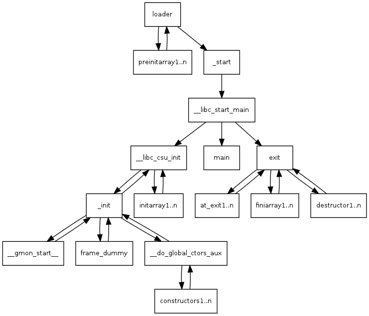

# How Sanitizer Runtime Initialized

本文分析了 sanitizer runtime 是如何做到在程序启动之前进行初始化的。

## What is a sanitizer?

Sanitizers 是由 Google 开源的动态代码分析工具，包括：

- AddressSanitizer (ASan)

- LeakSanitizer (LSan)

- ThreadSanitizer (TSan)

- UndefinedBehaviorSanitizer (UBSsan)

- MemorySanitizer (MSan)

所有的 Sanitizer 都由编译时插桩和运行时库两部分组成，Sanitizer 自 Clang 3.1 和 GCC 4.8 开始被集成在 Clang 和 GCC 中。

## Sanitizer runtime

我们先以 ASan 为例，简单看下 ASan runtime library 做了哪些事情。

ASan runtime 做的最主要的事情就是替换了 malloc/free, new/delete 的实现。这样应用程序的内存分配都由 ASan 实现的 allocator 来做，就能检测像 heap-use-after-free, double-free 这样的堆错误了。

程序在启用 ASan 后，virtual address space 会被分成 main application memory 和 shadow memory 两部分：

```cpp
// Typical shadow mapping on Linux/x86_64 with SHADOW_OFFSET == 0x00007fff8000:
// || `[0x10007fff8000, 0x7fffffffffff]` || HighMem    ||
// || `[0x02008fff7000, 0x10007fff7fff]` || HighShadow ||
// || `[0x00008fff7000, 0x02008fff6fff]` || ShadowGap  ||
// || `[0x00007fff8000, 0x00008fff6fff]` || LowShadow  ||
// || `[0x000000000000, 0x00007fff7fff]` || LowMem     ||
```

那么 ASan shadow memory 是什么时候初始化的？答：在程序启动之前 sanitizer runtime 初始化时做的。

另外，在使用 ASan 时，我们可以通过环境变量 ASAN_OPTIONS 来设置一些运行时参数，如：

- log_path，指定 sanitizer 的报告输出的位置

- detect_stack_use_after_return，是否检测 stack-use-after-return 类型的 bug

- alloc_dealloc_mismatch，是否检测 alloc-dealloc-mismatch 类型的 bug

- ...

那么这些通过 ASAN_OPTIONS 设置的运行时参数又是在什么时候被解析生效的呢？答：也是在程序启动之前在 sanitizer runtime 初始化时做的。

---

ASan runtime 初始化的入口函数是 `__asan_init`（感兴趣的话，可以仔细阅读下代码，本文不做此做详细的分析了。我这里截取了与 runtime flags 和 shadow memory 初始化相关的函数）。

```cpp
// compiler-rt/lib/asan/asan_rtl.cpp

void __asan_init() {
  AsanActivate();
  AsanInitInternal();
}

static void AsanInitInternal() {
  ...
  // Initialize flags. This must be done early, because most of the
  // initialization steps look at flags().
  InitializeFlags();
  ...
  // Set up the shadow memory.
  InitializeShadowMemory();
  ...
}
```

那 sanitizer runtime 是怎么做到在程序启动之前执行初始化的相关代码的呢？一言以蔽之： `.init_array`。下面我们详细看下是怎么实现的。

## Instrumentation

首先看下 ASan 插装代码中与 sanitizer runtime 初始化相关的实现。

ASan 插装部分的代码实现位于 llvm/lib/Transforms/Instrumentation/AddressSanitizer.cpp。有如下代码片段（简化并省略部分代码）：

```cpp
// llvm/lib/Transforms/Instrumentation/AddressSanitizer.cpp

const char kAsanInitName[] = "__asan_init";
const char kAsanModuleCtorName[] = "asan.module_ctor";

bool ModuleAddressSanitizer::instrumentModule(Module &M) {
  // ...
  // Create a module constructor.
  std::string AsanVersion = std::to_string(GetAsanVersion(M));
  std::string VersionCheckName =
      ClInsertVersionCheck ? (kAsanVersionCheckNamePrefix + AsanVersion) : "";
  std::tie(AsanCtorFunction, std::ignore) =
      createSanitizerCtorAndInitFunctions(M, kAsanModuleCtorName,
                                            kAsanInitName, /*InitArgTypes=*/{},
                                            /*InitArgs=*/{}, VersionCheckName);
  // ...
  const uint64_t Priority = GetCtorAndDtorPriority(TargetTriple);
  appendToGlobalCtors(M, AsanCtorFunction, Priority);

  return true;
}
```

`ModuleAddressSanitizer::instrumentModule(Module &M)` 的实现很简单：

1. 先调用 `createSanitizerCtorAndInitFunctions` 创建了一个名为 `kAsanModuleCtorName` 的函数，该函数的函数体很简单，就是对 `kAsanInitName` 函数和 `VersionCheckName` 函数的调用，其中因为 `kAsanInitName` 函数没有任何的参数，所以 `InitArgTypes` 和 `InitArgs` 都是空。

2. 然后通过调用 `appendToGlobalCtors` 将通过 `createSanitizerCtorAndInitFunctions` 创建的函数，添加至 GlobalCtors 中。

可能上述描述的还是不够清晰，下面结合一个例子来进一步说明。

考虑如下代码：

```cpp
int main(int argc, char **argv) {
  int *array = new int[100];
  delete [] array;
  return array[argc];  // BOOM
}
```

通过 [Compiler Explorer](https://godbolt.org/z/KxesEK3Wf) 能很方便看到开启 ASan 后（-fsanitize=address）生成的 LLVM IR 是什么样（这里只截取了部分我们关注的 LLVM IR）：

```llvm
@llvm.global_ctors = appending global [1 x { i32, void ()*, i8* }] [{ i32, void ()*, i8* } { i32 1, void ()* @asan.module_ctor, i8* null }]

declare void @__asan_init()

declare void @__asan_version_mismatch_check_v8()

define internal void @asan.module_ctor() {
  call void @__asan_init()
  call void @__asan_version_mismatch_check_v8()
  ret void
}
```

开启 ASan 后，能明显的看到多了一个函数 `asan.module_ctor`，多了一个全局变量 `@llvm.global_ctors`。它们分别由 ASan 插装函数 `ModuleAddressSanitizer::instrumentModule(Module &M)` 调用 `createSanitizerCtorAndInitFunctions` 和 `appendToGlobalCtors` 创建的。

`asan.module_ctor` 函数体由两个函数调用组成：

- `call void @__asan_init()`

- `call void @__asan_version_mismatch_check_v8()`

函数 `__asan_init` 是在 runtime libraray 中实现的，其代码实现我们前面已经给出了；函数 `__asan_version_mismatch_check_v8` 也是在 runtime libaray 中实现的，顾名思义就是用于检测 asan instrumentation 和 runtime library 的版本是否匹配。

然后 `@llvm.global_ctors` 中包含了函数 `asan.module_ctor` 的指针。

那么 `@llvm.global_ctors` 是什么、是怎么实现的？

根据 https://llvm.org/docs/LangRef.html#the-llvm-global-ctors-global-variable ：

> The `@llvm.global_ctors` array contains a list of constructor functions, priorities, and an associated global or function. The functions referenced by this array will be called in ascending order of priority (i.e. lowest first) when the module is loaded. The order of functions with the same priority is not defined.
> 
> If the third field is non-null, and points to a global variable or function, the initializer function will only run if the associated data from the current module is not discarded. On ELF the referenced global variable or function must be in a comdat.

即 `@llvm.global_ctors` 是一个数组，包含了一些 constructor functions。这些 constructor functions 会按照 priority 升序在 module 被加载时被调用。

但是 llvm 文档中并没有说 `@llvm.global_ctors` 是如何做到 “constructor functions 在 module 被加载时被调用“ 的。

## .init_array

实际上 LLVM IR 中的 `@llvm.global_ctors` 在生成汇编代码时，对应的是 `.init_array`。

我们还是通过前面用到的示例代码来说明：

```cpp
int main(int argc, char **argv) {
  int *array = new int[100];
  delete [] array;
  return array[argc];  // BOOM
}
```

通过 `clang++ -fsanitize=address test.cpp -S` 可以得到开启 ASan 后生成的汇编代码（我们这里省略了 main 函数的汇编代码）：

```
    .section    .text.asan.module_ctor,"axR",@progbits
    .p2align    4, 0x90    # -- Begin function asan.module_ctor
    .type    asan.module_ctor,@function
asan.module_ctor:    # @asan.module_ctor
    pushq    %rbp
    movq    %rsp, %rbp
    callq    __asan_init@PLT
    callq    __asan_version_mismatch_check_v8@PLT
    popq    %rbp
    retq

    .section    .init_array.1,"aw",@init_array
    .p2align    3
    .quad    asan.module_ctor
```

首先是 `asan.module_ctor` 的汇编实现，没什么特别：就是两条 call 指令，分别对函数 `__asan_init` 和 `__asan_version_mismatch_check_v8` 的调用。

需要注意的是 `.init_array.1 section`，存储了函数 `asan.module_ctor` 的指针。`.init_array.1` 中的 **".1"** 和 `asan.module_ctor` 的 priority 有关，因为 `{ i32 **1**, void ()* @asan.module_ctor, i8* null }` 即 `asan.module_ctor` 的 priority 是 1，所以这里就是 `.init_array.1`

关于 `.init_array`，maskray 的这篇文章写的很详细 https://maskray.me/blog/2021-11-07-init-ctors-init-array 。

在 ELF 文件被 loader 加载后，会先执行 .init_array section 中的函数，再执行 main 函数。这样就达到了在程序启动之前执行 sanitizer runtime 初始化函数的效果。



## Summary

总结一下，sanitizer runtime 是如何做到在程序启动之前进行初始化的，以 ASan 为例：

- 首先 sanitizer runtime library 中存在一个初始化函数 `__asan_init`，来做 ASan runtime 的初始化工作，如：初始化 shadow memory、初始化一些运行时参数。

- 然后在开启 ASan ，编译时插装这个阶段，会创建一个名为 `asan.module_ctor` 的函数，该函数会调用 `__asan_init`，然后将 `asan.module_ctor` 的函数指针加入到 `@llvm.global_ctors` 中。

- 在生成汇编代码时，会将 `@llvm.global_ctors` 中的函数指针放在 `.init_array` section 中。

- 最后在 loader 加载 ELF 文件时，会先执行 `.init_array` 中函数指针指向的函数，然后再执行 `main()` 函数，这样就做到在程序启动之前初始化 ASan runtime 了。

## P.S.

C/C++ 面试有一个常见问题就是问如何实现在 `main()` 函数执行之前，执行一条语句： https://www.zhihu.com/question/26031933

- 一种解决方案是通过 `__attribute((constructor))` 来修饰相关函数，实现该函数在 `main()` 函数执行之前被执行。

- 还有一种方案是利用全局变量的构造函数在 `main()` 函数执行之前执行实现该效果。

实际上述两种方案在汇编的角度来看是一样的，都是通过 `.init_array` section 来实现的。

## Reference

1. http://dbp-consulting.com/tutorials/debugging/linuxProgramStartup.html

2. https://maskray.me/blog/2021-11-07-init-ctors-init-array
