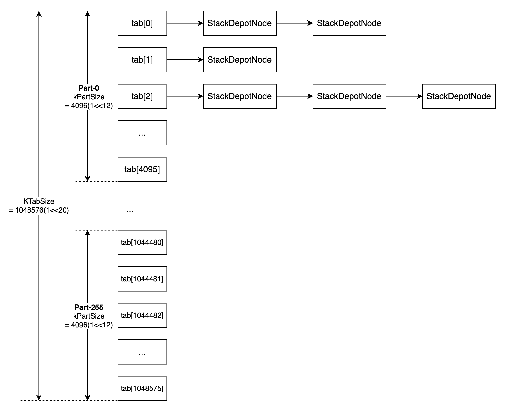

How Sanitizer Get Stack Trace
=============================

Sanitizer 非常好用的一个原因就是报告的内容非常详细。例如 ASan 检测到一个
heap-use-after-free 类型的 bug，在报告中不仅会给出执行哪行代码时触发了
heap-use-after-free，还会给出这块堆内存是在哪里被申请的，又是在哪里被释放的。

例如下面这个 heap-use-after-free 的例子：

-  “READ of size 4 at 0x603e0001fc64 thread T0” 给出的是触发
   heap-use-after-free 的 stack trace

-  “freed by thread T0 here:” 给出的是堆内存被释放时的 stack trace

-  “previously allocated by thread T0 here:” 给出的是堆内存被申请时的
   stack trace

.. code:: cpp

   // clang -O0 -g -fsanitize=address test.cpp && ./a.out
   int main(int argc, char **argv) {
     int *array = new int[100];
     delete [] array;
     return array[argc];  // BOOM
   }

::

   =================================================================
   ==6254== ERROR: AddressSanitizer: heap-use-after-free on address 0x603e0001fc64 at pc 0x417f6a bp 0x7fff626b3250 sp 0x7fff626b3248
   READ of size 4 at 0x603e0001fc64 thread T0
       #0 0x417f69 in main test.cpp:5
       #1 0x7fae62b5076c (/lib/x86_64-linux-gnu/libc.so.6+0x2176c)
       #2 0x417e54 (a.out+0x417e54)
   0x603e0001fc64 is located 4 bytes inside of 400-byte region [0x603e0001fc60,0x603e0001fdf0)
   freed by thread T0 here:
       #0 0x40d4d2 in operator delete llvm/projects/compiler-rt/lib/asan/asan_new_delete.cc:61
       #1 0x417f2e in main test.cpp:4
   previously allocated by thread T0 here:
       #0 0x40d312 in operator new llvm/projects/compiler-rt/lib/asan/asan_new_delete.cc:46
       #1 0x417f1e in main test.cpp:3
   Shadow bytes around the buggy address:
     0x1c07c0003f30: fa fa fa fa fa fa fa fa fa fa fa fa fa fa fa fa
     0x1c07c0003f40: fa fa fa fa fa fa fa fa fa fa fa fa fa fa fa fa
     0x1c07c0003f50: fa fa fa fa fa fa fa fa fa fa fa fa fa fa fa fa
     0x1c07c0003f60: fa fa fa fa fa fa fa fa fa fa fa fa fa fa fa fa
     0x1c07c0003f70: fa fa fa fa fa fa fa fa fa fa fa fa fa fa fa fa
   =>0x1c07c0003f80: fa fa fa fa fa fa fa fa fa fa fa fa[fd]fd fd fd
     0x1c07c0003f90: fd fd fd fd fd fd fd fd fd fd fd fd fd fd fd fd
     0x1c07c0003fa0: fd fd fd fd fd fd fd fd fd fd fd fd fd fd fd fd
     0x1c07c0003fb0: fd fd fd fd fd fd fd fd fd fd fd fd fd fd fa fa
     0x1c07c0003fc0: fa fa fa fa fa fa fa fa fa fa fa fa fa fa fa fa
     0x1c07c0003fd0: fa fa fa fa fa fa fa fa fa fa fa fa fa fa fa fa
   Shadow byte legend (one shadow byte represents 8 application bytes):
     Addressable:           00
     Partially addressable: 01 02 03 04 05 06 07
     Heap left redzone:     fa
     Heap righ redzone:     fb
     Freed Heap region:     fd
     Stack left redzone:    f1
     Stack mid redzone:     f2
     Stack right redzone:   f3
     Stack partial redzone: f4
     Stack after return:    f5
     Stack use after scope: f8
     Global redzone:        f9
     Global init order:     f6
     Poisoned by user:      f7
     ASan internal:         fe
   ==6254== ABORTING

本文以 ASan 为例分析 sanitizer runtime 是如何获取 stack trace 的。

Stack unwinding
---------------

在分析 sanitizer runtime 关于 stack trace 的具体实现之前，我们先来学习下
stack unwinding。

关于 stack unwinding，maskray 这篇文章 `Stack unwinding \|
MaskRay <https://maskray.me/blog/2020-11-08-stack-unwinding>`__
写的非常好。本节的内容都是从 maskray 这篇文章习来的。

Stack unwinding 主要用于获取 stack trace 或 实现 C++ exception。

Stack unwinding 可以分为两类：

-  synchronous: 由程序自身触发的，只发生在函数调用处（在 function body
   内，不会出现在 prologue/epilogue 处)。
-  asynchronous: 由 garbage collector, signal 或外部程序触发，这类 stack
   unwinding 可以发生在函数 prologue/epilogue 处。

Sanitizer 的 stack unwinding 就是 synchronous stack unwinding，由
sanitizer runtime 自身触发。例如 sanitizer runtime 在 malloc/free
时会通过 stack unwinding 获取 stack trace。

因此本文中我们只讨论 synchronous stack unwinding（而且我也不了解
asynchronous stack unwinding，以后有时间可以学习下）。

Frame pointer
~~~~~~~~~~~~~

最朴素的 stack unwinding 就是基于 frame (base) pointer [%rbp]
来实现的。如果编译时添加了选项 ``-fno-omit-frame-pointer``\ ，那么在函数
prologue/epilogue 处会有如下指令：

::

   pushq %rbp
   movq %rsp, %rbp
   ...
   popq %rbp
   ret

函数 prologue 处 ``pushq %rbp`` 将 caller 的 frame pointer
值压栈，\ ``movq %rsp, %rbp`` 将寄存器 %rbp 的值更新为保存 caller frame
pointer 的栈地址。这样，一旦我们获取了当前函数的 frame pointer
的值，将其解引用后就可以得到 caller 的 frame pointer
的值，不停地解引用就能获取到所有栈帧的 frame pointer。

我们可以将 stack frame 抽象为如下结构体：

.. code:: cpp

   struct stack_frame {
     stack_frame* nextFrame;
     void* returnAddress;
   };

以如下汇编代码为例进行说明：在 x86_64 下，caller 会在执行 call
指令时会将当前函数的下一条指令地址压栈，然后跳转到 callee
的入口处继续执行，接着在 callee 的第一条指令就是 ``pushq %rbp`` 将寄存器
%rbp 的值压栈。这两条指令合作将 struct stack_frame 的内容填充好。

::

   main:                                   # @main
           pushq   %rbp
           movq    %rsp, %rbp
           subq    $16, %rsp
           movl    $0, -4(%rbp)
           movl    $2, %edi
           callq   foo(int) # Pushes address of next instruction onto stack,
                            # populating 'returnAddress' member of 'stack_frame'.
                            # Then jumps to 'callee' address(i.e. function foo). 
           addl    $1, %eax
           addq    $16, %rsp
           popq    %rbp
           retq

   foo:                                # @foo(int)
           pushq   %rbp       # Push rbp (stack_frame ptr) onto stack (populates 'nextFrame' member)
           movq    %rsp, %rbp # Update rbp to point to new stack_frame
           subq    $16, %rsp. # Reserve an additional 16 bytes of stack-space
           movl    %edi, -4(%rbp)
           movl    -4(%rbp), %edi
           callq   bar(int)
           addl    $2, %eax
           addq    $16, %rsp. # Restore rsp
           popq    %rbp       # Pop rbp from stack
           retq               # Pop return address from top of stack and jump to it

因此我们可以通过 ``_builtin_frame_address(0)`` 得到当前函数的 frame
pointer 值，解引用 frame pointer 即可得到 nextFrame 和
returnAddress，不断重复，这样我们就能获取到 stack trace 了。

一个简单的 unwinding 代码示例实现 test_unwind.cpp 如下：

.. code:: cpp

    1  #include <stdio.h>
    2
    3  __attribute__((noinline)) void fast_unwind() {
    4    unsigned long *frame = (unsigned long *)__builtin_frame_address(0);
    5    for (;;) {
    6      printf("frame pointer is: %p\n", frame);
    7      unsigned long *pc = (unsigned long*)frame[1];
    8      printf("pc is: %p\n", pc);
    9      unsigned long *new_frame = (unsigned long *)(*frame);
    10      if (*new_frame <= *frame) break;
    11      frame = new_frame;
    12    }
    13  }
    14
    15  __attribute__((noinline)) int bar(int n) {
    16    if (n <= 0)
    17      return 0;
    18    if (n == 1)
    19      return 1;
    20    fast_unwind();
    21    return bar(n-1) + bar(n-2);
    22  }
    23
    24  __attribute__((noinline)) int foo(int n) {
    25    return bar(n)+2;
    26  }
    27
    28  int main() {
    29    return foo(2)+1;
    30  }

::

   $ clang++ test_unwind.cpp -g -no-pie -fno-omit-frame-pointer && ./a.out
   frame pointer is: 0x7ffcbde94c10
   pc is: 0x4011ec
   frame pointer is: 0x7ffcbde94c30
   pc is: 0x401233
   frame pointer is: 0x7ffcbde94c50
   pc is: 0x401259

   $ llvm-symbolizer -iCfe a.out 0x4011ec 0x401233 0x401259
   bar(int)
   test-stack-trace/test_unwind.cpp:21:14
   foo(int)
   test-stack-trace/test_unwind.cpp:25:16
   main
   test-stack-trace/test_unwind.cpp:29:16

但是这种基于 frame pointer 实现 stack unwinding
的方式有很大的局限性：编译器默认只有在 O0 优化等级下会添加
``-fno-omit-frame-pointer`` 编译选项，并且预留一个寄存器用于存储 frame
pointer 与不预留一个寄存器存储 frame pointer 相比会有额外的性能开销。

DWARF Call Frame Information
~~~~~~~~~~~~~~~~~~~~~~~~~~~~

另一种 stack unwinding 的实现方式就是基于 DWARF Call Frame Information
来实现的，由 compiler/assembler/linker/libunwind 提供相应支持。

我们还是以例子进行说明：

.. code:: cpp

   $ cat test.cpp
   __attribute__((noinline)) int bar(int n) {
     if (n <= 0)
       return 0;
     if (n == 1)
       return 1;
     return bar(n-1) + bar(n-2);
   }

   __attribute__((noinline)) int foo(int n) {
     return bar(n)+2;
   }

   int main() {
     return foo(2)+1;
   }

   # 生成 test_unwind.s
   $ clang++ -O1 test.cpp -S

我们可以在 test.s 中看到 .cfi_def_cfa_offset, .cfi_offset 这样的 `CFI
directives <https://sourceware.org/binutils/docs/as/CFI-directives.html>`__\ ，assembler/linker
会根据这些 CFI directives 生成 .eh_frame section，最终用于 stack
unwinding。

例如在汇编文件 test.s 中函数 bar 对应的汇编代码中有如下内容：

::

   _Z3bari:                                # @_Z3bari
       .cfi_startproc
   # %bb.0:                                # %entry
       pushq    %rbp
       .cfi_def_cfa_offset 16
       pushq    %rbx
       .cfi_def_cfa_offset 24
       pushq    %rax
       .cfi_def_cfa_offset 32
       .cfi_offset %rbx, -24
       .cfi_offset %rbp, -16
       testl    %edi, %edi
       jle    .LBB0_1

我们手动将 ``.cfi_offset %rbp, -16`` 修改为
``.cfi_offset %rbp, -24``\ ，然后将 test.s 编译为可执行文件，并用 gdb
调试看下会有什么影响：

::

   $ clang test.s
   $ gdb ./a.out
   (gdb) b bar
   (gdb) r
   (gdb) ni
   (gdb) ni
   (gdb) ni
   (gdb) disassemble
   Dump of assembler code for function _Z3bari:
      0x0000000000401110 <+0>:    push   %rbp
      0x0000000000401111 <+1>:    push   %rbx
      0x0000000000401112 <+2>:    push   %rax
   => 0x0000000000401113 <+3>:    test   %edi,%edi
   (gdb) i r rbx rbp
   rbx            0x0                 0
   rbp            0x401170            0x401170 <__libc_csu_init>
   (gdb) bt
   #0  0x0000000000401110 in bar(int) ()
   #1  0x0000000000401156 in foo(int) ()
   #2  0x000000000040116b in main ()
   (gdb) f 1
   #1  0x0000000000401156 in foo(int) ()
   (gdb) i r rbx rbp
   rbx            0x0                 0
   rbp            0x0                 0x0

我们让程序停在 bar 函数中 ``test %edi,%edi``
处，然后运行程序。可以看到在断点处 rbp 的值是 0x401170，rbx 的值是
0，跳转至 frame 1 后，再次看 rbp 的值，此时变为了 0。然而应当跳转至
frame 1 处和 rbp 的值也应该是 0x401170，变成 0 是因为我们将汇编文件
test.s 中 ``.cfi_offset %rbp, -16`` 修改为了
``.cfi_offset %rbp, -24``\ 。而 cfi_offset -24 处存储的是 %rbx
的值，%rbx 的值是 0，所以 gdb 将 frame 1 的 %rbp 的值恢复为了 0。

这样我们通过这样一个简单的例子管中窥豹了解了基于 DWARF Call Frame
Information 的 stack unwinding。

Sanitizer stack trace
---------------------

Sanitizer runtime 在 stack unwinding 时，有两种策略：fast unwind 和 slow
unwind，sanitizer runtime 优先使用 fast unwind。

在 sanitizer runtime 中有很多地方都需要收集 stack trace，例如在
malloc/free 被调用时收集 stack trace。在 ASan runtime library 中
intercptor malloc/free 函数实现中就通过宏 ``GET_STACK_TRACE_MALLOC`` 和
``GET_STACK_TRACE_FREE`` 来获取 stack trace 保存至 BufferedStackTrace
类型的变量 stack 中，然后将 stack 作为参数传给函数 ``asan_malloc``,
``asan_free`` 保存起来。

.. code:: cpp

   // compiler-rt/lib/asan/asan_malloc_linux.cpp

   INTERCEPTOR(void*, malloc, uptr size) {
     if (DlsymAlloc::Use())
       return DlsymAlloc::Allocate(size);
     ENSURE_ASAN_INITED();
     GET_STACK_TRACE_MALLOC;
     return asan_malloc(size, &stack);
   }

   INTERCEPTOR(void, free, void *ptr) {
     if (DlsymAlloc::PointerIsMine(ptr))
       return DlsymAlloc::Free(ptr);
     GET_STACK_TRACE_FREE;
     asan_free(ptr, &stack, FROM_MALLOC);
   }

``GET_STACK_TRACE_MALLOC`` 和 ``GET_STACK_TRACE_FREE``
宏展开后经过一系列的调用，最终执行的是
``BufferedStackTrace::Unwind()``\ ：

``BufferedStackTrace::Unwind()`` 函数的各个参数含义如下：

-  max_depth：设置 unwind 最大回溯的深度。

-  pc: the pc will be in the position 0 of the resulting stack trace. 即
   unwind 起始处的 pc，是通过 ``__builtin_return_address(0)`` 得到的。

-  bp: the bp may refer to the current frame or to the caller’s frame.
   即 unwind 起始处的 frame address，是通过
   ``__builtin_frame_address(0)`` 得到的。

-  context: 通常为 nullptr。在 Android lollipop 版本之前，从 signal
   handler 中 unwind 要基于 libcorkscrew.so，需要用到 signal handler
   提供的 context 参数。

-  stack_top, stack_bottom: unwind
   起始处所在线程的线程栈底和线程栈顶，主要用于判断采取 fast unwind 时
   unwind 过程何时终止。

-  request_fast_unwind: 表示是使用 fast unwind 还是 slow
   unwind。在环境变量 ASAN_OPTIONS 中可以设置运行时参数
   fast_unwind_on_check, fast_unwind_on_fatal,
   fast_unwind_on_malloc，sanitizer
   会根据这些参数的设置以及运行环境是否支持选择使用 fast unwind 还是
   slow unwind。

   -  fast_unwind_on_check: If available, use the fast
      frame-pointer-based unwinder on internal CHECK failures. Defaults
      to false.

   -  fast_unwind_on_fatal: If available, use the fast
      frame-pointer-based unwinder on fatal errors. Defaults to false.

   -  fast_unwind_on_malloc: If available, use the fast
      frame-pointer-based unwinder on malloc/free. Defaults to true.

.. code:: cpp

   // compiler-rt/lib/sanitizer_common/sanitizer_stacktrace_libcdep.cpp

   void BufferedStackTrace::Unwind(u32 max_depth, uptr pc, uptr bp, void *context,
                                   uptr stack_top, uptr stack_bottom,
                                   bool request_fast_unwind) {
     // Ensures all call sites get what they requested.
     CHECK_EQ(request_fast_unwind, WillUseFastUnwind(request_fast_unwind));
     top_frame_bp = (max_depth > 0) ? bp : 0;
     // Avoid doing any work for small max_depth.
     if (max_depth == 0) {
       size = 0;
       return;
     }
     if (max_depth == 1) {
       size = 1;
       trace_buffer[0] = pc;
       return;
     }
     if (!WillUseFastUnwind(request_fast_unwind)) {
   #if SANITIZER_CAN_SLOW_UNWIND
       if (context)
         UnwindSlow(pc, context, max_depth);
       else
         UnwindSlow(pc, max_depth);
       // If there are too few frames, the program may be built with
       // -fno-asynchronous-unwind-tables. Fall back to fast unwinder below.
       if (size > 2 || size >= max_depth)
         return;
   #else
       UNREACHABLE("slow unwind requested but not available");
   #endif
     }
     UnwindFast(pc, bp, stack_top, stack_bottom, max_depth);
   }

UnwindFast
~~~~~~~~~~

UnwindFast 其实就是基于 frame pointer 的 unwind，具体实现如下：

.. code:: cpp

   // llvm-project/compiler-rt/lib/sanitizer_common/sanitizer_stacktrace.cpp
   void BufferedStackTrace::UnwindFast(uptr pc, uptr bp, uptr stack_top,
                                       uptr stack_bottom, u32 max_depth) {
     // TODO(yln): add arg sanity check for stack_top/stack_bottom
     CHECK_GE(max_depth, 2);
     const uptr kPageSize = GetPageSizeCached();
     trace_buffer[0] = pc;
     size = 1;
     if (stack_top < 4096) return;  // Sanity check for stack top.
     uhwptr *frame = GetCanonicFrame(bp, stack_top, stack_bottom);
     // Lowest possible address that makes sense as the next frame pointer.
     // Goes up as we walk the stack.
     uptr bottom = stack_bottom;
     // Avoid infinite loop when frame == frame[0] by using frame > prev_frame.
     while (IsValidFrame((uptr)frame, stack_top, bottom) &&
            IsAligned((uptr)frame, sizeof(*frame)) &&
            size < max_depth) {
       uhwptr pc1 = frame[1];
       // Let's assume that any pointer in the 0th page (i.e. <0x1000 on i386 and
       // x86_64) is invalid and stop unwinding here.  If we're adding support for
       // a platform where this isn't true, we need to reconsider this check.
       if (pc1 < kPageSize)
         break;
       if (pc1 != pc) {
         trace_buffer[size++] = (uptr) pc1;
       }
       bottom = (uptr)frame;
       frame = GetCanonicFrame((uptr)frame[0], stack_top, bottom);
     }
   }

   static inline uhwptr *GetCanonicFrame(uptr bp,
                                         uptr stack_top,
                                         uptr stack_bottom) {
     CHECK_GT(stack_top, stack_bottom);
     return (uhwptr*)bp;
   }

   // Check if given pointer points into allocated stack area.
   static inline bool IsValidFrame(uptr frame, uptr stack_top, uptr stack_bottom) {
     return frame > stack_bottom && frame < stack_top - 2 * sizeof (uhwptr);
   }

UnwindSlow
~~~~~~~~~~

UnwindSlow 就是基于 libunwind 提供的接口 ``_Unwind_Backtrace`` 来实现的
unwind：

.. code:: cpp

   // llvm-project/compiler-rt/lib/sanitizer_common/sanitizer_unwind_linux_libcdep.cpp
   void BufferedStackTrace::UnwindSlow(uptr pc, u32 max_depth) {
     CHECK_GE(max_depth, 2);
     size = 0;
     UnwindTraceArg arg = {this, Min(max_depth + 1, kStackTraceMax)};
     _Unwind_Backtrace(Unwind_Trace, &arg);
     // We need to pop a few frames so that pc is on top.
     uptr to_pop = LocatePcInTrace(pc);
     // trace_buffer[0] belongs to the current function so we always pop it,
     // unless there is only 1 frame in the stack trace (1 frame is always better
     // than 0!).
     // 1-frame stacks don't normally happen, but this depends on the actual
     // unwinder implementation (libgcc, libunwind, etc) which is outside of our
     // control.
     if (to_pop == 0 && size > 1)
       to_pop = 1;
     PopStackFrames(to_pop);
     trace_buffer[0] = pc;
   }

   struct UnwindTraceArg {
     BufferedStackTrace *stack;
     u32 max_depth;
   };

   _Unwind_Reason_Code Unwind_Trace(struct _Unwind_Context *ctx, void *param) {
     UnwindTraceArg *arg = (UnwindTraceArg*)param;
     CHECK_LT(arg->stack->size, arg->max_depth);
     uptr pc = Unwind_GetIP(ctx);
     const uptr kPageSize = GetPageSizeCached();
     // Let's assume that any pointer in the 0th page (i.e. <0x1000 on i386 and
     // x86_64) is invalid and stop unwinding here.  If we're adding support for
     // a platform where this isn't true, we need to reconsider this check.
     if (pc < kPageSize) return UNWIND_STOP;
     arg->stack->trace_buffer[arg->stack->size++] = pc;
     if (arg->stack->size == arg->max_depth) return UNWIND_STOP;
     return UNWIND_CONTINUE;
   }

``_Unwind_Backtrace`` 的函数原型如下。

.. code:: cpp

   // _Unwind_Backtrace() is a gcc extension that walks the stack and calls the
   // _Unwind_Trace_Fn once per frame until it reaches the bottom of the stack
   // or the _Unwind_Trace_Fn function returns something other than _URC_NO_REASON.
   typedef _Unwind_Reason_Code (*_Unwind_Trace_Fn)(struct _Unwind_Context *,
                                                   void *);
   extern _Unwind_Reason_Code _Unwind_Backtrace(_Unwind_Trace_Fn, void *);

``_Unwind_Backtrace`` 在 stack unwinding 时，对于每一个 frame
都会调用回调函数 ``Unwind_Trace`` 将此 frame 的 PC/IP 指令地址保存至
BufferedStackTrace 的成员变量 trace_buffer 中。

StackDepot
----------

本节我们来看下 sanitizer runtime 是如何保存 stack trace 的。

我们在本文前面提到 intercetpr malloc 调用 ``asan_malloc``
来进行内存分配，而 ``asan_malloc`` 就是对
``__asan::Allocator::Allocate`` 函数的一层包装。

.. code:: cpp

   // compiler-rt/lib/asan/asan_allocator.cpp
   void *asan_malloc(uptr size, BufferedStackTrace *stack) {
     return SetErrnoOnNull(instance.Allocate(size, 8, stack, FROM_MALLOC, true));
   }

   void *Allocate(uptr size, uptr alignment, BufferedStackTrace *stack,
                    AllocType alloc_type, bool can_fill) {
     ...
     m->alloc_context_id = StackDepotPut(*stack);
     ...
   }

注意到 ``__asan::Allocator::Allocate`` 函数是通过调用函数
``StackDepotPut`` 将 stack unwinding 获取的 stack trace
保存起来。\ ``StackDepotPut`` 会返回一个 context_id，维护 context_id 与
stack trace 的映射关系，后续可以通过 context_id 找到对应的 stack trace。

存储 stack trace 的核心数据结构就是 StackDepot，代码位于：

-  compiler-rt/lib/sanitizer_common/sanitizer_stackdepotbase.h

-  compiler-rt/lib/sanitizer_common/sanitizer_stackdepot.h

-  compiler-rt/lib/sanitizer_common/sanitizer_stackdepot.cpp

.. code:: cpp

   // FIXME(dvyukov): this single reserved bit is used in TSan.
   typedef StackDepotBase<StackDepotNode, 1, StackDepotNode::kTabSizeLog>
       StackDepot;
   static StackDepot theDepot;

   u32 StackDepotPut(StackTrace stack) {
     StackDepotHandle h = theDepot.Put(stack);
     return h.valid() ? h.id() : 0;
   }

   StackTrace StackDepotGet(u32 id) {
     return theDepot.Get(id);
   }

-  ``StackDepotPut`` 函数，参数类型是 StackTrace（BufferedStackTrace 是
   StackTrace 的子类），返回值类型是 u32。存储 stack trace，返回一个
   id，id 与 stack trace 是一一对应关系。

-  ``StackDepotGet`` 函数，参数类型是 u32，返回值类型是 StackTrace。根据
   id 返回对应的 stack trace。

StackDepotNode 和 StackDepotBase/StackDepot 的成员变量如下所示。

-  StackDepotNode。成员变量 StackDepotNode \*link; 存储指向下一个
   StackDepotNode 的指针，即多个 StackDepotNode 组成一个链表。成员变量
   id 用于标识该 StackDepotNode/StackTrace。成员变量 tag 的可能取值是
   TAG_UNKNOWN(0), TAG_ALLOC(1), TAG_DEALLOC(2), TAG_CUSTOM(100) 表示
   stack trace 的来源。成员变量 size 就是用于表示 stack trace
   的深度，成员变量 stack 是个数组，数组每个元素用于存储 stack trace
   每一帧的 pc。

-  StackDepot/StackDepotBase。StackDepot 通过 hash table 来存储
   StackDepotNode，hash table 维护了 1<<20 个 tab，每 1<<12 个 tab
   又组成了一个 part。每个 tab 存储的是指向 StackDepotNode
   链表第一个元素的指针。

.. code:: cpp

   struct StackDepotNode {
     StackDepotNode *link;
     u32 id;
     atomic_uint32_t hash_and_use_count; // hash_bits : 12; use_count : 20;
     u32 size;
     u32 tag;
     uptr stack[1];  // [size]
     ...
   };

   template <class Node, int kReservedBits, int kTabSizeLog>
   class StackDepotBase {
     atomic_uintptr_t tab[kTabSize];   // Hash table of Node's.
     atomic_uint32_t seq[kPartCount];  // Unique id generators.
     ...
   };

StackDepot hash table 示意图如下：

-  对于一个给定的 stack trace，首先计算出该 stack trace 的 hash 值记作
   h，然后计算 ``h % kTabSize`` 找到存储该 stack trace 的
   tab。判断当前给定的 stack trace 是否已经在 ``tab[h % kTabSize]``
   对应的链表中。如果不在，就申请一块内存，在这块内存上根据给定的 stack
   trace 构造 StackDepotNode，然后将该 StackDepotNode 插入到
   ``tab[h % kTabSize]`` 对应的链表开头。 那么 StackDepotNode 的 id
   是怎么计算的呢？每 1<<12 个 tab 组成了一个 part，数组
   ``seq[kPartCount]`` 存储的是每个 part 中当前已经存储了多少个
   StackDepotNode。通过计算 ``h % kTabSize / kPartSize`` 找到存储该
   stack trace 的 tab 所在的 part。对于一个新的 StackDepotNode 对应的 id
   就是 ``(seq[part] + 1) | (part << kPartShift)``\ 。

-  对于一个给定的 id，首先通过 ``uptr part = id >> kPartShift;`` 找到该
   id 对应的 StackDepotNode 位于哪个 part。遍历该 part 中的 1 <<12 个
   tab，在每个 tab 链表中寻找是否存在与给定 id 相等的 StackDepotNode。

关于 sanitizer runtime 是如何保存 stack trace 的，可以仔细阅读下
StackDepot 的代码实现，这部分代码非常值得学习，这里就不一一贴代码了。

References
----------

1. `Stack unwinding \|
   MaskRay <https://maskray.me/blog/2020-11-08-stack-unwinding>`__

2. https://developers.facebook.com/blog/post/2021/09/23/async-stack-traces-folly-synchronous-asynchronous-stack-traces/
