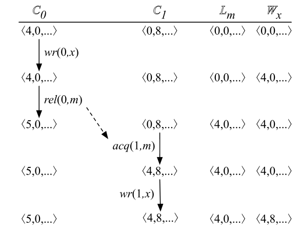

DataRace 检测算法之 FastTrack
=============================

根据 `AddressSanitizer, ThreadSanitizer, and MemorySanitizer: Dynamic
Testing Tools for C++ (GTAC’2013) <http://goo.gl/FPVd8>`__\ ，TSan V2
使用的 fast happens-before 算法，\ **类似**\ 于 FastTrack(PLDI’09)
中提出的算法。

本文是对 `FastTrack: efficient and precise dynamic race detection
(PLDI’09) <https://users.soe.ucsc.edu/~cormac/papers/pldi09.pdf>`__
这篇论文的学习笔记。

Preliminaries
-------------

Data Race
~~~~~~~~~

在 FastTrack(PLDI’09) 论文中，全文都用的是 race condition，根据 `Race
Condition vs. Data Race. EMBEDDED IN
ACADEMIA <https://blog.regehr.org/archives/490>`__ 中给出的关于 race
condition 和 data race 的定义，该论文中应该实际指代的应该是 data
race。本文全都使用 “data race” 。

首先看 data race 的定义：

-  A race condition occurs when a program’s execution contains two
   accesses to the same memory location that are not ordered by the
   happens-before relation, where at least one of the accesses is a
   write. —— from FastTrack: efficient and precise dynamic race
   detection (PLDI’09)

-  A data race is a situation when two threads concurrently access a
   shared memory location and at least one of the accesses is a write.
   —— from ThreadSanitizer: data race detection in practice (WBIA ’09)

即，如果两个线程访问同一个内存位置 (memory
location)，至少有一个访问是写操作，并且两个线程访问内存位置的访问顺序是不确定，则说明存在
data race。

举一个非常简单的 data race 的例子：

.. code:: cpp

   #include <pthread.h>
   #include <stdio.h>

   int Global;

   void *Thread1(void *x) {
     Global=1;
     return NULL;
   }

   void *Thread2(void *x) {
     Global=2;
     return NULL;
   }

   int main() {
     pthread_t t[2];
     pthread_create(&t[0], NULL, Thread1, NULL);
     pthread_create(&t[1], NULL, Thread2, NULL);
     pthread_join(t[0], NULL);
     pthread_join(t[1], NULL);
     printf("%d", Global);
   }

执行上述代码，输出是不确定的：有时候是 1，有时候是 2。

Concepts
~~~~~~~~

一个程序中有很多个线程，每一个线程用 :math:`t \in Tid`
表示，这些线程读写的变量用 :math:`x \in Var` 表示，锁用
:math:`m \in Lock` 表示。

线程 :math:`t` 能执行的\ **操作**\ 包括：

-  :math:`rd(t, x)` 和 :math:`wr(t, x)` 分别表示 线程 :math:`t` 读
   :math:`x`\ ，线程 :math:`t` 写 :math:`x`

-  :math:`acq(t, m)` 和 :math:`rel(t, m)` 分别表示 获取锁
   :math:`m`\ ，释放锁 :math:`m`

-  :math:`fork(t, u)` 表示线程 :math:`t` fork 一个新的线程 :math:`u`

-  :math:`join(t, u)` 表示线程 :math:`t` 阻塞直至线程 :math:`u` 终止执行

happen-before
的定义（尝试用中文表述总觉得词不达意，摆烂直接用英文原文）：

A trace :math:`\alpha` captures an execution of a multithreaded program
by listing the sequence of operations performed by the various threads.

**The happens-before relation** :math:`<_\alpha` for a trace
:math:`\alpha` is the smallest transitively-closed relation over the
operations in :math:`\alpha` such that the relation :math:`a <_\alpha b`
holds whenever :math:`a` occurs before :math:`b` in :math:`\alpha` and
one of the following holds:

-  Program order: The two operations are performed by the same thread.

-  Locking: The two operations acquire or release the same lock.

-  Fork-join: One operation is :math:`fork(t, u)` or :math:`join(t, u)`
   and the other operation is by thread :math:`u`.

如果 :math:`a` happens before :math:`b`\ ，那么 :math:`b` happens after
:math:`a`

如果两个线程访问同一个内存位置 (memory
location)，至少有一个访问是写操作，并且这两个访问操作之间没有
happen-before 关系，那么说明这两个访存操作之间存在 data race。

Vector Clock and :math:`DJIT^+` Algorithm
-----------------------------------------

Vector Clock
~~~~~~~~~~~~

假设程序中有 n 个线程，每个线程都对应一个 n 个元素的 vector，称为 vector
clock。

Vector clock 之间是存在偏序关系 :math:`\sqsubseteq` 的。

:math:`\sqcup` 表示两个 vector clock 之间的交汇 (join) 操作。

:math:`\bot_C` 表示最小的 vector clock 。

:math:`inc_t` 表示递增 vector clock 的表示线程 :math:`t` 的那个元素。

形式化表示如下：

-  :math:`C_1 \sqsubseteq C_2\quad\textbf{iff}\quad\forall t.\;C_1(t) \leq C_2(t)`

-  :math:`C_1 \sqcup C_2 \quad=\quad \lambda t.\;max(C_1(t), C_2(t))`

-  :math:`\bot_C \quad=\quad \lambda t.\;0`

-  :math:`inc_t(C)\quad=\quad\lambda u.\;\textbf{if}\;u = t\;\textbf{then}\;C(u)+1\;\textbf{else}\;C(u)`

--------------

举个例子帮忙理解 vector clock 。

假设程序中有 2 个线程 :math:`t_1` 和 :math:`t_2` ，假设 :math:`t_1` 的
vector clock :math:`C_1` 为 :math:`<4, 0>`\ ，\ :math:`t_2` 的 vector
clock :math:`C_2` 为 :math:`<5, 8>` 。

-  因为 :math:`4 \leq 5` ，\ :math:`0 \leq 8` 所以
   :math:`C_1 \sqsubseteq C_2`

-  :math:`C_1 \sqcup C_2 \;=\;<max(4, 5), max(0, 8)> \;=\;<5, 8>`

-  因为此例中只有 2 个线程所以 :math:`\bot_C =\; <0, 0>`

-  :math:`inc_{t1}(C_1) =\; <4+1, 0> \;=\;<5, 0>`\ ，
   :math:`inc_{t2}(C_1)\;=\;<4, 0+1> \; =\; <4, 1>`\ ，
   :math:`inc_{t1}(C_2)\;=\;<5+1, 8> \;=\;<6, 8>`\ ，
   :math:`inc_{t2}(C_2)\;=\;<5, 8+1> \;=\;<5, 9>`

:math:`DJIT^+` Algorithm
~~~~~~~~~~~~~~~~~~~~~~~~

:math:`DJIT^+` Algorithm 就是基于 vector clock 来检测 data race 的：

-  每个线程 :math:`t` 都对应一个 vector clock
   :math:`\mathbb{C}_t`\ ，对于任意一个线程 :math:`u`\ ，
   :math:`\mathbb{C}_t(u)` 记录了与线程 :math:`t` 的当前操作满足
   happen-before 关系的线程 u 的上一次操作的 clock（如果把线程 :math:`u`
   的上一次操作记为 :math:`O_u`\ ，把线程 :math:`t` 的当前操作记为
   :math:`O_t`\ ，那么有 :math:`O_u\;\text{happen-before}\;O_t`\ ）

-  每一个锁 :math:`m` 也对应一个 vector clock :math:`\mathbb{L}_m`

-  每一个变量 :math:`x` 对应两个 vector clock :math:`\mathbb{W}_x` 和
   :math:`\mathbb{R}_x`\ 。对于任意一个线程 :math:`t`
   ，\ :math:`\mathbb{W}_x` 和 :math:`\mathbb{R}_x` 记录了线程 :math:`t`
   对变量 :math:`x` 的最后一次读/写的 clock

   -  线程 :math:`t` 对变量 :math:`x` 的读时，会将
      :math:`\mathbb{R}_x[t]` 的值更新为 :math:`\mathbb{C}_t(t)` 的值

   -  程序 :math:`t` 对变量 :math:`x` 的写时，会将
      :math:`\mathbb{W}_x[t]` 的值更新为 :math:`\mathbb{C}_t(t)` 的值

-  程序中执行同步和线程操作时，算法会更新相应的 vector clock：

   -  线程 :math:`u` 释放了锁 :math:`m`\ ，\ :math:`DJIT^+` 会先将
      :math:`\mathbb{L}_m` 的值更新为 :math:`\mathbb{C}_u` 的值，再将
      :math:`\mathbb{C}_u` 的值更新为 :math:`inc_u(\mathbb{C}_u)`

   -  线程 :math:`t` 获取了锁 :math:`m`\ ，\ :math:`DJIT^+` 会将
      :math:`\mathbb{C}_t` 的值更新为
      :math:`\mathbb{C}_t \sqcup \mathbb{L}_m` 的值。

   -  :math:`fork(t, u)`\ ，\ :math:`DJIT^+` 会先将 :math:`\mathbb{C}_u`
      的值更新为 :math:`\mathbb{C}_u \sqcup \mathbb{C}_t`\ ，再将
      :math:`\mathbb{C}_t` 的值更新为 :math:`inc_t(\mathbb{C}_t)`

   -  :math:`join(t, u)`\ ，\ :math:`DJIT^+` 会先将 :math:`\mathbb{C}_t`
      的值更新为 :math:`\mathbb{C}_t\sqcup \mathbb{C}_u`\ ，再将
      :math:`\mathbb{C}_u` 的值更新为 :math:`inc_u(\mathbb{C}_u)`

-  如何判断是否存在 data race：

   -  假设当前线程 :math:`u` 读变量 :math:`x` ，如果
      :math:`\mathbb{W}_x \sqsubseteq \mathbb{C}_u` 那么当前线程
      :math:`u` 对变量 :math:`x` 的读则与之前其他线程对变量 :math:`x`
      的写不存在 data race

   -  假设当前线程 :math:`u` 写变量 :math:`x` ，如果
      :math:`\mathbb{W}_x \sqsubseteq \mathbb{C}_u` 且
      :math:`\mathbb{R}_x \sqsubseteq \mathbb{C}_u` 那么当前线程 u
      对变量 :math:`x` 的写则与之前其他线程对变量 :math:`x`
      的写和读不存在 data race

我们用如下例子来理解 :math:`DJIT^+` 是如何检测 data race 的：

如上图所示，程序中有两个线程，线程 0 和线程 1。线程 0 对应的 vector
clock 为 :math:`\mathbb{C}_0`\ ，线程 1 对应的 vector clock 为
:math:`\mathbb{C}_1`\ ，锁 :math:`m` 对应的 vector clock 为
:math:`\mathbb{L}_m`\ ，并且我们用 vector clock :math:`\mathbb{W}_x`
来记录前一次对变量 :math:`x` 的写操作。

1. 初始状态时，\ :math:`\mathbb{C}_0` 为 <4, 0>，\ :math:`\mathbb{C}_1`
   为 <0, 8>，\ :math:`\mathbb{L}_m` 为 <0, 0>（即
   :math:`\bot_C`\ ），\ :math:`\mathbb{W}_x` 为 <0, 0>（即
   :math:`\bot_C`\ ）

2. 线程 0 写变量 :math:`x`\ ，vector clock :math:`\mathbb{W}_x[0]`
   的值更新为 :math:`\mathbb{C}_0[0]` 的值，所以 :math:`\mathbb{W}_x`
   的值由 <0, 0>更新为 <4, 0>，其余 vector clock 的值不变

3. 线程 0 释放锁 :math:`m`\ ，vector clock :math:`\mathbb{L}_m`
   的值更新为 :math:`\mathbb{C}_0` 的值 <4, 0>，然后 vector clock
   :math:`\mathbb{C}_0` 的值更新为 :math:`inc_0(\mathbb{C}_0)` 即 <5,
   0>，其余 vector clock 的值不变

4. 线程 1 获取锁 :math:`m`\ ，vector clock :math:`\mathbb{C}_1`
   的值更新为 :math:`\mathbb{C}_1 \sqcup \mathbb{L}_m` 即 <0, 8>
   :math:`\sqcup` <4, 0> = <4, 8>，其余 vector clock 的值不变

5. 线程 1 写变量 :math:`x`\ ，由于 :math:`\mathbb{C}_1` 为 <4,
   8>，\ :math:`\mathbb{W}_x` 为 <4, 0>，所以
   :math:`\mathbb{W}_x\;\sqsubseteq\;\mathbb{C}_1`\ ，也就是说
   :math:`\mathbb{wr(0, x)}\;\text{happen-before}\;\mathbb{wr(1, x)}`\ ，所以线程
   1 写变量 :math:`x` 与线程 0 写变量 :math:`x` 之间没有 data
   race。最后还要更新 :math:`\mathbb{W}_x[1]` 为 :math:`\mathbb{C}_1[1]`
   ，即 :math:`\mathbb{W}_x` 的值由 <4, 0> 变为 <4, 8>，其余 vector
   clock 的值不变

FastTrack Algorithm
-------------------

上述基于 vector clock 的 :math:`DJIT^+` Algorithm
的缺点就是性能开销。如果程序中有 n 个线程，那么每一个 vector clock
都需要 :math:`O(n)` 的空间，并且对 vector clock 的操作 (copying,
comparing, joining, etc) 都要花费 :math:`O(n)` 的时间。

**key observation**\ ：作者通过收集大量的 Java
程序信息发现：在所有需要被 data race detector 监测的操作（\ :math:`rd`,
:math:`wr`, :math:`acq`, :math:`rel`, :math:`fork`, :math:`join`,
…）中，同步 (synchronization) 操作 (lock acquires and releases, forks,
joins, waits, notifies, etc)
出现的次数只占很少的比例；而对数组和对象字段的读写则占了被监测操作的 96%
。

**key insight**\ ：超过 99% 的读写操作，我们并不需要使用 vector clock
来表示其 happen-before 关系，只需使用一种更轻量级 happen-before
表示方式即可，只在必要时 fallback 为 vector clock 。

还是用上面这个例子来进行说明，这次我们不再使用 vector clock
来记录每个线程对变量 :math:`x` 的写操作，只记录上一次是哪个线程写了变量
:math:`x` ：

我们把 clock :math:`c` 和 thread :math:`t` 组成的对组 (pair) 叫作
:math:`epoch`\ ，记作 :math:`c@t`\ 。epoch 与 vector clock
存在如下关系：\ :math:`c@t \preceq C\quad\textbf{iff}\quad c \leq C(t)`
。

在上面这个例子中，对于 :math:`\mathbb{W}_x` 我们只需要使用 :math:`epoch`
记录上一次是哪个线程写了变量 :math:`x` ：

1. 初始状态时，\ :math:`\mathbb{C}_0` 为 <4, 0>，\ :math:`\mathbb{C}_1`
   为 <0, 8>，\ :math:`\mathbb{L}_m` 为 <0, 0>（即
   :math:`\bot_C`\ ），\ :math:`\mathbb{W}_x` 为 :math:`\bot_e`

2. 线程 0 写变量 :math:`x`\ ，将 epoch :math:`\mathbb{W}_x` 的值更新为
   :math:`4@0`\ ，表示线程 0 在 clock 为 4 时写了变量 :math:`x`

3. 线程 0 释放锁 :math:`m`\ ，vector clock :math:`\mathbb{L}_m`
   的值更新为 :math:`\mathbb{C}_0` 的值 <4, 0>，然后 vector clock
   :math:`\mathbb{C}_0` 的值更新为 :math:`inc_0(\mathbb{C}_0)` 即 <5,
   0>，其余 vector clock 的值不变

4. 线程 1 获取锁 :math:`m`\ ，vector clock :math:`\mathbb{C}_1`
   的值更新为 :math:`\mathbb{C}_1 \sqcup \mathbb{L}_m` 即 <0, 8>
   :math:`\sqcup` <4, 0> = <4, 8>，其余 vector clock 的值不变

5. 线程 1 写变量 :math:`x`\ ，由于 :math:`\mathbb{C}_1` 为 <4,
   8>，\ :math:`\mathbb{W}_x` 为 :math:`4@0`\ ，所以有
   :math:`\mathbb{W}_x=4@0 \preceq\;<4,8>\;=\mathbb{C}_1`\ ，也就是说
   :math:`\mathbb{wr(0, x)}\;\text{happen-before}\;\mathbb{wr(1, x)}`\ ，所以线程
   1 写变量 :math:`x` 与线程 0 写变量 :math:`x` 之间没有 data
   race。最后还要更新 :math:`\mathbb{W}_x` 为 :math:`8@1`\ ，表示线程 1
   在 clock 为 8 时写了变量 :math:`x`\ ，其余 vector clock 的值不变

在这个例子中，我们用 epoch 来代替 vector clock :math:`\mathbb{W}_x`
后，在判断 :math:`wr(1, x)` 是否与 :math:`wr(0, x)` 之间存在 data race
时，将 :math:`O(n)` 的 vector clock 之间的比较操作 :math:`\sqsubseteq`
替换优化为了 :math:`O(1)` 的 epoch 与 vector clock 之间的比较操作
:math:`\preceq` 。

下面我们系统地学习一下 FastTrack Algorithm 是如何检测 data race 的。

Type of Data Race
~~~~~~~~~~~~~~~~~

data race 可以根据观测到的读写操作的先后顺序可以分为以下三类：

-  **write-write** data race。

   对于 write-write 这种 data race，我们没有必要使用完整的 vector clock
   记录所有线程对变量 :math:`x` 的写操作，只记录上一次是哪个线程写了变量
   :math:`x` 就足够了。假设程序执行至某一时刻，对变量 :math:`x`
   的读写操作还没有出现过 data race，那么所有对变量 :math:`x`
   的写操作都是按照 happen-before 关系排序好的，所以为了检测后续对变量
   :math:`x` 的写与之前对变量 :math:`x` 的写之间是否存在 write-write
   data race，我们需要记录的关键信息就是最近的一次对变量 :math:`x`
   的写是在哪一 clock 由哪一 thread 完成的。如前所述，我们把 clock
   :math:`c` 和 thread :math:`t` 组成的对组 (pair) 叫作
   :math:`epoch`\ ，记作 :math:`c@t`\ 。epoch 与 vector clock
   存在如下关系：\ :math:`c@t \preceq C\quad\textbf{iff}\quad c \leq C(t)`
   。所以检测是否存在 write-write data race，我们只需花费 :math:`O(1)`
   的时间开销比较 epoch 与 vector clock 之间是否满足 :math:`\preceq`
   关系即可。

-  **write-read** data race

   一旦我们用 epoch 来记录上一次对变量 :math:`x` 的写，检测是否存在
   write-read data race 也变得非常简单。假设线程 :math:`t` 读变量
   :math:`x` 时的 vector clock 是 :math:`\mathbb{C}_t`\ ，我们只需花费
   :math:`O(1)` 的时间开销比较 :math:`\mathbb{W}_x\preceq\mathbb{C}_t`
   是否满足，就可以判断上一次对变量 :math:`x` 的写操作是否 happen-before
   这一次对变量 :math:`x` 的读操作，以检测是否存在 write-read data race
   。

-  **read-write** data race

   与 write-write data race 和 write-read data race
   的检测相比，read-write data race 的检测则相对复杂一些。因为在没有
   data race 的程序中，对变量 :math:`x` 的多个读操作也可能是 concurrent
   的。假设程序执行至某一个时刻，对变量 :math:`x` 的两个读操作
   :math:`rd(0, x)` 和 :math:`rd(1, x)` 是 concurrent 的，即有可能
   :math:`rd(0, x)` 先执行，也有可能 :math:`rd(1, x)`
   先执行，那么就算我们知道
   :math:`wr(\_, x)\;\text{happen-before}\;rd(0,x)` ，我们也无法判断
   :math:`wr(\_, x)\;\text{happen-before}\;rd(1,x)`
   是否成立。因此，我们需要使用完整的 vector clock :math:`R_x`
   来记录对变量 :math:`x` 的读操作。

   FastTrack 使用一种自适应的 (adaptive) 方式来记录对变量 :math:`x`
   的读：如果当前对变量 :math:`x` 的读操作 happen-after 所有之前对变量
   :math:`x` 的读操作，那么我们只需要使用 epoch 来记录这一次最新的对变量
   :math:`x` 的读即可。如果对变量 :math:`x` 的读操作之间是 concurrent
   的，我们转而使用 vector clock 来记录对变量 :math:`x` 的读操作。

Analysis Detail
~~~~~~~~~~~~~~~

FastTrack 是一个 online algorithm，对于被测程序，FastTrack
会维护一个程序状态 :math:`\sigma`\ ，每当程序执行一个操作 :math:`a`
时，FastTrack 会相应地更新状态：\ :math:`\sigma \Rightarrow^a \sigma'`
。

:math:`\sigma=(C,L,R,W)` 是一个四元组：

-  :math:`C_t` 表示当前线程 :math:`t` 的 vector clock

-  :math:`L_m` 表示上一次释放锁 :math:`m` 对应的 vector clock

-  :math:`R_x` 表示上一次对变量 :math:`x` 读对应的 epoch 或 vector clock

-  :math:`W_x` 表示上一次对变量 :math:`x` 写对应的 epoch

状态 :math:`\sigma` 的初始值为：

:math:`\sigma_0 = (\lambda t. inc_t(\bot_V), \lambda m.\bot_V, \lambda x.\bot_e, \lambda x.\bot_e)`

:math:`E(t)` 表示线程 :math:`t` 的当前 epoch :math:`c@t`\ ，其中
:math:`c=C_t(t)` 即线程 :math:`t` 的当前 clock 。

:math:`R` 是一个函数，\ :math:`R_x` 是 :math:`R(x)`
的缩写，\ :math:`R[x := V ]` 表示将 :math:`R(x)` 修改为
:math:`V`\ ，其余部分不变。

下图详细给出了针对不同的操作，FastTrack 是如何更新程序状态
:math:`\sigma`\ （在每种操作的右边同时给出了作者在 benchmarks
中观察到的不同操作的出现占比）：

Read Operations
^^^^^^^^^^^^^^^

Read Operations 又细分为 4 条规则：

-  **[FT READ SAME EPOCH]**

   此时程序执行的操作是 :math:`rd(t, x)`\ ，即线程 :math:`t` 读变量
   :math:`x`\ 。如果 :math:`R_x = E(t)`\ ，即前一次对变量 :math:`x`
   读与这一次对变量 :math:`x` 读，是同一个线程在同一 clock 时刻对变量
   :math:`x` 读，那么不用更新程序状态 :math:`\sigma`

-  **[FT READ SHARED]**

   此时程序执行的操作是 :math:`rd(t, x)`\ ，即线程 :math:`t` 读变量
   :math:`x`\ 。如果此时 :math:`R_x` 已经是用 vector clock 表示的
   (:math:`R_x \in VC`)，并且前一次对变量 :math:`x` 的写 happen-before
   此时线程 :math:`t` 对变量 :math:`x` 的读
   (:math:`W_x \preceq C_t`)，那么我们只需要把 vector clock :math:`R_x`
   中线程 :math:`t` 的那部分更新为 :math:`C_t(t)` 即可，形式化表示
   :math:`R' = R[x:=R_x(t:=C_t(t))]`

-  **[FT READ EXCLUSIVE]**

   此时程序执行的操作是 :math:`rd(t, x)`\ ，即线程 :math:`t` 读变量
   :math:`x`\ 。如果此时 :math:`R_x` 是用 epoch 表示的
   (:math:`R_x \in Epoch`)，并且前一次对变量 :math:`x` 的读
   happen-before 此时线程 :math:`t` 对变量 :math:`x` 的读
   ($\ :math:`R_x \preceq C_t`)，前一次对变量 :math:`x` 的写
   happen-before 此时线程 :math:`t` 对变量 :math:`x` 的读
   (:math:`W_x \preceq C_t`)，那么我们只需更新 epoch :math:`R_x` 为
   :math:`E(t)` 即可。\ :math:`E(t)` 表示线程 :math:`t` 的当前 epoch
   :math:`c@t`\ ，其中 :math:`c=C_t(t)` 即线程 :math:`t` 的当前 clock

-  **[FT READ SHARE]**

   此时程序执行的操作是 :math:`rd(t, x)`\ ，即线程 :math:`t` 读变量
   :math:`x`\ 。如果此时 :math:`R_x` 是用 epoch 表示的
   (:math:`R_x = c@u`)，并且前一次对变量 :math:`x` 的写 happen-before
   此时线程 :math:`t` 对变量 :math:`x` 的读
   (:math:`W_x \preceq C_t`)，但是前一次对变量 :math:`x` 的读与此时线程
   :math:`t` 对变量 :math:`x` 的读没有 happen-before 关系
   ($\ :math:`R_x \preceq C_t`)，那么我们需把 epoch :math:`R_x` 转换为
   vector clock :math:`R_x`\ ，线程 :math:`u` 的 clock 是 c，线程 t 的
   clock 是 :math:`C_t(t)`\ 。形式化表示
   :math:`V=\bot_V[t:=C_t(t), u:=c], R'=R[x:=V]`

Write Operations
^^^^^^^^^^^^^^^^

-  **[FT WRITE SAME EPOCH]**

   此时程序执行的操作是 :math:`wr(t, x)`\ ，即线程 :math:`t` 写变量
   :math:`x`\ 。如果 :math:`W_x = E(t)`\ ，即前一次对变量 :math:`x`
   写与这一次对变量 :math:`x` 写，是同一个线程在同一 clock 时刻对变量
   :math:`x` 写，那么不用更新程序状态 :math:`\sigma`\ 。

-  **[FT WRITE EXCLUSIVE]**

   此时程序执行的操作是 :math:`wr(t, x)`\ ，即线程 :math:`t` 写变量
   :math:`x`\ 。如果此时 :math:`R_x` 是用 epoch 表示的
   (:math:`R_x \in Epoch`)，并且前一次对变量 :math:`x` 的读
   happen-before 此时线程 :math:`t` 对变量 :math:`x` 的写
   (:math:`R_x \preceq C_t`)，前一次对变量 :math:`x` 的写 happen-before
   此时线程 :math:`t` 对变量 :math:`x` 的写
   (:math:`W_x \preceq C_t`)，那么我们只需要把 epoch :math:`W_x`
   中更新为 :math:`E_t(t)` 即可，形式化表示 :math:`W' = W[x:=E(t)]`

-  **[FT WRITE SHARED]**

   此时程序执行的操作是 :math:`wr(t, x)`\ ，即线程 :math:`t` 写变量
   :math:`x`\ 。如果此时 :math:`R_x` 已经是用 vector clock 表示的
   (:math:`R_x \in VC`)，并且前面所有对变量 :math:`x` 的读 happen-before
   此时线程 :math:`t` 对变量 :math:`x` 的写
   (:math:`R_x \sqsubseteq C_t`)，前一次对变量 :math:`x` 的写
   happen-before 此时线程 :math:`t` 对变量 :math:`x` 的写
   (:math:`W_x \preceq C_t`)，那么我们把 epoch :math:`W_x` 中更新为
   :math:`E(t)` ，并且把 :math:`R_x` 更新为 :math:`\bot_e` 。

   将 :math:`R_x` 更新为 :math:`\bot_e` 是因为后续对变量 :math:`x`
   的写操作不可能与此时 :math:`R_x` 中记录的对变量 :math:`x` 的写操作有
   data race 了，所以我们无需再记录之前对变量 :math:`x` 的写了。

   形式化表示 :math:`W' = W[x:=E(t)], R'= R[x:=\bot_e]`

Other Operations
^^^^^^^^^^^^^^^^

Other operations包括 acquire, release, fork 和 join，FastTrack algorithm
对这些操作的处理与 :math:`DJIT^+` algorithm 类似：

-  **[FT ACQUIRE]**

   此时程序执行的操作是 :math:`acq(t, m)`\ ，线程 :math:`t` 获取了锁
   :math:`m` 。将 :math:`C_t` 的值更新为 :math:`C_t \sqcup L_m` 的值

-  **[FT RELEASE]**

   此时程序执行的操作是 :math:`rel(t, m)`\ ，线程 :math:`t` 释放了锁
   :math:`m` 。将 :math:`L_m` 的值更新为 :math:`C_t` 的值，再将
   :math:`C_t` 的值更新为 :math:`inc_t(C_t)`

-  **[FT FORK]**

   此时程序执行的操作是 :math:`fork(t, u)` 。先将 :math:`C_u` 的值更新为
   :math:`C_u \sqcup C_t`\ ，再将 :math:`C_t` 的值更新为
   :math:`inc_t(C_t)`

-  **[FT JOIN]**

   此时程序执行的操作是 :math:`join(t, u)` 。先将 :math:`C_t` 的值更新为
   :math:`C_t\sqcup C_u`\ ，再将 :math:`C_u` 的值更新为
   :math:`inc_u(C_u)`

Algorithm Pseudo Code
~~~~~~~~~~~~~~~~~~~~~

FastTrack Algorithm 的伪代码实现如下，就是对上一节 Analysis Detail
的实现，此处不再赘述：

Example
~~~~~~~

最后，我们再用一个例子来理解 FastTrack 是如何检测 data race 的：

.. image:: ./assets/Figure-5.png

初始状态时，\ :math:`W_x` 和 :math:`R_x` 都是 :math:`\bot_e` ，表示变量
:math:`x` 还没有被写和读过。

1. 线程 0 写变量 :math:`x`\ ，epoch :math:`W_x` 的值更新为线程 0 的当前
   epoch :math:`c@t`\ ，即 :math:`7@0`

2. :math:`fork(0, 1)` 。先将 :math:`C_1` 的值更新为
   :math:`C_1 \sqcup C_0` 即 <7,1>，再将 :math:`C_0` 的值更新为
   :math:`inc_0(C_0)` 即 <8, 0>

3. 线程 1 读变量 :math:`x`\ ，因为前一次对变量 :math:`x` 的写
   happen-before 此时线程 1 对变量 :math:`x` 的读
   (:math:`W_x=7@0\preceq\;<7,1>\;=C_1`)，所有没有 write-read data
   race。 因为之前 :math:`R_x` 是 :math:`\bot_e`\ ，所以只需要用 epoch
   来表示 :math:`R_x` 即可，将 :math:`R_x` 的值更新为线程 1 的当前 epoch
   :math:`c@t`\ ，即 :math:`1@1`

4. 线程 0 读变量 :math:`x`\ ，因为前一次对变量 :math:`x` 的写
   happen-before 此时线程 0 对变量 :math:`x` 的读
   (:math:`W_x=7@0\preceq\;<8,0>\;=C_0`)，所有没有 write-read data
   race。但是前一次对变量 :math:`x` 的读与此时线程 0 对变量 :math:`x`
   的读没有 happen-before 关系 (:math:`R_x =1@1\npreceq\;<8,0>\;=C_0`)
   。所以需要用 vector clock 替代 epoch 来表示 :math:`R_x` ，将
   :math:`R_x` 的值更新为 <8, 1>

5. 线程 1 读变量 :math:`x`\ ，因为前一次对变量 :math:`x` 的写
   happen-before 此时线程 1 对变量 :math:`x` 的读
   (:math:`W_x=7@0\preceq\;<7,1>\;=C_1`)，所以没有 write-read data
   race。 因为 :math:`R_x` 已经是是 vector clock 表示了，所以只需要把
   vector clock :math:`R_x` 中线程 1 的那部分更新为 :math:`C_1(1)`
   即可。因为 :math:`R_x(1)` 是 1，\ :math:`C_1(1)` 也是 1，vector clock
   :math:`R_x` 更新前后都是 <8, 1>

6. :math:`join(0, 1)`\ ，先将 :math:`C_0` 的值更新为
   :math:`C_0 \sqcup C_1` 即 <8,1>，再将 :math:`C_1` 的值更新为
   :math:`inc_1(C_1)` 即 <7, 2>

7. 线程 0 写变量 :math:`x`\ ，此时 :math:`R_x` 已经是用 vector clock
   表示的，并且前面所有对变量 :math:`x` 的读 happen-before 此时线程 0
   对变量 :math:`x` 的写，没有 read-write data race
   (:math:`R_x=\;<8,1>\;\sqsubseteq\;<8,1>\;=C_0`)，前一次对变量
   :math:`x` 的写 happen-before 此时线程 :math:`t` 对变量 :math:`x`
   的写，没有 write-write data race
   (:math:`W_x =7@0\preceq\;<8,1>=C_0`)，我们把 :math:`W_x` 中更新为线程
   0 的当前 epoch即 :math:`8@0` ，并且把 :math:`R_x` 更新为
   :math:`\bot_e` 。

8. 线程 0 读变量 :math:`x`\ ，因为前一次对变量 :math:`x` 的写
   happen-before 此时线程 0 对变量 :math:`x` 的读
   (:math:`W_x=8@0\preceq\;<8,1>\;=C_0`)，所以没有 write-read data
   race。 因为之前 :math:`R_x` 是 :math:`\bot_e`\ ，所以只需要用 epoch
   来表示 :math:`R_x` 即可，将 :math:`R_x` 的值更新为线程 0 的当前 epoch
   :math:`c@t`\ ，即 :math:`8@0`

最终 FastTrack 发现程序中没有 data race 。

Conclusions
-----------

本文是对知名的 data race 检测算法 FastTrack 的学习笔记。

FastTrack 算法是对 :math:`DJIT^+` 算法的一个优化，本质上都是基于 vector
clock 检测 data tace 的，FastTrack 通过（在某些情况下）使用 epoch 代替
vector clock 来获得更好的空间复杂度和时间复杂度。

最后说一下，由于手工验证 data race detector 检测出来的 data race
是不是误报是非常困难的，所以对于 data race 的检测，我们希望 data race
detector 报告出来的 data race
都是真的，而不是误报。在实践中，我们通常会用动态分析来做 data race
的检测，保证没有误报，比如 TSan 就是 data race 的动态分析工具。

理解了 FastTrack 算法后，再去阅读 TSan 源码，理解 TSan
背后的算法就会变得容易些。下一篇文章就是 ThreadSanitizer
底层算法的基本原理。
