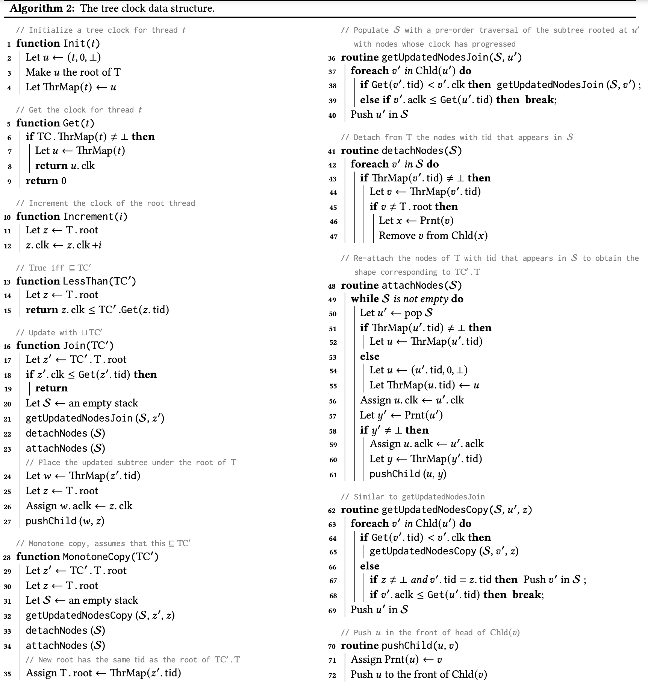

# A Tree Clock Data Structure for Causal Orderings in Concurrent Executions

本文是对 [A Tree Clock Data Structure for Causal Orderings in Concurrent Executions (ASPLOS’22)](https://dl.acm.org/doi/pdf/10.1145/3503222.3507734) 这篇论文的学习笔记。

个人感觉这篇文章非常精妙，提出了 tree clock 这种数据结构来替代目前 Data Race 检测算法中广泛使用的数据结构 vector clock，极大的改善了计算 happen-before 关系时的时间复杂度。

## Contribution

首先来看 tree clock 解决的是什么问题：

假设程序中有 k 个线程，那么 vector clock 的大小就是 k，那么 vector clock 在做 join 和 copy 操作时，就是 $\Theta(k)$ 的时间复杂度。因此，当 k 很大时，join 和 copy 就是 bottleneck。而 tree clock 可以优化该 linear 的时间复杂度为 sublinear。

## Key Insight

vector clock 最基本的操作就是 join 操作，即 $\mathbb{C}_{t_1} \sqcup \mathbb{C}_{t_2} = \lambda t.\;max(\mathbb{C}_{t_1}(t), \mathbb{C}_{t_2}(t))$

考虑如下例子：

- 当前程序中一共有 6 个线程，vector clock 的大小为 6。
  线程 $t_2$ 和线程 $t_1$ 于事件 $e_2$ 和事件 $e_3$ 进行同步 (synchronization)。可以理解为事件 $e_2$ 释放了锁 $m$，然后事件 $e_3$ 获取了锁 $m$，通过锁来实现同步。
  所以更新 $\mathbb{C}_{t_1}$ 为 $\mathbb{C}_{t_1} \sqcup \mathbb{C}_{t_2}$，即 $\mathbb{C}_{t_1} = \mathbb{C}_{t_1} \sqcup \mathbb{C}_{t_2} = [27, 5, 9, 45, 17, 26] \sqcup [11, 6, 5, 32, 14, 20] \\
   = [max(27, 11), max(5, 6), max(9, 5), max(45, 32), max(17, 14), max(26, 20)] \\
   = [28, 6, 9, 45, 17, 26]$

- 现在我们**假设** 线程 $t_2$ 的 vector clock $\mathbb{C}_{t_2}$ 中 $t_3, t_4, t_5, t_6$ 的值都是 $\mathbb{C}_{t_2}$ 之前和 $\mathbb{C}_{t_3}$ 做 join 操作时从 $t_3$ 处获取到的。
  注意到 $\mathbb{C}_{t_1}$ 中 $t_3$ 的值（即 $\mathbb{C}_{t_1}(t_3) = 9$）比 $\mathbb{C}_{t_2}$ 中 $t_3$ 的值（即 $\mathbb{C}_{t_2}=5$）**大**，这意味着**之前**在某一时刻线程 $t_2$ 与 $t_3$ 之间先进行同步， $t_2$ 从 $t_3$ 获取到了 $t_3, t_4, t_5, t_6$ 的值，**然后**某一时刻 线程 $t_1$ 与 $t_3$ 之间再进行同步。
  也就是说，在 $e_2$ 这个时候线程 $t_2$ 的 $\mathbb{C}_{t_2}$ 中 $t_3, t_4, t_5, t_6$ 的值**一定不会**比 $e_3$ 时线程 $t_1$ 的 $\mathbb{C}_{t_1}$ 中持有的 $t_3, t_4, t_5, t_6$ 的值**更**新。所以在 更新 $\mathbb{C}_{t_1}$ 为 $\mathbb{C}_{t_1} \sqcup \mathbb{C}_{t_2}$ 时，计算 $t_3, t_4, t_5, t_6$ 的值是**冗余操作**！

- 由于 vector clock 中没有保存 “线程 $t_2$ 的 vector clock $\mathbb{C}_{t_2}$ 中 $t_3, t_4, t_5, t_6$ 的值都是 $\mathbb{C}_{t_2}$ 之前和 $\mathbb{C}_{t_3}$ 做 join 操作时从 $t_3$ 处获取到的” 这个信息，所以不能避免 $\mathbb{C}_{t_1} \sqcup \mathbb{C}_{t_2}$ 时分别计算 $t_3, t_4, t_5, t_6$ 的最大值这种冗余操作。而 tree clock 就是通过将这一信息编码在一种树数据结构中来避免这种冗余计算的。

## Tree Clock Data Structure

Tree clock 每一个节点对应 vector clock 中的一个 entry，每个节点 u 都由三个元素组成 (tid, clk, aclk)，每个节点的子节点 Chld(u) 都是按照 aclk 的大小降序排序的。

我们举例来说明节点的每一个元素所代表的意义：

$sync(l)$ 表示同步操作，如图 2(a) 中线程 $t_1$ 和线程 $t_2$ 于事件 $e_1$ 和 $e_2$ 处进行同步，即线程 $t_1$ 在 $e_1$ 释放了锁 $l_1$，线程 $t_2$ 在 $e_2$ 获取了锁 $l_1$，事件 $e_1$ 和 事件 $e_2$ 满足 happen-before 关系。

图 3 左边的树对应图 2(a) 中线程 $t_4$ 在事件 $e_7$ 后的 tree clock：

- 因为是 $t_4$ 的 tree clock，所以根节点 $(t_4, 2, \bot)$ 的 tid 就是 $t_4$ ，根节点的 clk 值是 2，这是因为在事件 $e_7$ 后线程 $t_4$ 的 local time 就是 2，根节点的 aclk 的值一定是 $\bot$

- 通过树的结构可以看出来，此时 $t_4$ 持有的 $t_3$ 的信息是通过之前和 $t_3$ 做 join 操作获得的，$t_4$ 持有的 $t_2$ 的信息是通过之前和 $t_2$ 做 join 操作获得的，而 $t_4$ 持有的 $t_1$ 的信息则是通过 $t_2$ 传递过来获得的。

- 根节点的左子节点是 $(t_3, 2, 2)$ 。$(t_3, 2, 2)$ 的 aclk 的值是 2 表示线程 $t_4$ 此时持有的 $t_3$ 的信息是在 local time 为 2 时与线程 $t_3$ 做的 join 获取的，clk 值为 2 表示当时线程 $t_3$ 的 local time 是 2 。

- 根节点的右子节点是 $(t_2, 2, 1)$ 。线程 $t_4$ 此时持有的 $t_2$ 的信息是在 local time 为 1 时与线程 $t_2$ 做的 join 获得的，并且当时线程 $t_2$ 的 local time 是 2 。

- 节点 $(t_2, 2, 1)$ 只有一个子节点 $(t_1, 1, 1)$。对于线程 $t_4$ 来说，持有的 $t_1$ 的信息是通过 $t_2$ 传递获得的。线程 $t_2$ 是在 local time 为 1 时与线程 $t_1$ 做的 join，并且当时线程 $t_1$ 的 local time 就是 1 。

图 3 右边的树对应图 2(b) 中线程 $t_4$ 在事件 $e_7$ 后的 tree clock：

- 因为是 $t_4$ 的 tree clock，所以根节点 $(t_4, 2, \bot)$ 的 tid 就是 $t_4$ ，根节点的 clk 值是 2，这是因为在事件 $e_7$ 后线程 $t_4$ 的 local time 就是 2，根节点的 aclk 的值一定是 $\bot$

- 通过树的结构可以看出来，此时 $t_4$ 持有的 $t_1, t_2, t_3$ 的信息都是通过之前和 $t_3$ 做 join 操作获得的， 而 $t_4$ 持有的 $t_1, t_2$ 的信息则是通过 $t_3$ 传递过来获得的。

- 根节点只有一个子节点 $(t_3, 3, 2)$ 。表示线程 $t_4$ 此时持有的 $t_3$ 的信息是在 local time 为 2 时与线程 $t_3$ 做的 join 获取的，当时线程 $t_3$ 的 local time 是 3 。

- 节点 $(t_3, 3, 2)$ 的左子节点是 $(t_2, 1, 2)$ 。线程 $t_3$ 此时持有的 $t_2$ 的信息是在 local time 为 2 时与线程 $t_2$ 做的 join ，并且当时线程 $t_2$ 的 local time 是 1 。

- 节点 $(t_3, 3, 2)$ 的右子节点是 $(t_1, 1, 1)$。线程 $t_3$ 是在 local time 为 1 时与线程 $t_1$ 做的 join，并且当时线程 $t_1$ 的 local time 就是 1 。

### Algorithm

Tree clock 详细的数据结构及算法如下图所示：

我们还是举例说明 tree clock 执行 Join 和 MonotoneCopy 这两个关键操作的算法流程。

#### Join

我们用 $TC_2.Join(TC_1)$ 表示 joins the tree clock TC1 to TC2。

以图 4 说明，$TC_2.Join(TC_1)$ 的流程：

- `Let z' = TC'.T.root`
  
  z' 即 $TC_1$ 的根节点 $(t_1, 16, \bot)$
- `if z'.clk <= Get(z'.tid) then return`
  
  z'. clk 为 16，z'. tid 为 $t_1$ ；Get(z'. tid) 即 $TC_2$ 中 tid 为 $t_1$ 的节点的 clk 值，$TC_2$ 中 tid 为 $t_1$ 的节点为 $(t_1, 4, 4)$，其 clk 值为 4
  
  z'. clk = 16 <= Get(z'. tid) = 4 不成立，所以需要继续执行 Join 剩余流程。（这里 z'. clk <= Get(z'. tid) 就是判断 $TC_2$ 中持有的关于 $t_1$ 的信息是否比 $TC_1$ 更新）
- `Let S = an empty stack; getUpdatedNodesJoin(S, z')`
  
  执行完 `getUpdatedNodesJoin(S, z')` 后，S 的内容如下：
  
  $[(t_1, 16, \bot), (t_3, 17, 7), (t_2, 20, 9)]$，注意 S 是栈
- `detachNodes(S)` 就是将$TC_2$ 中与 S 中节点 tid 相同的节点从 $TC_2$ 中“拆卸”下来，即将 $TC_2$ 中的 $(t_1, 4, 4)$、$(t_3, 10, 4)$ 和 $(t_2, 14, 9)$ “拆卸”下来
- `attachNodes(S)` 就是将 `detachNodes(S)` 中"拆卸"下来的节点再“附加”到恰当的位置 ：
  - 第一个处理的 S 中的节点是 $(t_1, 16, \bot)$，记作 u'，对应的 $TC_2$ 中的节点就是 $(t_1, 4, 4)$，记作 u。更新 u 的 clk 为 u' 的 clk，更新 u 的 aclk 为 u' 的 aclk，即 $(t_1, 4, 4)$ 变为 $(t_1, 16, \bot)$，由于 u' 是 $TC_1$ 的 根结点，我们暂时先把 u 先放一放，等下再将其“附加”到 $TC_2$ 中恰当的位置。
  - 第二个处理的 S 中的节点是 $(t_3, 17, 7)$，记作 u'，对应的 $TC_2$ 中的节点就是 $(t_3, 10, 4)$，记作 u。更新 u 的 clk 为 u' 的 clk，更新 u 的 aclk 为 u' 的 aclk，即 $(t_3, 10, 4)$ 变为 $(t_3, 17, 7)$，在 $TC_1$ 中 u' $(t_3, 17, 7)$ 的父节点是 $(t_1, 16, \bot)$，所以我们将 u “附加”到 $TC_2$ 中 tid 为 $t_1$ 的节点上，作为第一个子节点。
  - 第三个处理的 S 中的节点是 $(t_2, 20, 9)$，流程与 $(t_3, 17, 7)$ 类似不再赘述，需要注意的是，我们在“拆卸”和“附加”时原本节点的子节点也会随着父节点一起动。
- `Let w = ThrMap(z'.tid); Let z = T.root; Assign w.aclk = z.clk; pushChild(w, z)`
  
  最后将我们在 `attachNodes(S)` 中遗留下来的 $(t_1, 16, \bot)$ 进行处理，首先将 aclk 的值设置为 $TC_2$ 的根节点的 clk 值，即 $(t_1, 16, \bot)$ 变为 $(t_1, 16, 25)$，然后“附加”到根结点上，作为根结点的第一个子节点。

#### MonotoneCopy

我们用 $TC_2.MonotoneCopy(TC_1)$ 表示 copy TC1 to TC2 when we know that TC2 ⊑ TC1 。

$TC_2.MonotoneCopy(TC_1)$ 的流程就不再详细解释了，这里以图 5 为例简单描述下：

- `Let z' = TC'.T.root; Let z = T.root`
  
  z' 即 $TC_1$ 的根结点 $(t_1, 28, \bot)$， z 即 $TC_2$ 的根节点 $(t_3, 14, \bot)$

- `getUpdatedNodesCopy(S, z', z)`
  
  执行完 `getUpdatedNodesCopy(S, z', z)` 后，S 的内容为：$[(t_1, 28, \bot), (t_3, 14, 7), (t_2, 13, 9), (t_5, 8, 11)]$

- `detachNodes(S)` 和 `attachNodes(S)` 的流程与 Join 是一样的，最后 `Assign T.root = ThrMap(z'.tid)` 将 $(t_1, 28, \bot)$ 设置为新的 $TC_2$ 的根节点。

## Conclusion

本文提出了 tree clock 这种数据结构，一种用于在并发执行中维护逻辑时间的新数据结构。 与 vector clock 相比，核心思想就是 tree clock 额外保存了“当前 tree clock 中每一个 thread 的 clock 的值是何时从何处获取到的”这一信息，利用这一信息 tree clock 可以在 sublinear 时间内执行 join 和 copy 操作，从而尽可能避免了由于冗余操作造成的时间开销。

原本中还有很多部分都涉及到一些复杂的数学证明，我就没有涉猎了。

P.S. 这篇论文获得 ASPLOS 2022 的 Best Paper Awards 我觉得当之无愧。
