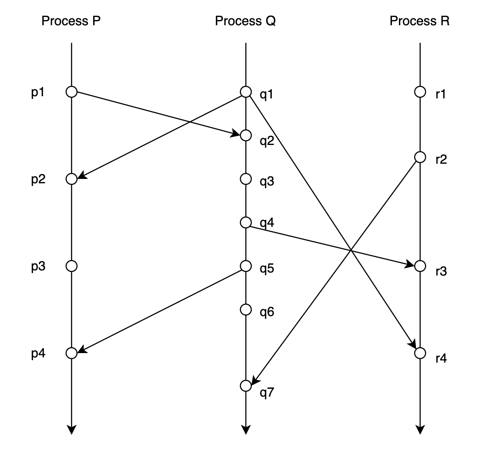

Dissecting ThreadSanitizer Algorithm
====================================

本文深入剖析 ThreadSanitizer(V2) 检测 Data Race 背后的算法原理。

.. raw:: html

   <!--more-->

Introduction
------------

ThreadSanitizer(AKA TSan) 是一个集成在 GCC 和 Clang
中的动态分析工具，能够检测 C++ 代码中大多数的数据竞争 (data race)
。它由编译时插桩和运行时库两部分组成，通过编译和链接时添加参数
``-fsanitize=thread``\ ，就可以在运行时检测 data race 。

Data Race
---------

TSan 是检测 data race 的动态分析工具。我们先看下 data race 指的是什么？

**Data Race**\ ：两个线程 **concurrently** 访问了\ **同一个内存位置
(memory
location)**\ ，并且两个线程的访存操作中\ **至少一个是写操作**\ 。

注：关于 race condition 和 data race 的区别，见 `Race Condition vs. Data
Race – Embedded in Academia <https://blog.regehr.org/archives/490>`__

例如下述代码：两个线程并发地修改整型全局变量 Global 存在 data
race。两个线程执行结束后，全局变量 Global 的值可能是 1 也可能是
2。如果是在读写 STL 容器时存在 data
race，则可能导致更严重的后果，比如内存破坏、程序崩溃。

.. code:: cpp

   int Global;

   void Thread1() {
     Global = 1;
   }

   void Thread2() {
     Global = 2;
   }

根据 data race 的定义，判断代码中是否存在 data race 需要考虑 3 个条件：

1. 两个线程访问的是否为\ **同一个 memory location**
2. 两个线程的访存操作中\ **至少有一个是写操作**
3. 两个线程的访存操作是否 **concurrent**

其中前两个条件很容易判断，所以检测 data race
的要解决的关键问题就是怎么判断两个访存操作是否 **concurrent** **！**

Happen-Before & Concurrent
--------------------------

在介绍如何判断两次访问操作是否是 concurrent 之前，我们需要先引入
happen-before 的定义。

Happen-before 的定义最开始是在 `Lamport, L., 1978. Time, clocks, and the
ordering of events in a distributed
system <https://lamport.azurewebsites.net/pubs/time-clocks.pdf>`__
中给出的，描述的是分布式系统中事件之间的一种偏序关系。

一个分布式系统是由一系列 processes 组成的，每个 process
又由一系列事件组成， 不同的 process 之间是通过收发消息进行通信的。

**Happen-before** 关系（记作 :math:`\rightarrow`\ ）的定义：

1. 如果事件 :math:`a` 和事件 :math:`b` 是在同一个 process 中的事件，并且
   :math:`a` 早于 :math:`b` 发生，那么 :math:`a \rightarrow b`

2. 如果事件 :math:`a` 和事件 :math:`b` 是不同 process 中的事件，且
   :math:`b` 是 :math:`a` 发送的消息的接收者，那么
   :math:`a \rightarrow b`

3. **Happen-before** 关系是一种严格\ **偏序**\ 关系 (strict partial
   order)，即满足 transitive, irreflexive and antisymmetric

   1. Transitive。对于任意事件 :math:`a,b ,c`\ ，如果
      :math:`a \rightarrow b` 且 :math:`b \rightarrow c`\ ，那么有
      :math:`a \rightarrow c`
   2. Irreflexive。对于任意事件 :math:`a`\ ，都有
      :math:`a \nrightarrow a`
   3. Antisymmetric。对于任意事件 :math:`a,b`\ ，如果
      :math:`a \rightarrow b`\ ，那么有 :math:`b \nrightarrow a`

下面通过一个例子对 happen-before 进行说明：

上图是对一个分布式系统的某一次 trace：

-  3 条垂直线分别表示 3 个 process: :math:`P, Q, R`
-  垂直线上的点表示事件，在同一条垂直线上纵坐标小的事件发生的时间早于纵坐标大的事件发生的时间。例如事件
   :math:`p_1` 早于事件 :math:`p_2` 发生
-  连接 process 之间的线表示 process
   之间通过收发消息进行通信，\ :math:`p_1 \rightarrow q_2` 表示 process
   :math:`P` 于事件 :math:`p_1` 向 process :math:`Q` 发送消息，
   这个消息被 process :math:`Q` 于事件 :math:`q_2` 接收到

那么对于上图分布式系统 trace：

-  根据 **happen-before**
   的定义能得出：\ :math:`p_1 \rightarrow r_4`\ ，这是因为
   :math:`p_1 \rightarrow q_2`, :math:`q_2 \rightarrow q_4`,
   :math:`q_4 \rightarrow r_3`, :math:`r_3 \rightarrow r_4`\ ，所以
   :math:`p_1 \rightarrow r_4`\ 。即事件 :math:`p1` 一定是先于事件
   :math:`r4` 发生，不管上述分布式系统事件运行多少次
-  尽管根据本次 trace 看来在时间上事件 :math:`q_3` 是早于事件
   :math:`p_3` 发生的，但是 :math:`q_3 \nrightarrow p_3` 且
   :math:`p_3 \nrightarrow q_3`\ ，即事件 :math:`q_3` 和事件 :math:`p_3`
   之间是没有 happen-before 关系的。所以不能保证每一次运行，事件
   :math:`q_3` 都是早于事件 :math:`p_3` 发生的，也有可能在某一次 trace
   中事件 :math:`p_3` 是早于事件 :math:`q_3` 发生的

理解了 happen-before 的定义后，我们给出 **concurrent** 的定义：如果
:math:`a \nrightarrow b` 且 :math:`b \nrightarrow a`\ ，那么称 :math:`a`
和 :math:`b` 是 **concurrent** 的。

这样我们就能够将判断两次访存操作之间是否 concurrent
转化为了判断两次访存操作之间是否存在 happen-before 关系。

那么如何判断两次访存操作之间是否存在 happen-before 关系呢？答案是 Vector
Clock。在介绍 Vector Clock 之前，我们需要先了解下 Lamport Logical
Clock。

Lamport Logical Clock
---------------------

Lamport logical clock 算法是由 Leslie Lamport 在 `Lamport, L., 1978.
Time, clocks, and the ordering of events in a distributed
system <https://lamport.azurewebsites.net/pubs/time-clocks.pdf>`__
中提出的一种简单的逻辑时钟算法，用于描述分布式计算机系统中事件的偏序关系。

算法如下：

1. 每个 Process :math:`P_i` 都持有一个逻辑时钟
   :math:`Clock_i`\ ，process :math:`P_i` 在每次本地事件发生之前，都将
   :math:`Clock_i` 自增 1
2. Process :math:`P_i` 向其他 Process 发送消息时，先执行步骤 1，然后将
   :math:`Clock_i` 的值包含在消息中一并发送出去
3. Process :math:`P_j` 接收到 Process :math:`P_i`
   发送来的消息时，获取消息中携带的 :math:`Clock_i` 的值，与自身的
   :math:`Clock_j` 取最大值，然后在认为收到消息之前将 :math:`Clock_j`
   自增 1

根据 lamport logical clock 算法流程和 happen-before
定义易得：对于任意两个事件，如果事件 :math:`a` **happen-before** 事件
:math:`b`\ ，那么 :math:`Clock(a) < Clock(b)`\ 。

下面通过例子来说明 lamport logical clock 算法流程：

-  初始时，Process :math:`P` 和 Process :math:`Q` 的逻辑时钟的值都为 0
-  Process :math:`P` 发生本地事件 :math:`p_1`\ ，逻辑时钟
   :math:`Clock_p` 的值由 0 更新为 1。Process :math:`Q` 发生本地事件
   :math:`q_1`\ ，逻辑时钟 :math:`Clock_q` 的值由 0 更新为 1
-  Process :math:`P` 于事件 :math:`p_2` 向 Process :math:`Q`
   发送消息，先自增逻辑时钟 :math:`Clock_p` 的值，由 1 更新为
   2。然后将此时 :math:`Clock_p` 的值（即 2）包含在消息中一并发送出去
-  Process :math:`Q` 接收到 Process :math:`P`
   发送来的消息，获取消息中携带的逻辑时钟的值（即 2），首先将逻辑时钟
   :math:`Clock_q` 的值更新为消息中携带的逻辑时钟的值与此时自身逻辑时钟
   :math:`Clock_q` 的值的最大值（即 :math:`Clock_q` 更新为 2 和 2
   的最大值，还是 2），然后再将 :math:`Clock_q` 自增 1（即
   :math:`Clock_q` 的值由 2 更新为 3 ）
-  …

但是 lamport logical clock 是存在局限性的：

-  只能保证：如果 :math:`a \rightarrow b`\ ，那么
   :math:`Clock(a) < Clock(b)`
-  但是 :math:`Clock(a) < Clock(b)` 不意味着
   :math:`a \rightarrow b`\ ，即我们不能基于 :math:`Clock(a) < Clock(b)`
   来判定事件 :math:`a` **happen-before** 事件 :math:`b`

例如 $Clock_p(p1)= 1 < 2 = Clock_q(q2) $，但是实际上 :math:`p_1`
**happen-before** :math:`p_2` 是不成立！也就是说，事件 :math:`p_1`
和事件 :math:`p_2` 之间谁都可能早于另外一个事件发生。

我们前面将 data race 检测问题转化为了判断两次访存操作之间是否存在
happen-before 关系的问题。但是由于 lamport logical lock
的局限性，我们不能直接将 lamport logic clock 应用于 data race 的检测。

Vector Clock
------------

Colin Fidge 和 Friedemann Mattern 提出的 vector clock 解决了 lamport
logic clock 的上述局限性

vector clock 算法如下：

-  每一个 process :math:`P_i` 都对应一个 vector clock
   :math:`VC_i`\ ，\ :math:`VC_i` 是由 n 个元素组成的向量，n
   是分布式系统中 process 的数量。每个 process :math:`P_i` 的
   :math:`VC_i` 都被初始化为 0
-  每当 process :math:`P_i` 发生本地事件之前，更新 vector
   clock：\ :math:`VC_i[i] = VC_i[i] + 1`
-  Process :math:`P_i` 向其他 Process 发送消息时，先更新 vector
   clock：\ :math:`VC_i[i] = VC_i[i] + 1`\ ，然后将 :math:`VC_i`
   的值包含在消息中
-  process :math:`P_j` 接收由 process :math:`P_i` 发送来的 message，更新
   vector
   clock：\ :math:`VC_j[j] = VC_j[j] + 1, VC_j[k] = max(VC_j[k], VC_i[k])\ \textup{for all process}\ k`

下面还是通过一个例子来说明 vector clock 的算法流程：

-  初始时 :math:`VC_1 = VC_2 = VC_3= [0,0,0]`

-  Process :math:`P` 发生内部事件 :math:`p_1`\ ，更新 vector
   clock：\ :math:`VC_1 = [0+1,0,0]=[1,0,0]`

-  Process :math:`Q` 发生内部事件\ :math:`p_2`\ ，更新 vector
   clock：\ :math:`VC_2 = [0,0+1,0] = [0,1,0]`

-  Process :math:`R` 发生内部事件 :math:`p_3`\ ，更新 vector
   clock：\ :math:`VC_3 = [0,0,0+1]=[0,0,1]`

-  process :math:`Q` 于事件 :math:`q_2` 接收由 process :math:`P` 于事件
   :math:`p_2` 发送的消息，更新 vector clock：

   -  :math:`VC_1[1] = 1 + 1 = 2, VC_1 = [2, 0, 0]`
   -  :math:`VC_2[2] = 1 + 1 = 2, VC_2 = [0,2,0]`
   -  :math:`VC_2 = max(VC_1, VC_2) = [max(2,0), max(0,2), max(0,0)]=[2,2,0]`

-  …

Vector clock 解决了 lamport logical clock 的局限性，满足如下性质：

-  如果事件 :math:`a` **happen-before** 事件 :math:`b`\ ，那么
   :math:`VC(a) < VC(b)`
-  如果 :math:`VC(a) < VC(b)`\ ，那么事件 :math:`a` **happen-before**
   事件 :math:`b`

即
:math:`p_a \rightarrow q_b \quad \textup{iff} \quad VC_p(a) < VC_q(b)`

Vector clock 上的偏序关系如下：

-  :math:`VC_p = VC_q \quad \textup{iff} \enspace \forall k, \enspace VC_p[k] = VC_q[k]`
-  :math:`VC_p \neq VC_q \quad \textup{iff} \enspace \exist k, \enspace VC_p[k] \neq VC_q[k]`
-  :math:`VC_p \leq VC_q \quad \textup{iff} \enspace \forall k, \enspace VC_p[k] \leq VC_q[k]`
-  :math:`VC_p < VC_q \quad \textup{iff} \enspace (VC_p \le VC_q \enspace \textup{and} \enspace VC_p \neq VC_q)`

根据
:math:`p_a \rightarrow q_b \quad \textup{iff} \quad VC_p(a) < VC_q(b)`
这个性质，我们就能使用 vector clock 来判断两次访存操作之间是否存在
happen-before 关系，即能够基于 vector clock 算法来检测多线程程序中的
data race。

Data Race Detection
-------------------

我们前面在介绍 lamport logic clock 和 vector clock
时都是以分布式系统中的事件之间序关系为背景进行介绍的。

实际上多线程程序也可以看作是一个分布式系统。我们对上述 vector clock
算法稍加修改，就可以应用于检测多线程程序中的 data race：

-  符号定义：

   -  :math:`\mathbb{VC_1} \sqsubseteq \mathbb{VC_2}\quad\textbf{iff}\quad\forall t.\ \mathbb{VC_1}(t) \leq \mathbb{VC_2}(t)`
   -  :math:`\mathbb{VC_1} \sqcup \mathbb{VC_2} \quad=\quad \lambda t.\ max(\mathbb{VC_1}(t), \mathbb{VC_2}(t))`

-  每个线程 :math:`t` 都对应一个 vector clock
   :math:`\mathbb{VC}_t`\ ，初始值为 0。对于任意一个线程
   :math:`u`\ ，\ :math:`\mathbb{VC}_t(u)` 记录的其实是与线程 :math:`t`
   的当前操作满足 happen-before 关系的线程 :math:`u` 的上一次操作的
   clock。如果把线程 :math:`u` 的上一次操作记为 :math:`O_u`\ ，把线程
   :math:`t` 的当前操作记为 :math:`O_t`\ ，那么有
   :math:`O_u\ \text{happen-before}\ O_t`
-  每一个锁 :math:`m` 都对应一个 vector clock :math:`\mathbb{L}_m`
-  每一个变量 :math:`x`\ 都对应两个 vector clock: :math:`\mathbb{W}_x`
   和 :math:`\mathbb{R}_x`\ 。对于任意一个线程
   :math:`t`\ ，\ :math:`\mathbb{W}_x[t]` 和 :math:`\mathbb{R}_x[t]`
   记录了线程 :math:`t` 对变量 :math:`x` 的最后一次读/写的 clock

   -  线程 :math:`t` 对变量 :math:`x` 的读时，会将
      :math:`\mathbb{R}_x[t]` 的值更新为 :math:`\mathbb{VC}_t[t]` 的值
   -  程序 :math:`t` 对变量 :math:`x` 的写时，会将
      :math:`\mathbb{W}_x[t]` 的值更新为 :math:`\mathbb{VC}_t[t]` 的值

-  程序中执行同步和线程操作时，算法会更新相应的 vector clock：

   -  :math:`rel(t, m)`\ 。线程 :math:`u` 释放了锁 :math:`m`\ ，先将
      :math:`\mathbb{L}_m` 的值更新为 :math:`\mathbb{VC}_u` 的值，再将
      :math:`\mathbb{VC}_u[u]++`
   -  :math:`acq(t, m)`\ 。线程 :math:`t` 获取了锁 :math:`m`\ ，将
      :math:`\mathbb{VC}_t` 的值更新为
      :math:`\mathbb{VC}_t \sqcup \mathbb{L}_m` 的值
   -  :math:`fork(t, u)`\ 。先将 :math:`\mathbb{VC}_u` 的值更新为
      :math:`\mathbb{VC}_u \sqcup \mathbb{VC}_t`\ ，再将
      :math:`\mathbb{VC}_t[t]++`
   -  :math:`join(t, u)`\ 。先将 :math:`\mathbb{VC}_t` 的值更新为
      :math:`\mathbb{VC}_t\sqcup \mathbb{VC}_u`\ ，再将
      :math:`\mathbb{VC}_u[u]++`

-  判断是否存在 data race：

   -  假设当前线程 :math:`u` 读变量 :math:`x`\ ，如果满足
      :math:`\mathbb{W_x} \sqsubseteq \mathbb{VC_u}`\ ，那么当前线程
      :math:`u` 对变量 :math:`x` 的读与之前其他线程对变量 :math:`x`
      的写不存在 data race
   -  假设当前线程 :math:`u` 写变量 :math:`x`\ ，如果
      :math:`\mathbb{W_x} \sqsubseteq \mathbb{VC_u}` 且
      :math:`\mathbb{R_x} \sqsubseteq \mathbb{VC_u}` 那么当前线程
      :math:`u` 对变量 :math:`x` 的写与之前其他线程对变量 :math:`x`
      的写和读不存在 data race

--------------

下面还是通过一个例子来说明如何应用 vector clock 检测多线程程序中的 data
race：

-  考虑多线程程序中有两个线程 A 和 B，有一个锁 :math:`m` ，还有一个变量
   :math:`x`

-  线程 :math:`A` 对应的 vector clock 记作 :math:`\mathbb{VC}_A`\ ，线程
   :math:`B` 对应的 vector clock 记作 :math:`\mathbb{VC}_B`\ ，锁
   :math:`m` 对应的 vector clock 记作 :math:`\mathbb{L}_m`\ ，变量
   :math:`x` 对应的写/读 vector clock 记作 :math:`\mathbb{W}_x` 和
   :math:`\mathbb{R}_x`

-  假设多线程程序某一个时刻的运行状态如下图所示：

   .. image:: assets/2022-10-20-11-32-22-image.png

-  此时线程 :math:`A` 执行语句 ``x = 0`` 写变量
   :math:`x`\ ，我们需要检查当前线程对变量 :math:`x`
   的写与之前其他线程对变量 :math:`x` 的写和读之间是否存在 data
   race，即判断 :math:`\mathbb{W_x} \sqsubseteq \mathbb{VC_u}` 和
   :math:`\mathbb{R_x} \sqsubseteq \mathbb{VC_u}` 是否满足。

   显然 :math:`[3, 0] \sqsubseteq [4,1]` 和
   :math:`[0, 1] \sqsubseteq [4,1]` 都满足，即本次线程 :math:`A`
   执行语句 ``x = 0`` 写变量 :math:`x` 与之前其他线程对变量 :math:`x`
   的写和读之间不存在 data race

   .. image:: assets/2022-10-20-11-34-10-image.png

-  因为线程 :math:`A` 执行语句 ``x = 0`` 写了变量
   :math:`x`\ ，我们要更新 :math:`\mathbb{W}_x` 的值，将
   :math:`\mathbb{W}_x[A]` 的值更新为 :math:`\mathbb{VC}_A[A]` 的值：

   .. image:: assets/2022-10-20-11-34-59-image.png

-  程序继续执行，此时线程 :math:`A` 执行语句 ``rel(m)`` 释放锁
   :math:`m`\ ，先将 :math:`\mathbb{L}_m` 的值更新为
   :math:`\mathbb{VC}_A` 的值，再将 :math:`\mathbb{VC}_A[A]++`

   .. image:: assets/2022-10-20-11-40-30-image.png

-  程序继续执行，此时线程 :math:`B` 执行语句 ``acq(m)`` 申请锁
   :math:`m`\ ，将 :math:`\mathbb{VC}_B` 的值更新为
   :math:`\mathbb{VC}_B \sqcup \mathbb{L}_m` 的值

   .. image:: assets/2022-10-20-11-41-22-image.png

-  线程 :math:`B` 执行语句 ``x = 1`` 写变量 :math:`x`
   ，我们需要检查当前线程对变量 :math:`x` 的写与之前其他线程对变量
   :math:`x` 的写和读之间是否存在 data race，即判断
   :math:`\mathbb{W_x} \sqsubseteq \mathbb{VC_u}` 和
   :math:`\mathbb{R_x} \sqsubseteq \mathbb{VC_u}` 是否满足。

   显然 :math:`[4, 0] \sqsubseteq [4,8]` 和
   :math:`[0, 1] \sqsubseteq [4,8]` 都满足，即本次线程 :math:`B`
   执行语句 ``x = 1`` 写变量 :math:`x` 与之前其他线程对变量 :math:`x`
   的写和读之间不存在 data race。

   因为线程 :math:`B` 执行语句 ``x = 1`` 写变量 :math:`x`\ ，我们要更新
   :math:`\mathbb{W}_x` 的值，将 :math:`\mathbb{W}_x[B]` 的值更新为
   :math:`\mathbb{VC}_B[B]` 的值：

   .. image:: assets/2022-10-20-11-43-57-image.png

-  线程 :math:`A` 执行语句 ``y = x`` 读变量
   :math:`x`\ ，我们需要检查当前线程对变量 :math:`x`
   的读与之前其他线程对变量 :math:`x` 的写之间是否存在 data race，即判断
   :math:`\mathbb{W_x} \sqsubseteq \mathbb{VC_u}` 是否满足。

   显然 :math:`[4, 8] \sqsubseteq [5,1]` **不满足**\ ，即本次线程
   :math:`B` 执行语句 ``x = 1`` 写变量 :math:`x` 与之前其他线程对变量
   :math:`x` 的读之间\ **存在 data race**\ 。

   即我们检测到线程 :math:`A` 执行语句 ``y = x`` 读变量 :math:`x`
   与之前其他线程对变量 :math:`x` 的写和读之间\ **存在 data
   race**\ 。更具体地说是线程 :math:`A` 执行语句 ``y = x`` 读变量
   :math:`x` 与之前线程 :math:`B` 执行语句 ``x = 1`` 读变量 :math:`x`
   存在 data race。

   .. image:: assets/2022-10-20-11-45-55-image.png

ThreadSanitizer Internals
-------------------------

ThreadSanitizer 检测 data race 的思想其实就是基于 vector clock
算法的，只不过在实现时做了一些取舍。比如对于每一个变量
:math:`x`\ ，ThreadSanitizer 不会记录所有线程最近一次对变量 :math:`x`
的读写，ThreadSanitizer 只会记录最近 4 次对变量 :math:`x` 的读写。

ThreadSanitizer 由编译时插桩和运行时库两部分组成。

-  编译时插桩：对于每一次 memory access (load, store)，都会在此次
   acccess 之前插入一个函数调用 (``__tsan_read``,
   ``__tsan_write``)，该函数调用是在运行时库中实现的。
-  运行时库：在 ``__tsan_read``, ``__tsan_write`` 中实现 data race
   检测的核心逻辑，判断本次访问是否存在 data race。劫持了很多函数实现如
   libc 和 pthread，在申请锁、释放锁，fork/join 线程时更新 vector clock
   。

例如，本文最开始提到的全局变量数据竞争的代码片段使用 ThreadSanitizer
插桩后的代码变为如下所示：

.. code:: cpp

   int global;

   void Thread1() {
     __tsan_func_entry(__builtin_return_address(0));
     __tsan_write4(&global);
     global = 1;
     __tsan_func_exit();
   }

   void Thread2() {
     __tsan_func_entry(__builtin_return_address(0));
     __tsan_write4(&global);
     global = 2;
     __tsan_func_exit();
   }

注意到：在 ``global = 1`` 和 ``global = 2`` 之前都插入了对
``__tsan_write4`` 的函数调用。

--------------

启用 ThreadSanitizer 后，在程序运行过程中，每一个线程都会保存一个 vector
clock，每 8-bytes 的应用程序内存都对应有 4 个 8-bytes 的 shadow
word。每个 shadow word 都用于记录一次访问操作，记录 TID（线程
id）、Epoch（访存操作发生时线程 TID 此时的 local
time）、Pos:Size（标识本次访存访问的是当前 8-bytes 的哪几个
bytes）、IsWrite（标识本次访存操作是读还是写）。

每次读写变量 :math:`x` 时，由于程序被 ThreadSanitizer
插桩，所以在执行读写操作之前，都会调用函数 ``__tsan_read`` 或
``__tsan_write``\ ，在\ ``__tsan_read`` 和
``__tsan_write``\ 的函数实现中，首先找到变量 :math:`x` 所在的 8-bytes
内存区域。然后找到这 8-bytes 内存所对应的 4 个 shadow
word，检查当前这一次对变量 :math:`x` 的读写与shadow word 中记录的最近 4
次读写是否存在 data race。最后更新 shadow word 的内容，记录本次对变量
:math:`x` 的读写，保证 shadow word 记录的是最近 4 次对变量 :math:`x`
的读写。

完整的 ThreadSanitizer 算法的伪代码如下所示：

.. code:: python

   def HandleMemoryAccess(thread_state, tid, pc, addr, size, is_write, is_atomic):
     shadow_mem = MemToShadow(addr) # the type of shadow_mem is uint64_t*
     IncrementThreadClock(tid)
     LogEvent(tid, pc)
     new_shadow_word = ShadowWord(tid, CurrentClock(tid), addr, size, is_write, is_atomic)
     stored = false
     for i in range(0, 4):
       raced = UpdateOneShadowState(thread_state, shadow_mem, i, new_shadow_word, stored)
       if raced:
         return
     if not stored:
       # Evict a random Shadow Word
       shadow_mem[Random(4)] = store_word # Atomic

   def UpdateOneShadowState(shadow_mem, idx, new_shadow_word, stored):
    old_shadow_word = shadow_mem[idx] # Atomic
    # The old state is empty
    if old_shadow_word == 0:
      if not stored:
        StoreIfNotYetStored(shadow_mem[idx], store_word)
        stored = true
      return false
    # Is the memory access equal to the previous?
    if AccessedSameRegion(old_shadow_word, new_shadow_word):
      if SameThreads(old_shadow_word, new_shadow_word): # same thread
        if IsRWWeakerOrEqual(old_shadow_word, new_shadow_word):
          StoreIfNotYetStored(shadow_mem[idx], store_word)
          stored = true
        return false
      if HappensBefore(old_shadow_word, thread_state):
          return false
      if IsBothReadsOrAtomic(old_shadow_word, new_shadow_word):
        return false
      # race!
      ReportRace(old_shadow_word, new_shadow_word)
      return true
    # Do the memory access intersect?
    if AccessedIntersectingRegions(old_shadow_word, new_shadow_word):
      if SameThreads(old_shadow_word, new_shadow_word):
        return false
      if IsBothReadsOrAtomic(old_shadow_word, new_shadow_word):
        return false
      if HappensBefore(old_shadow_word, thread_state):
        return false
      # race!
      ReportRace(old_shadow_word, new_shadow_word)
      return true
    # The accesses do not intersect, do nothing
    return false

   def StoreIfNotYetStored(shadow_mem, store_word):
     *shadow_mem = store_word # Atomic
     store_word = 0

   def IsRWWeakerOrEqual(old_shadow_word, new_shadow_word):
    return (old_shadow_word.is_atomic > new_shadow_word.is_atomic) ||
           (old_shadow_word.is_atomic == new_shadow_word.is_atomic &&
            !old_shadow_word.is_write >= !new_shadow_word.is_write)

   def HappensBefore(old_shadow_word, thread_state):
     return thread_state.vector_clock.get(old_shadow_word.tid) >= old_shadow_word.epoch

References
----------

1. `Lamport, L., 1978. Time, clocks, and the ordering of events in a
   distributed system.Communications of the ACM,21(7),
   pp.558-565. <https://lamport.azurewebsites.net/pubs/time-clocks.pdf>`__
2. `Cormac Flanagan and Stephen N. Freund. 2009. FastTrack: efficient
   and precise dynamic race detection. (PLDI
   ’09) <https://users.soe.ucsc.edu/~cormac/papers/pldi09.pdf>`__
3. `Finding races and memory errors with GCC instrumentation. (GNU Tools
   Cauldron
   2012) <https://gcc.gnu.org/wiki/cauldron2012?action=AttachFile&do=get&target=kcc.pdf>`__
4. `AddressSanitizer, ThreadSanitizer and MemorySanitizer – Dynamic
   Testing Tools for C++. (Google Test Automation
   Conference) <https://developers.google.com/google-test-automation-conference/2013/presentations-day2#Day2Presentation6>`__
5. https://en.wikipedia.org/wiki/Lamport_timestamp
6. https://en.wikipedia.org/wiki/Vector_clock
