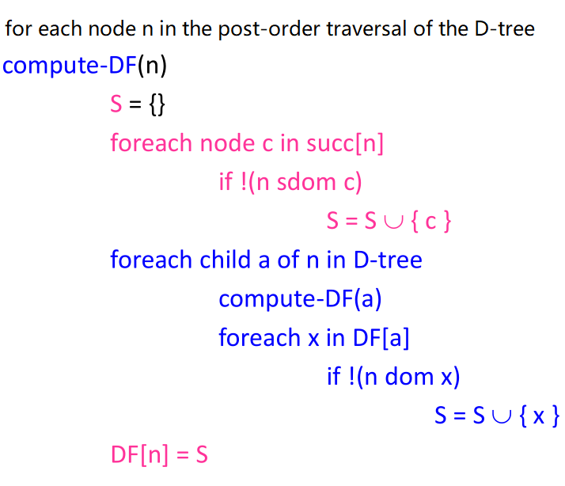
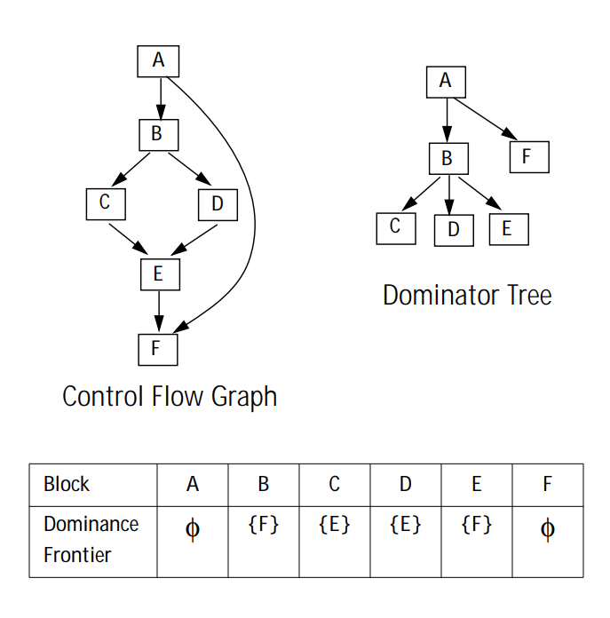
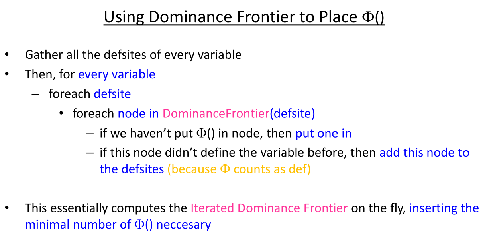
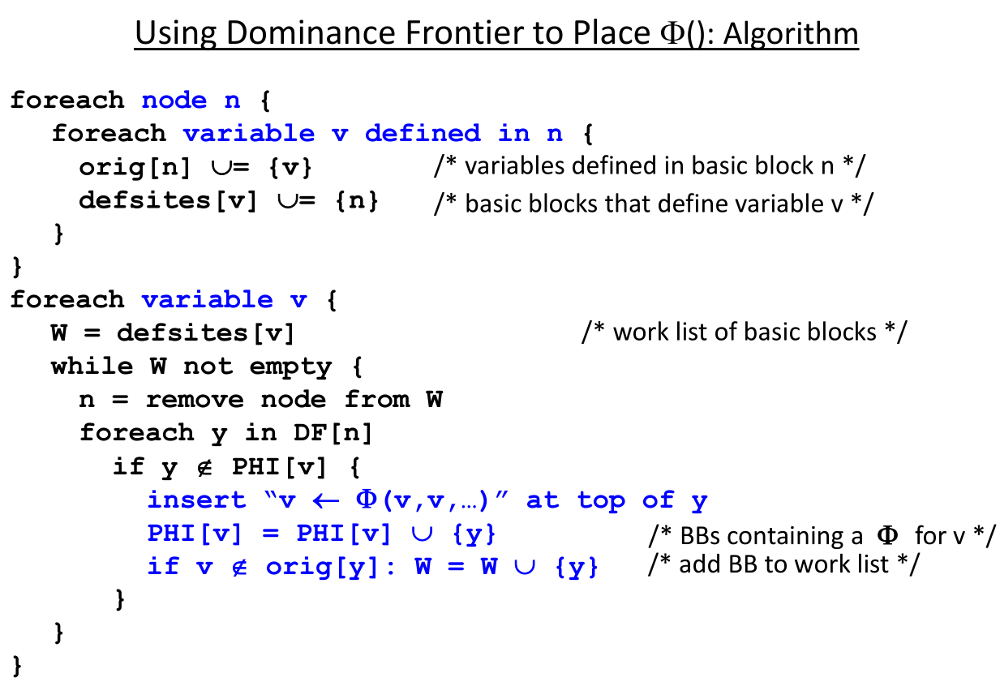
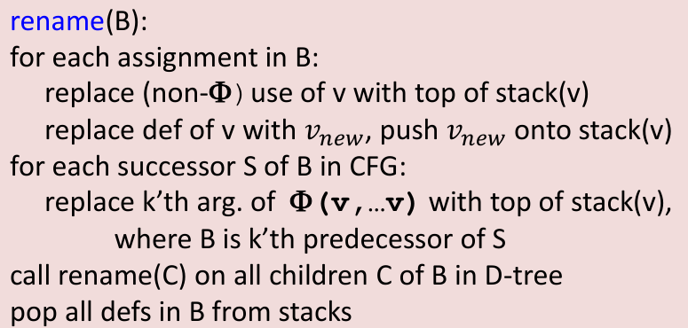
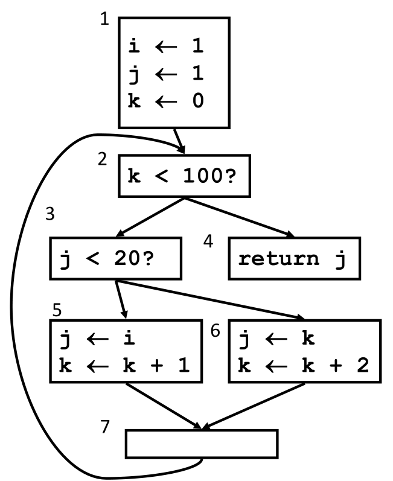
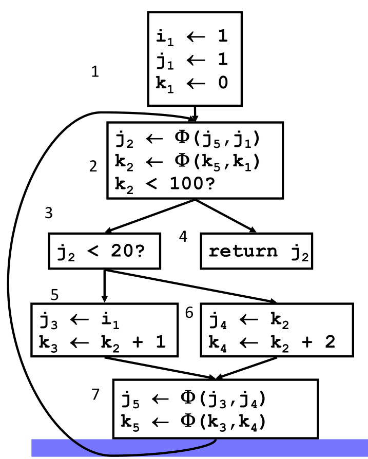

SSA-construction
================

本文中的内容基本上均来自 CMU 15-745 的课程讲义。

标准的SSA 构建算法分成两步：

1. Place all Φ()
2. Rename all variables

在讲 SSA 构建算法之前，需要一些基础知识。

Basics
------

Dominator
~~~~~~~~~

-  N dominates M (N dom M) <==> 在 CFG 上，从 entry node 到 M
   的所有路径都经过 N
-  真支配 (strictly dominate, sdom)，如果 N dom M 并且 N != M，则 N sdom
   M
-  直接支配 (immediate dominate, idom)，如果N dom M 并且不存在 N’，使 N
   dom N’，N’ dom M，则 N idom M

Dominator Tree
~~~~~~~~~~~~~~

-  父节点是子节点的直接支配节点

Dominance Frontier
~~~~~~~~~~~~~~~~~~

对于图节点 N，The Dominance Frontier of node N 是一个集合，该集合包含 W
如果 W 满足以下条件：

1. N 是 W 的某个前驱结点的支配节点
2. N 不是 W 的真支配节点

即 DF(N) = { W \| N dom pred(W) AND !(N sdom W)}

Computing the Dominance Frontier: Algorithm
~~~~~~~~~~~~~~~~~~~~~~~~~~~~~~~~~~~~~~~~~~~

|image0|

下图是一个计算 Dominance Frontier 的例子：

|image1|

Iterated Dominance Frontier
~~~~~~~~~~~~~~~~~~~~~~~~~~~

首先定义节点集合的 Dominance Frontier：设节点集合 S = { X0, X1, X2 … XN
}，那么 DF(S) = DF(X0) U DF(X1) U DF(X2) … U DF(XN)

节点集合的 Iterated Dominance Frontier 记作 DF+(S)，DF+(S)
就是不断地计算 S 及其 DF 集合的 DF 集合，直至不动点。

以上面计算 Dominance Frontier 的例子来计算 Iterated Dominance Frontier：

1. DF1({A, B, C}) = DF({A, B, C}) = { E, F}
2. DF2({A, B, C}) = DF( {A, B, C} U DF1({A, B, C}) ) = DF( {A, B, C, E,
   F} ) = { E, F }
3. DF+({ A, B, C}) = { E, F }

Place all Φ()
-------------

|image2|

这里说 “This essentially computes the Iterated Dominance Frontier”
为什么？

上述算法首先计算了 DF(defsites)，对于 DF(defsites)
中的元素，如果该元素不在 defsites 中就将其加入到 defsites 中，再计算
DF(new defsites)，其实就是 DF (defsites U
DF(defsites))，如此直至没有新的节点加入到 defsites 中。可见这就是在计算
Iterated Dominance Frontier。

|image3|

Rename all variables
--------------------

Rename 算法如下，参数 B 表示基本块。

|image4|

当完成 Phase1 (place all Φ()) 后，执行 phase2 (rename all variables)
就是调用 rename(entry block)，entry block 就是 CFG 的入口基本块。

Example
-------

Normal Form IR
~~~~~~~~~~~~~~

|image5|

SSA Form IR
~~~~~~~~~~~

|image6|

LLVM
----

Basics 部分的内容在 LLVM 中均有实现， Iterated Dominance Frontier
的实现位于
``llvm-7.0.0.src/include/llvm/Analysis/IteratedDominanceFrontier.h`` 和
``llvm-7.0.0.src/lib/Analysis/IteratedDominanceFrontier.cpp``\ 。

.. code:: cpp

   template <class NodeTy, bool IsPostDom>
   class IDFCalculator {
    public:
     IDFCalculator(DominatorTreeBase<BasicBlock, IsPostDom> &DT)
         : DT(DT), useLiveIn(false) {}

     void setDefiningBlocks(const SmallPtrSetImpl<BasicBlock *> &Blocks) {
       DefBlocks = &Blocks;
     }

     void setLiveInBlocks(const SmallPtrSetImpl<BasicBlock *> &Blocks) {
       LiveInBlocks = &Blocks;
       useLiveIn = true;
     }

     void resetLiveInBlocks() {
       LiveInBlocks = nullptr;
       useLiveIn = false;
     }

     void calculate(SmallVectorImpl<BasicBlock *> &IDFBlocks);

   private:
    DominatorTreeBase<BasicBlock, IsPostDom> &DT;
    bool useLiveIn;
    const SmallPtrSetImpl<BasicBlock *> *LiveInBlocks;
    const SmallPtrSetImpl<BasicBlock *> *DefBlocks;
   };

``IDFCalculator`` 的构造函数很简单，初始化了成员变量
``DominatorTreeBase<BasicBlock, IsPostDom> &DT`` 和
``bool useLiveIn``\ ，成员变量 ``bool useLiveIn`` 就是标识是否使用
``LiveInBlocks`` ，\ ``LiveInBlocks`` 就是这样的基本块集合， value
在这些基本块的入口是活跃的。\ ``DefBlocks`` 就是那些对 value
进行定值的基本块。

函数 ``setDefiningBlocks()`` 和函数 ``setLiveInBlocks()``
就是用来设置成员变量 ``DefBlocks`` 和 ``LiveInBlocks`` 的。

``IDFCalculator`` 真正来计算 Iterated Dominance Frontier
的函数就是成员函数 ``calculate()``\ 。类 ``IDFCalculator``
的使用方式就是首先定义该类的一个对象，然后调用成员函数
``setDefiningBlocks()`` 和 ``setLiveInBlocks()``\ ，其中对
``setLiveInBlocks()`` 的调用是可选的。最后调用成员函数 ``calculate()``
计算出 Iterated Dominance Frontier。

成员函数 ``calculate()`` 的定义如下：

.. code:: cpp

   template <class NodeTy, bool IsPostDom>
   void IDFCalculator<NodeTy, IsPostDom>::calculate(
       SmallVectorImpl<BasicBlock *> &PHIBlocks) {
     // Use a priority queue keyed on dominator tree level so that inserted nodes
     // are handled from the bottom of the dominator tree upwards. We also augment
     // the level with a DFS number to ensure that the blocks are ordered in a
     // deterministic way.
     typedef std::pair<DomTreeNode *, std::pair<unsigned, unsigned>>
         DomTreeNodePair;
     typedef std::priority_queue<DomTreeNodePair, SmallVector<DomTreeNodePair, 32>,
                                 less_second> IDFPriorityQueue;
     IDFPriorityQueue PQ;

     DT.updateDFSNumbers();

     for (BasicBlock *BB : *DefBlocks) {
       if (DomTreeNode *Node = DT.getNode(BB))
         PQ.push({Node, std::make_pair(Node->getLevel(), Node->getDFSNumIn())});
     }

     SmallVector<DomTreeNode *, 32> Worklist;
     SmallPtrSet<DomTreeNode *, 32> VisitedPQ;
     SmallPtrSet<DomTreeNode *, 32> VisitedWorklist;

     while (!PQ.empty()) {
       DomTreeNodePair RootPair = PQ.top();
       PQ.pop();
       DomTreeNode *Root = RootPair.first;
       unsigned RootLevel = RootPair.second.first;

       // Walk all dominator tree children of Root, inspecting their CFG edges with
       // targets elsewhere on the dominator tree. Only targets whose level is at
       // most Root's level are added to the iterated dominance frontier of the
       // definition set.

       Worklist.clear();
       Worklist.push_back(Root);
       VisitedWorklist.insert(Root);

       while (!Worklist.empty()) {
         DomTreeNode *Node = Worklist.pop_back_val();
         BasicBlock *BB = Node->getBlock();
         // Succ is the successor in the direction we are calculating IDF, so it is
         // successor for IDF, and predecessor for Reverse IDF.
         for (auto *Succ : children<NodeTy>(BB)) {
           DomTreeNode *SuccNode = DT.getNode(Succ);

           // Quickly skip all CFG edges that are also dominator tree edges instead
           // of catching them below.
           if (SuccNode->getIDom() == Node)
             continue;

           const unsigned SuccLevel = SuccNode->getLevel();
           if (SuccLevel > RootLevel)
             continue;

           if (!VisitedPQ.insert(SuccNode).second)
             continue;

           BasicBlock *SuccBB = SuccNode->getBlock();
           if (useLiveIn && !LiveInBlocks->count(SuccBB))
             continue;

           PHIBlocks.emplace_back(SuccBB);
           if (!DefBlocks->count(SuccBB))
             PQ.push(std::make_pair(
                 SuccNode, std::make_pair(SuccLevel, SuccNode->getDFSNumIn())));
         }

         for (auto DomChild : *Node) {
           if (VisitedWorklist.insert(DomChild).second)
             Worklist.push_back(DomChild);
         }
       }
     }
   }

虽然看起来函数 ``calculate()``
有很多行，但是实际上还是比较清晰的。该函数中使用优先队列来存储那些对
value 进行定值的基本块，基本块在 Dominator Tree 上的 level
越低（越靠近叶子节点），基本块在 Dominator Tree 上的 DFS
访问次序越小，就越排在优先队列的前面。优先队列的排序方式对应 Computing
the Dominance Frontier: Algorithm 中以 post-order traversal of the
Dominator tree 的方式来依次处理 Dominator tree
上的每个节点。后面该函数的迭代方式就是将计算 Dominance Frontier 和 Place
Φ() 的算法结合在了一起。

Reference
---------

https://www.cs.cmu.edu/~15745/lectures/L11-SSA.pdf

