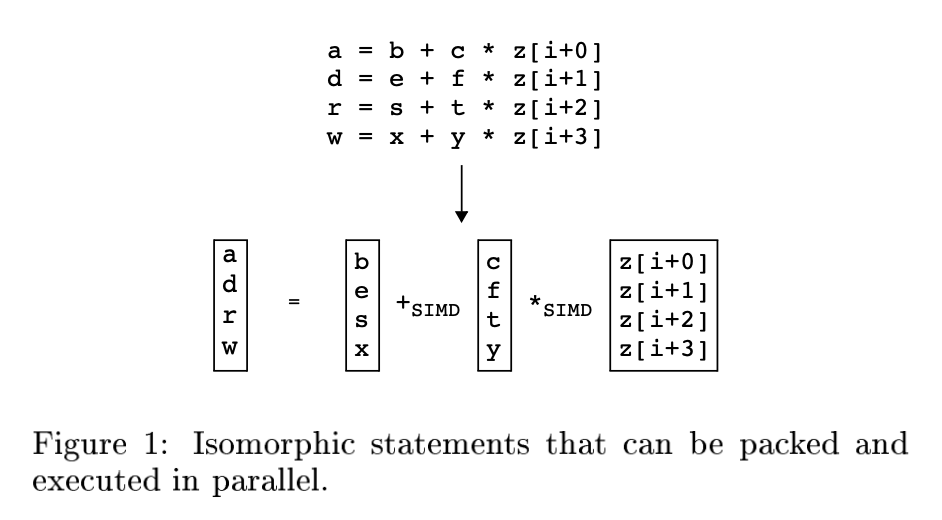
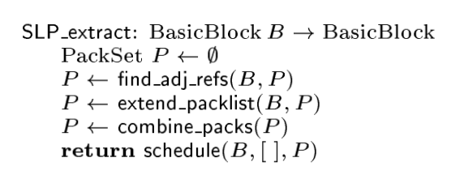
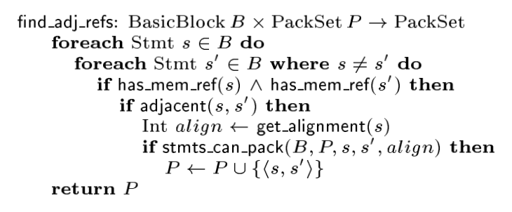
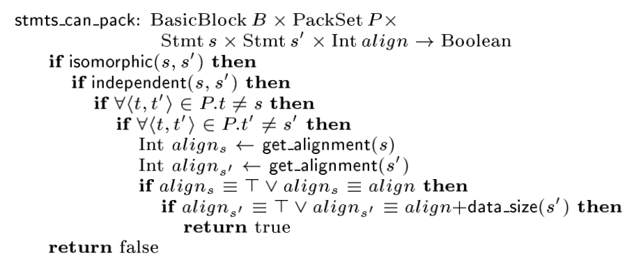
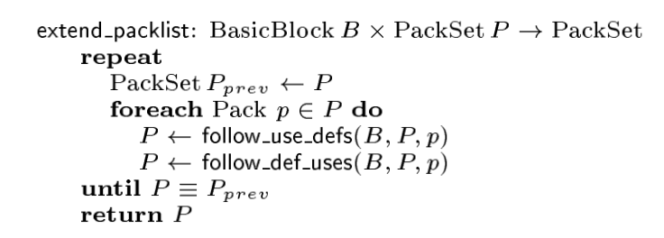
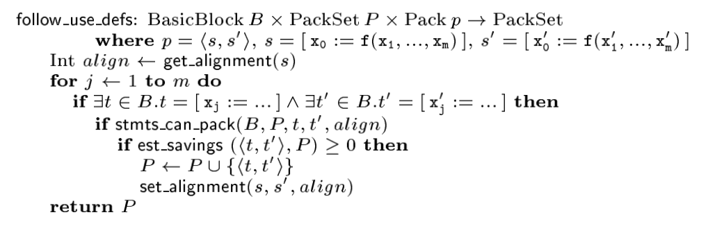
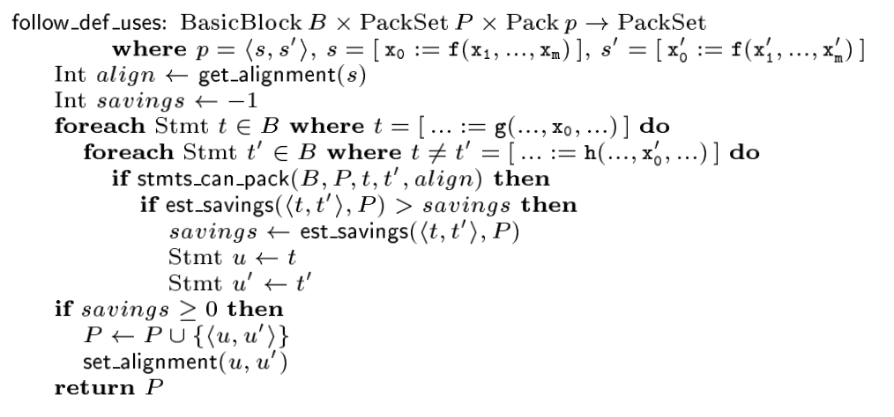
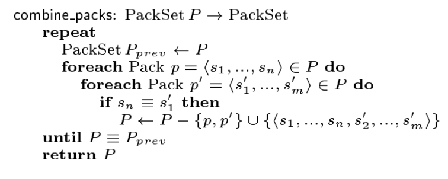
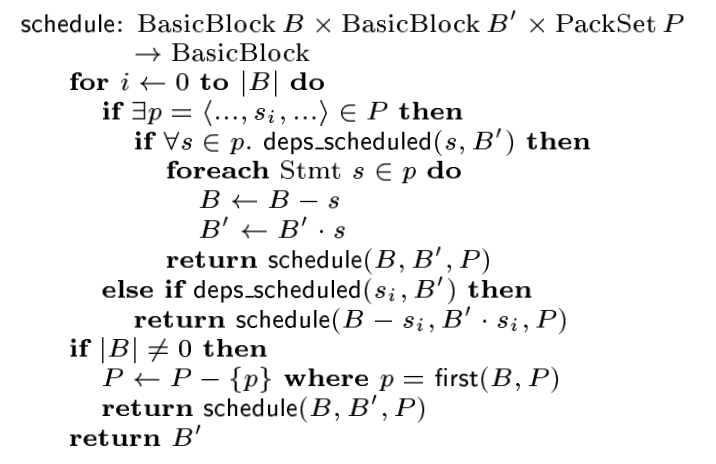
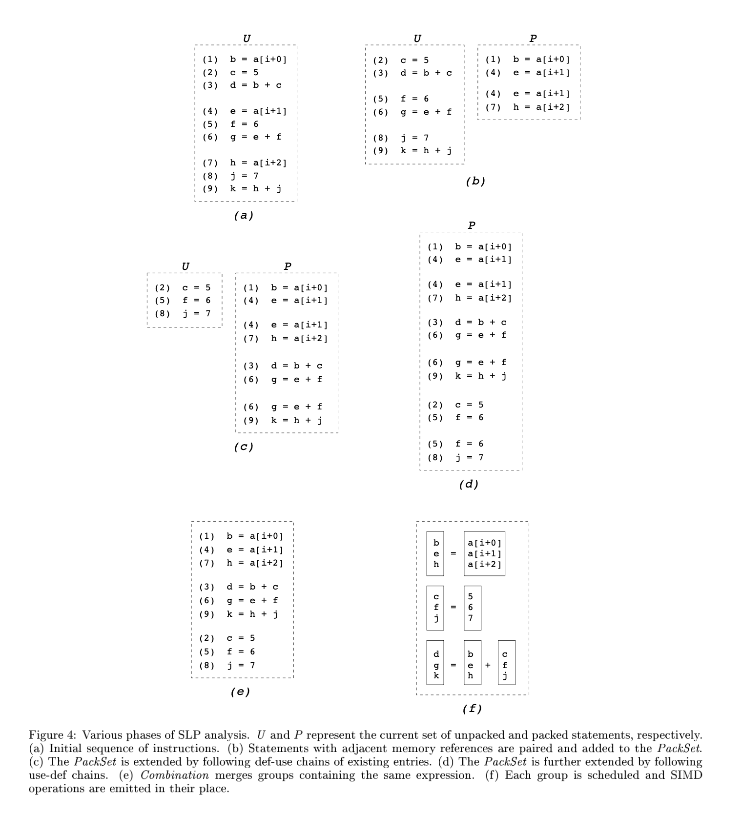

SLP Vectorizer
==============

本文是论文\ `《Exploiting Superword Level Parallelism with Multimedia
Instruction
Sets》 <https://groups.csail.mit.edu/cag/slp/SLP-PLDI-2000.pdf>`__\ 的阅读笔记。论文提出一种称作
SLP 的向量化技术，作者是 Samuel Larsen 和 Saman Amarasinghe ，发表在
PLDI’2000。

About SLP (Superword Level Parallelism)
---------------------------------------

SLP 即 Superword Level Parallelism，是自动向量化技术的一种（另一种是
Loop vectorizer）。SLP vectorization 的目标是将多条 independent
isomorphic 指令组合成一条向量化指令。

例如，图 1 中的四条语句对应位置的操作数都可以 pack 到一个向量寄存器 (
vector register ) 中（b, e, s, x 被 pack 到一个向量寄存器中，c, f, t, y
被 pack 到一个向量寄存器中，z[i+0], z[i+1], z[i+2], z[i+3] 被 pack
到一个向量寄存器中），然后就可以通过 SIMD 指令并行执行这四条语句。

因为通过 SIMD 指令并行执行得到的结果也是在向量寄存器中的，所以根据 a, d,
r, w 的（被）使用方式，可能还需要将 a, d, r, w 从向量寄存器中 load
出来。该操作称为 unpack。

如果 并行执行的时间开销 + packing 操作数时间开销 + unpacking
操作数时间开销 **小于** 原本执行的时间开销，就说明 SLP vectorization
有性能收益。

总结一下 SLP：

-  Generally applicable: SLP is not restricted on parallelism of loops

-  Find independent isomorphic instructions within basic block

-  Goal

   1. Gain more speed up via parallelism

   2. Minimize the cost of packing and unpacking

-  Prefer operating on adjacent memory, whose cost of packing is minimum

Compared To Previous Approach
-----------------------------

在作者撰写论文时，向量编译器 (vector compilers) 通常以循环为目标来寻找
vector parallelism
的机会，因为循环天然提供了对多个数据执行相同指令的机会。向量编译器通过
loop transformations 将一段代码转换为可以被向量化的形式 (vectorizable
form)。

例如，如下循环：

::

   for (i=0; i<16; i++) {
     localdiff = ref[i] - curr[i];
     diff += abs(localdiff);
   }

应用 scalar expansion 和 loop fission 后就被转换为了可以被向量化的形式：

::

   for (i=0; i<16; i++) {
     T[i] = ref[i] - curr[i];
   }
   for (i=0; i<16; i++) {
     diff += abs(T[i]);
   }

注意：应用了 scalar expansion 和 loop fission
后的代码，只有第一个循环是可以通过 SIMD
指令一次执行多次减法操作的，第二个循环则不能。

SLP 同样能够对上循环进行向量化，并且是以一个完全不同的角度：

如下循环：

::

   for (i=0; i<16; i++) {
     localdiff = ref[i] - curr[i];
     diff += abs(localdiff);
   }

经过 loop unroll 和 rename 后得到：

::

   for (i=0; i<16; i+=4) {
     localdiff0 = ref[i+0] - curr[i+0];
     diff += abs(localdiff0);

     localdiff1 = ref[i+1] - curr[i+1];
     diff += abs(localdiff1);

     localdiff2 = ref[i+2] - curr[i+2];
     diff += abs(localdiff2);

     localdiff3 = ref[i+3] - curr[i+3];
     diff += abs(localdiff3);
   }

这样 SLP 就能够将计算 localdiff{0, 1, 2, 3} 的这四条 independent
isomorphic 指令组合成一条向量化指令 (SIMD-)：

::

   for (i=0; i<16; i+=4) {
     localdiff0 = ref[i+0] - curr[i+0];
     localdiff1 = ref[i+1] - curr[i+1];
     localdiff2 = ref[i+2] - curr[i+2];
     localdiff3 = ref[i+3] - curr[i+3];

     diff += abs(localdiff0);
     diff += abs(localdiff1);
     diff += abs(localdiff2);
     diff += abs(localdiff3);
   }

--------------

**但是**\ 对于如下的代码片段，向量编译器 (vector compilers)
要想向量化该循环，需要将 do while 循环转换为 for 循环，恢复归纳变量
(induction variable) ，将展开后的循环恢复为未展开的形式 (loop
rerolling)。而 SLP 向量化该循环则非常容易，直接将计算 dst[{0, 1, 2, 3}]
的这四条 independent isomorphic 语句组合成一条使用向量化指令的语句即可。

::

   do {
     dst[0] = (src1[0] + src2[0]) >> 1;
     dst[1] = (src1[1] + src2[1]) >> 1;
     dst[2] = (src1[2] + src2[2]) >> 1;
     dst[3] = (src1[3] + src2[3]) >> 1;

     dst  += 4;
     src1 += 4;
     src2 += 4;
   }

SLP Extraction Algorithm
------------------------

作者提出了一种简单的算法，将具有 SLP 机会的基本块转换为使用 SIMD
指令的基本块。该算法寻找 independent（无数据依赖
）、isomorphic（相同操作）的指令组合成一条向量化指令。

作者观察到 (observation)：

   Packed statements that containt adjacent memory references among
   corresponding operands are particularly well suited for SLP execution

即 如果被 pack 的指令的操作数引用的是相邻的内存，那么则特别适合 SLP
执行。

所以 SLP Extraction Algorithm 的核心算法就是从识别 adjacent memory
references 开始的。

在识别 adjacent memory references 开始之前实际上还有一些准备工作要做：

1. **Loop unrolling.** transform vector parallelism into basic blocks
   with superword level parallelism，见 `Compared To Previous
   Approach <#Compared-To-Previous-Approach>`__

2. **Alignment analysis.** memory load, store, simd

3. **Pre-Optimization.** constant propagation, dead code elimination,
   common subexpression elimination, loop invariant code motion and
   redundant load/store elimination.
   避免向量化不必要的代码（死代码、冗余代码）

SLP Extraction Algorithm 的核心算法如下：

主要分为以下 4 步：

1. Identifying Adjacent Memory References

2. Extending the PackSet

3. Combination

4. Scheduling

下面进行详细解释。

Identifying Adjacent Memory References
~~~~~~~~~~~~~~~~~~~~~~~~~~~~~~~~~~~~~~

Identifying Adjacent Memory References 即 find_adj_refs，伪代码如下：

find_adj_refs 的输入是 BasicBlock，输出为集合 PackSet。

对于 BasicBlock 中的任意语句对 <s, s’>，如果语句 s 和 s’
访问了相邻的内存（如，s 访问了 array[1]， s’ 访问了 array[2]），并且语句
s 和 s’ 能 pack 到一起（函数 stmts_can_pack 返回 true ），那么就将语句对
<s, s’> 加入集合 PackSet 中。

函数 stmts_can_pack 的伪代码如下：

即，如果两条语句 s 和 s’ 满足如下条件，那么语句 s 和 s’ 就能 pack
到一起：

-  s 和 s’ 是相同操作 (isomorphic)

-  s 和 s’ 无数据依赖 (independent)

-  s 之前没有作为左操作数出现在 PackSet 中，s’
   之前没有作为右操作数出现在 PackSet 中

-  s 和 s’ 的满足对齐要求 (consistent)

find_adj_refs 执行结束后，我们就得到了集合 PackSet，PackSet 中元素是 <s,
s’> 这样的语句对。

Extending the PackSet
~~~~~~~~~~~~~~~~~~~~~

在 find_adj_refs 我们构建了 PackSet 集合，在这一步中我们沿着被 pack
的语句的 defs 和 uses 来扩充 PackSet 集合。extent_packlist 的输入集合
PackSet，输出为集合 PackSet。

extent_packlist 的伪代码如下：

对 Packet 中每一个元素 Pack，执行函数 follow_use_defs 和 follow_def_uses
扩充 PackSet 集合，不断扩充直至 PackSet 不能再加入新的 Pack。

先看 follow_use_defs：

对于一个 Pack，即语句对 <s, s’>：考察 s 和 s’ 的每一对源操作数 xj 和
xj’，如果 s 和 s’ 所在 BasicBlock 中存在对 xj 和 xj’ 定值 (def) 的语句 t
和 t’，语句 t 和 t’ 还能 pack 到一起（函数 stmts_can_pack 返回 true
），并且根据 cost model，将 <t, t’> 加入 PackSet 中有收益，那么就将 <t,
t’> 加入集合 PackSet 中。

再看 follow_def_uses：

对于一个 Pack，即语句对 <s, s’>：考察 s 和 s’ 的目的操作数 x0 和
x0’，如果 s 和 s’ 所在 BasicBlock 中存在使用 (use) x0 和 x0’ 的语句 t 和
t’，语句 t 和 t’ 还能 pack 到一起（函数 stmts_can_pack 返回 true
），根据 cost model，找到将 <t, t’> 加入 PackSet 后获得收益最大的使用
(use) x0 和 x0’ 的语句 u 和 u’（存在多个使用 x0 和 x0’ 的语句 t 和
t’），将 <u, u’> 加入集合 PackSet 中。

extent_packlist 执行结束后，我们就扩充了集合 PackSet，PackSet 中元素是
<s, s’> 这样的语句对。

Combination
~~~~~~~~~~~

在 find_adj_refs 我们构建了 PackSet 集合，在 extent_packlist
中我们扩充了 PackSet 集合。此时 PackSet 中元素是 <s, s’> 这样的语句对。

这一步我们对 PackSet 中的语句对进行合并，combine_packs 的输入集合
PackSet，输出为集合 PackSet。伪代码如下：

对于 PackSet 中的任意两个 Pack，p = <s1, …, sn>，p’ = <s1’, …,
sm’>，如果 p 的最后一个语句和 p’ 的第一个语句是同一个语句，那么就将 p 和
p’ 合并。

这一步很容易理解。 combine_packs 执行结束后，PackSet 中元素是 <s, …, sn>
这样的语句 n 元组，n >= 2。

Scheduling
~~~~~~~~~~

最后一步对基本块中的指令进行调度，生成包含 SIMD 指令的基本块。 对于
PackSet 中的一个 Pack（Pack 是语句 n 元组），Pack
可能依赖于之前定义，因此我们需要按照数据依赖图的拓扑顺序生成指令。如果存在循环依赖，我们
revert 导致循环的 Pack 不在对该 Pack 使用 SIMD 指令。

Scheduling 这一步输入是原本的 BasicBlock 和 PackSet，输出是包含 SIMD
指令的 BasicBlock。

Example
~~~~~~~

这里我们用论文中的例子来理解一下整个算法的流程：

1. 初始状态，BasicBlock 中包含的指令序列如 (a) 所示。

2. 执行 find_adj_refs，我们发现语句(1) 和 语句(4) 访问的分别是 a[i+0] 和
   a[i+1]，并且满足 stmts_can_pack，所以将 <(1), (4)> 加入到 PackSet
   中。语句 (4) 和 语句(7) 访问的分别是 a[i+1] 和 a[i+2]，语句 (4) 和
   语句(7) 是 independent 和 isomorphic 的，并且语句(4) 没有作为 Pack
   的左操作数出现在 Pack 中（<(1), (4)> 中语句(4) 是作为 Pack
   的右操作数），语句(7) 也没有作为 Pack 的右操作数出现在 Pack
   中，且语句 (4) 和 语句(7)满足对齐要求，所以再将 <(4), (7)> 加入到
   PackSet 中。 find_adj_refs 执行结束，此时 PackSet 内容为 {<(1), (4)>,
   <(4), (7)>}

3. 执行 extent_packlist：

   1. follow_use_defs，在 BasicBlock 中没有对 a[i+0], a[i+1], a[i+2]
      进行 def 的语句，所以第一次 follow_use_defs 没有改变 PackSet。

   2. follow_def_uses，这一次将 (3) 和 (6)、(6) 和 (9) 加入到 PackSet
      中，分别是根据 (1) 和 (4)、(4) 和 (7) follow_def_uses 得到的。

   3. 再一次执行 follow_use_defs，这一次将对 (3) 和 (6) 中定值 c 和 f
      的语句(2) 和 (5) 加入到 PackSet 中，将对 (6) 和 (9) 中定值 f 和 j
      的语句 (5) 和 (8) 加入到 PackSet 中。

   4. 再一次执行 follow_use_defs，发现没有新的 Pack 能加入到 PackSet
      中了，extent_packlist 执行结束。

4. 执行 combine_packs：

   1. <(1), (4)> 和 <(4), (7)> 合并为 <(1), (4), (7)>

   2. <(3), (6)> 和 <(6), (9)> 合并为 <(3), (6), (9)>

   3. <(2), (5)> 和 <(5), (8)> 合并为 <(2), (5), (8)>

5. 执行 scheduling，注意 (3) 依赖 (1) 和 (2)，(6) 依赖 (4) 和 (5)，(9)
   依赖 (7) 和 (8)。

Implementation
--------------

LLVM
`实现 <https://llvm.org/docs/Vectorizers.html#the-slp-vectorizer>`__ 了
SLP vectorization 算法，是基于 “Loop-Aware SLP in GCC” by Ira Rosen,
Dorit Nuzman, Ayal Zaks. 这篇论文。

接下来会先阅读 Loop-Aware SLP in GCC 这篇论文写一下阅读笔记，然后再学习
LLVM 的实现，写一下源码阅读笔记。

References
----------

1. http://groups.csail.mit.edu/cag/slp/

2. https://www.cs.cornell.edu/courses/cs6120/2020fa/blog/slp/
